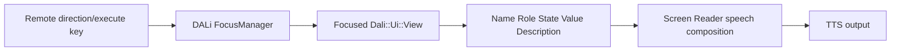

[→ 한국어 문서](https://github.sec.samsung.net/NUI/dali-ui/wiki/Accessibility-(kr))

# Accessibility

> Audience: TV Application developers and Component developers using DALi UI
> Baseline date: 2026-08-20
> Implementation baselines: `dali-ui` `11a63b7dadf66`; TV `screen-reader` `6e012e4b4bcb`
> Localization POC cross-check: `TempAccessibilityVDSupport` `9b6b9adf50fd`
> Status: Current with known component and product-integration gaps

This guide defines shared accessibility requirements for Application developers who compose TV screens and Component developers who build reusable UI. It covers accessibility fundamentals, TV UX specifications, DALi UI implementation, and validation in one flow. Every implementation example uses the C++ `Dali::Ui` API.

Scope | Meaning
--|--
Common DALi UI | Public APIs, semantic responsibilities, and Component contracts that do not depend on a product Screen Reader. Unmarked content has this scope.
Tizen TV | Behavior validated in Tizen TV integration, including the TV remote, current TV Screen Reader speech, product attributes, and page or modal lifecycle

Read Common contracts separately from Tizen TV behavior. Statements marked with terms such as `current TV Screen Reader`, `Tizen product`, or `product contract` must not be generalized into Common DALi UI guarantees.

<br/>

## 1. Quick Start

Reader | Read first | Completion evidence
--|--|--
Application developer | Accessibility basics → TV UX specification → Application developer guide → Validation | Complete the core task using only the remote and Screen Reader
Component developer | Accessibility basics → TV UX specification → Component developer guide → Validation | Satisfy the role, state, action, and tree contract

Keep these principles in mind:

1. Always provide accessibility information—such as Name, Role, State, Value, and Description—regardless of whether the Screen Reader is enabled.
2. Keep Name short; do not concatenate Role, State, or Value into it.
3. Do not treat TV remote keyboard focus and accessibility highlight as the same state.
4. Applications own the screen context and information source; Components own default semantics, accessibility exposure and synchronization, and the action contract.
5. After setting APIs, verify both the AT-SPI tree and actual TV Screen Reader behavior.

### 1.1 Application and Component Responsibility Boundary

Rather than assigning every accessibility property exclusively to one side, the Application determines the screen context and the source of the information, while the Component owns its intrinsic default semantics and the accessibility exposure and synchronization of that information.

Information or behavior | Application responsibility | Component or framework responsibility
--|--|--
Name | Explicit name for the screen context | Default name derived from visible text
Role | Select the correct Component and validate exceptional overrides | Default Role consistent with the actual action contract
State | Determine the current state managed by the Application | Expose and synchronize visual and interaction state as accessibility State
Value | Determine the actual value, unit, and presentation | Format and expose the value and synchronize action results
Description | Explicit override that explains a screen-specific purpose or context | Default usage guidance intrinsic to the Component
Action | Handle feature results and Application-specific follow-up behavior | Route touch, remote key, API, and accessibility actions through the same feature path
Tree and lifecycle | Active page and modal subtree, initial focus and highlight, and return target | AT-SPI object and D-Bus bridge, default tree exposure of internal children, and semantic synchronization during reuse and recycling
Images | Distinguish informative images from decorative images | Provide the default image tree and action contract

Description is not owned exclusively by either side. For example, stable instructions for operating a Slider belong in the Component's default Description, while an explanation of what that Slider controls on a particular screen is set explicitly by the Application. A Component's default Name and Description must not overwrite an Application's explicit override, so use default hooks such as `OnAccessibilityRequestDefaultName()` and `OnAccessibilityRequestDefaultDescription()`. Do not call `SetAccessibilityDescription()` or `SetTranslatableAccessibilityDescription()` again during an ordinary state or type change if doing so would overwrite the Application value.

State follows the same split. The Application determines the current state, while the Component consistently reflects that state in visual and input behavior and in accessibility States such as `CHECKED`, `SELECTED`, `EXPANDED`, and `ENABLED`. When an Application composes a plain View directly, it owns both responsibilities.

<br/>

## 2. Accessibility Basics

### 2.1 What accessibility means

Accessibility means designing and implementing products and services so people can use them regardless of disability. On a TV, users must be able to understand their current position, explore content, and perform an intended action with the remote without relying on sight.

### 2.2 Screen Reader and TTS

TTS is a technology that converts supplied text into speech. A Screen Reader is an accessibility tool that explores UI objects, composes speech from semantics and the current context, and sends user input back as actions.

```text
TTS: application supplies a completed sentence → speech output
Screen Reader: UI semantics + current context → speech, navigation, and action
```

Applications and Components should therefore expose accurate meaning and state instead of assembling final speech sentences or calling TTS separately for each control.

### 2.3 Accessibility semantics

Information | Meaning | TV example
--|--|--
Name | Short name that identifies the target | `"Netflix"`, `"Volume"`
Role | Function of the target | `BUTTON`, `CHECK_BOX`, `ADJUSTABLE`
State | Current selection, checked, or enabled state | `CHECKED`, `SELECTED`, `ENABLED`
Value | Adjustable or progress value | `"50%"`, `"3/10"`
Description | Supporting explanation or essential usage guidance | `"Opens available networks"`

If the expected speech is “Volume, adjustable, 50%,” do not put the full sentence in Name. Set Name to `"Volume"`, Role to `ADJUSTABLE`, and Value to `"50%"`. The Screen Reader and locale policy determine the final wording and order.

### 2.4 AT-SPI

AT-SPI is the accessibility interface through which assistive technology such as a Screen Reader interacts with UI applications on Linux/Tizen. The Application declares semantics on DALi Views, and DALi UI plus the adaptor translate them into the accessibility tree and AT-SPI interfaces. General Applications and Components do not implement D-Bus protocols or AT-SPI objects directly.

<br/>

## 3. Tizen TV Accessibility Runtime

> **Scope: Tizen TV.** This section describes TV remote and current TV Screen Reader integration.

### 3.1 TV remote focus flow

A typical TV remote navigation flow is shown below. Product branches may differ in Screen Reader integration details, but the Application and Component contract remains the same.



Direction keys move keyboard focus through `FocusManager`. When the Screen Reader is active, it uses the current target semantics to explain where the user is and what they can do. Execution keys, touch, and accessibility actions must converge on the same feature and state-update path.

### 3.2 Keyboard focus and accessibility highlight

> [!IMPORTANT]
> **Keyboard focus and accessibility highlight are separate states.** `FocusManager` focus determines the target of remote and key input. Accessibility highlight represents the target read by the Screen Reader. Making a View focusable does not create accessibility semantics, and moving accessibility highlight does not automatically move keyboard focus.

State which one is meant in TV UX specifications and test reports. Saying only “move focus” can hide a mismatch between remote focus and Screen Reader highlight.

<br/>

## 4. TV Accessibility UX Specification

> **Scope: Tizen TV.** The focus, restoration, and speech-validation criteria in this section target TV user flows.

If UX delivers only visual layout, developers and QA must guess the accessibility navigation unit and speech. Record the following information in every screen or Component specification.

UX field | Required decision | Example
--|--|--
Directional focus | Left/right/up/down target and boundary behavior | The last modal item cannot escape to the background
Initial focus | First target after entering a screen or modal | Dialog title or primary action
Focus restoration | Target after close or back | Button that opened the dialog
Grouping | One representative root or individually navigable children | Settings icon + label + toggle form one target
Image treatment | Informative name or decorative exclusion | Describe a sale banner; hide a divider from the tree
Semantic expectation | Name, Role, State, Value, Description | Name `Volume`, Role `ADJUSTABLE`, Value `50%`
State feedback | Semantics that change immediately after an action | Update `CHECKED` after toggling
Repeated content | Heading, collection name, and index policy | Episode card `3/10`
Dynamic content | Announcement frequency and interruption policy | Do not announce call duration every second

### 4.1 Directional, initial, and restored focus

- Design directional focus around the user task order, not only geometric proximity.
- Select one logical first target when entering a screen, tab, or modal.
- After closing a modal or child screen, restore the originating target or the next target appropriate to the task.
- Document wraparound, boundary exits, and exceptional paths with arrows or a table.

### 4.2 Grouping and navigation units

If an icon, label, and toggle represent one setting, let one root expose the Name, Role, State, and action, and prevent decorative internals from becoming duplicate navigation targets. If children have separate actions, do not merge them; expose each actionable child independently.

Good grouping reduces navigation effort, but must not hide several actions behind one ambiguous target. Decide using both “information understood in one navigation stop” and “actions that must be independently available.”

### 4.3 Image descriptions

- Give informative images a concise Name with the same purpose as the visual information.
- If important text inside an image is not available elsewhere, include its meaning in the Name.
- Hide purely decorative or redundant images from the accessibility tree.
- Do not repeat words such as `"image"` or `"icon"` in Name when Role already conveys them.

### 4.4 Expected speech and state feedback

An expected utterance is a UX review aid. The implementation contract is the set of semantic parts used to compose it.

```text
UX expectation: "Volume, adjustable, 50%"
Implementation: Name="Volume", Role=ADJUSTABLE, Value="50%"
```

After selection, checked, expanded, or value actions, update visual state and semantics in the same model update. If product-specific result speech is required, verify that it neither duplicates the default semantic feedback nor interrupts other important speech.

### 4.5 Repeated and dynamic content

- Divide long screens with headings and meaningful collections.
- Give repeated cards distinguishable Names and current collection indices.
- Rebind all semantics on recycled Views so the previous item Name, State, Value, or index cannot remain.
- For timers, progress, and live status, decide which changes matter and limit announcement frequency.
- For long loading operations, provide `BUSY` state and understandable information about the current operation.

<br/>

## 5. DALi UI API Overview

The `Dali::Ui::View` Accessibility APIs expose a View's semantics, reading information, states, and relations to the accessibility tree. A Screen Reader queries this information to announce the currently highlighted View and sends accessibility actions back to the View.

```cpp
#include <dali-ui-foundation/dali-ui-foundation.h>

using namespace Dali;
using namespace Dali::Ui;

View button = View::New();
button.SetAccessibilityRole(Accessibility::Role::BUTTON);
button.SetAccessibilityName("Confirm");
button.SetAccessibilityDescription("Saves the entered information");
button.AddAccessibilityReadingInfo(Accessibility::ReadingInfo::NAME);
button.AddAccessibilityReadingInfo(Accessibility::ReadingInfo::ROLE);
button.AddAccessibilityReadingInfo(Accessibility::ReadingInfo::DESCRIPTION);

window.Add(button);
```

See [Tizen TV Accessibility Runtime](#3-tizen-tv-accessibility-runtime) for the distinction between keyboard focus and accessibility highlight.

<br/>

## 6. Basic Information

The basic information a Screen Reader needs to understand a View consists of its name, description, value, and role.

API | Purpose | Example
--|--|--
`SetAccessibilityName()` | A short name that identifies the target | `"Wi-Fi"`
`SetAccessibilityDescription()` | Additional explanation of the name | `"Opens available networks"`
`SetAccessibilityValue()` | The current value | `"50%"`, `"On"`
`SetAccessibilityRole()` | The target's meaning and supported behavior | `BUTTON`, `ENTRY`, `ADJUSTABLE`

```cpp
View volume = View::New();
volume.SetAccessibilityRole(Accessibility::Role::ADJUSTABLE);
volume.SetAccessibilityName("Volume");
volume.SetAccessibilityValue("50%");
```

Choose a role based on the functionality presented to the user, rather than the View's implementation class. For example, a clickable control built from a plain `View` should use `BUTTON` if it behaves as a button.

Common roles include:

Category | Role
--|--
Action/selection | `BUTTON`, `TOGGLE_BUTTON`, `CHECK_BOX`, `RADIO_BUTTON`, `LINK`
Input/value | `ENTRY`, `PASSWORD_TEXT`, `ADJUSTABLE`, `SPIN_BUTTON`, `PROGRESS_BAR`, `SCROLL_BAR`
Structure | `CONTAINER`, `LIST`, `LIST_ITEM`, `TAB_LIST`, `TAB`, `MENU`, `MENU_ITEM`, `TOOL_BAR`
Content | `TEXT`, `IMAGE`, `HEADER`, `SCENE_3D`, `MODEL`
Context | `ALERT`, `NOTIFICATION`, `DIALOG`, `POPUP_MENU`

See `Accessibility::Role` for the complete list. Assigning a meaningful role also makes the View highlightable by default.

> [!NOTE]
> Use `OnAccessibilityRequestDefaultName()` and `OnAccessibilityRequestDefaultDescription()` when visible Component content supplies the default Name or Description. Reserve `OnAccessibilityRequestName/Description/Value()` for authoritative values that must take precedence over explicit properties. See [Dynamic Values and Default Component Name/Description](#165-dynamic-values-and-default-component-namedescription) for the resolution order.

<br/>

## 7. Accessibility Behavior Properties

```cpp
view.SetAccessibilityHidden(false);
view.SetAccessibilityHighlightable(true);
view.SetAccessibilityScrollable(false);
view.SetAccessibilityModal(false);
view.SetAutomationId("settings-wifi-button");
```

API | Description
--|--
`SetAccessibilityHidden(bool)` | Hides the View from accessibility clients when set to `true`. Use it for decorative Views that should not be read.
`SetAccessibilityHighlightable(bool)` | Explicitly overrides role-based highlight eligibility.
`ResetAccessibilityHighlightable()` | Removes the override and restores role-based behavior. A role other than `NONE` is highlightable by default.
`SetAccessibilityScrollable(bool)` | Indicates that the View exposes accessibility scrolling behavior.
`SetAccessibilityModal(bool)` | Indicates a modal context that should constrain accessibility navigation.
`SetAutomationId()` | Sets a stable identifier for UI automation tools.

Each setter has a corresponding `Is...()` or `Get...()` API.

> [!WARNING]
> `SetAccessibilityHidden(true)` does not change the View's visual visibility. Likewise, a visually hidden View should not normally remain exposed to accessibility. Keep visual and accessibility exposure consistent.

<br/>

## 8. Selecting Information to Announce

`Accessibility::ReadingInfo` selects which semantic information a Screen Reader should use when reading a View. The enum is not a bit mask; use the per-item APIs.

```cpp
view.AddAccessibilityReadingInfo(Accessibility::ReadingInfo::NAME);
view.AddAccessibilityReadingInfo(Accessibility::ReadingInfo::ROLE);
view.AddAccessibilityReadingInfo(Accessibility::ReadingInfo::DESCRIPTION);
view.AddAccessibilityReadingInfo(Accessibility::ReadingInfo::STATE);

view.RemoveAccessibilityReadingInfo(Accessibility::ReadingInfo::DESCRIPTION);

if(view.HasAccessibilityReadingInfo(Accessibility::ReadingInfo::STATE))
{
  // STATE is included in the reading information.
}

view.ClearAccessibilityReadingInfo();
```

Item | Information exposed
--|--
`NAME` | `AccessibilityName`
`ROLE` | `AccessibilityRole`
`DESCRIPTION` | `AccessibilityDescription`
`STATE` | Current accessibility state

<br/>

## 9. State Management

Use `AddAccessibilityState()`, `RemoveAccessibilityState()`, and `ClearAccessibilityStates()` for semantic states owned by the application or component.

```cpp
checkBox.AddAccessibilityState(Accessibility::State::ENABLED);
checkBox.AddAccessibilityState(Accessibility::State::CHECKED);

checkBox.RemoveAccessibilityState(Accessibility::State::CHECKED);
bool checked = checkBox.HasAccessibilityState(Accessibility::State::CHECKED);
```

State | When to use it
--|--
`ENABLED` | Accessibility interaction is available
`SELECTED` | A list item, tab, or similar item is selected
`CHECKED` | A check or toggle value is on
`BUSY` | A value or content is still being updated
`EXPANDED` | Collapsible content is currently expanded

These application states are combined with DALi runtime states such as visibility, sensitivity, and focus before being exposed to accessibility clients. Do not use these APIs to add runtime states such as `FOCUSED`, `SHOWING`, or `HIGHLIGHTED` directly.

<br/>

## 10. Relations Between Views

Use `Accessibility::RelationType` when the relationship between Views cannot be inferred from their visual layout.

```cpp
View title = Label::New("Password");
View input = View::New();
View error = Label::New("Enter at least 8 characters");

title.AddAccessibilityRelation(Accessibility::RelationType::LABEL_FOR, input);
input.AddAccessibilityRelation(Accessibility::RelationType::LABELLED_BY, title);

error.AddAccessibilityRelation(Accessibility::RelationType::ERROR_MESSAGE, input);
input.AddAccessibilityRelation(Accessibility::RelationType::ERROR_FOR, error);
```

Common relation pairs are:

Source → target | Target → source
--|--
`LABEL_FOR` | `LABELLED_BY`
`DESCRIPTION_FOR` | `DESCRIBED_BY`
`CONTROLLER_FOR` | `CONTROLLED_BY`
`FLOWS_TO` | `FLOWS_FROM`
`NODE_PARENT_OF` | `NODE_CHILD_OF`
`EMBEDS` | `EMBEDDED_BY`
`DETAILS` | `DETAILS_FOR`
`ERROR_MESSAGE` | `ERROR_FOR`
`MEMBER_OF` | No inverse relation is required

Relations are stored one direction at a time. Add the corresponding inverse relation separately, as shown above, when clients need to query the relationship from both sides.

```cpp
input.RemoveAccessibilityRelation(Accessibility::RelationType::LABELLED_BY, title);
input.ClearAccessibilityRelations();
bool exists = input.HasAccessibilityRelation(Accessibility::RelationType::LABELLED_BY, title);
```

Targets are stored as weak handles, so a relation does not extend the lifetime of its target View.

### 10.1 Announcing Group Context on Entry on TV

> **Scope: Tizen TV product contract.** Do not assume this is portable AT-SPI behavior.

The current TV Screen Reader can announce a group or page context before the first focused member when the member explicitly opts in and has exactly one `MEMBER_OF` target.

```cpp
View group = View::New();
group.SetAccessibilityRole(Accessibility::Role::CONTAINER);
group.SetAccessibilityName("Picture settings");

View item = View::New();
item.SetAccessibilityRole(Accessibility::Role::BUTTON);
item.SetAccessibilityName("Brightness");
item.AddAccessibilityRelation(Accessibility::RelationType::MEMBER_OF, group);
item.AppendAccessibilityAttribute("announce-member-on-entry", "true");
```

The group is announced before the item when focus enters it, but is not repeated while focus moves between members of the same group. Leaving and re-entering the group announces the context again. More than one `MEMBER_OF` target is ambiguous and suppresses the entry-context announcement. When an item is recycled or removed from the group, remove both the relation and the opt-in attribute.

> [!NOTE]
> `announce-member-on-entry` is a current Tizen TV Screen Reader product contract, not a portable AT-SPI attribute. Verify it on the target product image and keep the group Name, Role, and reading information meaningful.

### 10.2 Labeled Text Input on TV

> **Scope: Tizen TV Screen Reader integration.** Validate speech order and password handling on the target product image.

Connect a visible label to an `ENTRY` or `PASSWORD_TEXT` View with `LABELLED_BY` and include Name in its reading information. The current TV Screen Reader can then compose label, role, and current input content in that order.

```cpp
label.SetAccessibilityRole(Accessibility::Role::TEXT);
label.SetAccessibilityName("Account name");

input.SetAccessibilityRole(Accessibility::Role::ENTRY);
input.AddAccessibilityRelation(Accessibility::RelationType::LABELLED_BY, label);
input.AddAccessibilityReadingInfo(Accessibility::ReadingInfo::NAME);
input.AddAccessibilityReadingInfo(Accessibility::ReadingInfo::ROLE);
```

Keep the visible label and relation current instead of copying a changing label and input content into one Name. For `PASSWORD_TEXT`, the Screen Reader announces a localized character count rather than the secret text. Verify insertion, deletion, delete-all, IME navigation, empty content, and password privacy on the target image.

<br/>

## 11. Multilingual Accessibility Strings

### 11.1 Domain Setup and Direct Lookup with `GetLocalizedString()`

Register the gettext domain before resolving or binding its resources. `RegisterDomain()` does not make the domain the default automatically.

```cpp
#include <dali-ui-foundation/public-api/configuration/ui-localization-manager.h>

UiLocalizationManager localization = UiLocalizationManager::Get();
bool registered = localization.RegisterDomain("settings", "/usr/share/locale");
localization.SetDefaultDomain("settings"); // Application-owned default domain

Dali::String title = localization.GetLocalizedString("IDS_SETTINGS_TITLE");
Dali::String wifi  = localization.GetLocalizedString("IDS_SETTINGS_WIFI", "settings");
```

Use `GetLocalizedString()` when the translated result is needed immediately for a one-time calculation, a complete sentence assembled by a formatter, or an API that has no translation binding. The overload without a domain uses the current default domain. A reusable Component or framework should normally pass its own domain explicitly so an Application cannot change its strings by replacing the default domain.

Direct lookup does not remember the resource ID and does not update the returned `Dali::String` after a locale change. Re-run the lookup from a locale-refresh path, or use a binding when the value must stay current. If the resource ID is empty, the result is empty. If localization is bypassed, no effective domain exists, or no translation is found, the resource ID is returned as the fallback. Treat a returned SID as a diagnostic failure for user-facing accessibility text; do not intentionally expose it to the Screen Reader.

Need | API | Locale-change contract
--|--|--
One-time or immediate lookup | `GetLocalizedString()` | Caller re-runs the lookup
Name or Description resource | `SetTranslatableAccessibilityName/Description()` | DALi reapplies automatically
Formatted Value or custom property | `SetBindingResource()` | Callback reruns automatically; model changes remain caller-owned
Quantity-dependent text | `GetLocalizedPluralString()` | Caller re-runs lookup, normally from a binding callback

When direct lookup supplies a Screen Reader announcement, reject an empty result or the unchanged resource ID and use a reviewed fallback:

```cpp
constexpr char kPleaseWaitId[] = "IDS_PLEASE_WAIT";
Dali::String resolved = localization.GetLocalizedString(kPleaseWaitId, "settings");
std::string text = resolved.CStr() ? resolved.CStr() : "";
if(text.empty() || text == kPleaseWaitId)
{
  text = "Please wait."; // Must follow the product fallback-locale policy.
}
```

The reviewed `ProgressBar` and `Loading` code uses direct lookup appropriately because it resolves the message again whenever it builds an announcement. If that result is cached for later use, add an explicit refresh path or replace the cache with a binding.

### 11.2 Binding Name and Description Resources

Binding the name and description to `UiLocalizationManager` resources refreshes their translated values when the locale changes.

```cpp
view.SetTranslatableAccessibilityName("IDS_SETTINGS_WIFI", "settings");
view.SetTranslatableAccessibilityDescription("IDS_SETTINGS_WIFI_DESCRIPTION", "settings");

Dali::String nameResourceId = view.GetTranslatableAccessibilityName();

view.ClearTranslatableAccessibilityName();
view.ClearTranslatableAccessibilityDescription();
```

The binding is resolved when it is registered and again when DALi receives the platform locale-changed signal. Omitting the domain uses the default domain. `GetTranslatableAccessibilityName()` and `GetTranslatableAccessibilityDescription()` return the bound resource ID, not the translated text; use `GetAccessibilityName()` or `GetAccessibilityDescription()` to inspect the effective value.

Calling `SetAccessibilityName()` or `SetAccessibilityDescription()` with an explicit string clears the corresponding translation binding and language spans. See [Localization & Multilingual UI](https://github.sec.samsung.net/NUI/dali-ui/wiki/Localization-&-Multilingual-UI) for general localization setup.

### 11.3 Dynamic or Formatted Accessibility Values

There is no `SetTranslatableAccessibilityValue()` API. Use a named `UiLocalizationManager::SetBindingResource()` binding when a Value or another custom property must be reformatted after a locale change.

```cpp
void SliderImpl::BindAccessibilityValue(View view)
{
  mView = view;
  UiLocalizationManager::Get().SetBindingResource(
    view,
    "AccessibilityValueFormat",
    "IDS_SLIDER_VALUE_FORMAT",
    "settings",
    LocalizedStringCallback::New(this, &SliderImpl::OnLocalizedValueFormat));
}

void SliderImpl::OnLocalizedValueFormat(BaseHandle target,
                                        const Dali::String& localizedFormat)
{
  mLocalizedValueFormat = localizedFormat;
  ApplyAccessibilityValue(View::DownCast(target));
}

void SliderImpl::ApplyAccessibilityValue(View view)
{
  // FormatNamedTokens validates and replaces <<MIN>>, <<MAX>>, and <<CURRENT>>.
  std::string value = FormatNamedTokens(mLocalizedValueFormat, mMin, mMax, mCurrent);
  view.SetAccessibilityValue(value.c_str());
}
```

`SetBindingResource()` invokes the callback immediately and again when bindings refresh. A model change does not invoke the localization callback, so the Component must also call `ApplyAccessibilityValue()` whenever minimum, maximum, or current value changes. Use a binding ID unique to the target property; registering the same target and binding ID replaces the previous resource, domain, and callback.

The manager keeps the target as a weak reference, but a member-function callback does not keep its owner alive. Clear the binding before the callback owner is destroyed:

```cpp
UiLocalizationManager::Get().ClearBinding(mView, "AccessibilityValueFormat");
```

Use `ClearBindings()` only when the owner intentionally owns every localization binding on that target.

### 11.4 Translatable Sentences, Parameters, and Fallbacks

- Translate a complete natural-language unit whenever possible. Do not translate fragments separately and concatenate them in a fixed order; translators need control over word order, particles, inflection, and politeness.
- For runtime data, use documented named tokens or type-safe positional formatting that allows locale-specific reordering. The Slider POC uses `<<A>>`, `<<B>>`, and `<<C>>` for minimum, maximum, and current value.
- Validate that every required token exists and that no unresolved token remains before exposing the result. Rebuild from the original localized template each time instead of repeatedly replacing an already formatted string.
- Use a short, human-readable fallback when the catalog or template is invalid. Returning a SID such as `IDS_SLIDER_VALUE` is useful for diagnostics but is not an acceptable production Screen Reader value.
- Keep command lines, resource IDs, locale keys, and other machine syntax outside translated sentences unless only their surrounding explanation is translated.
- Pass the final localized text, not a resource ID or format template, to `SetAccessibilityValue()`.

### 11.5 Plural Forms

Use gettext plural rules instead of choosing singular and plural with `quantity == 1`.

```cpp
Dali::String format = localization.GetLocalizedPluralString(
  "IDS_ONE_UNREAD_MESSAGE",
  "IDS_MANY_UNREAD_MESSAGES",
  unreadCount,
  "settings");

Dali::String value = FormatCount(format, unreadCount);
view.SetAccessibilityValue(value.CStr());
```

`quantity` selects a catalog plural form but is not substituted into the returned string. The formatter must insert it. `LocalizedStringOverrideFunc` is not applied to plural lookup. Because plural lookup is not itself a binding, a dynamic View can register a regular `SetBindingResource()` callback as its locale-refresh trigger and call `GetLocalizedPluralString()` inside that callback. Re-run the same update when the quantity changes.

Each PO catalog must declare correct `Plural-Forms` and provide every required plural entry. Test languages with one, two, and more than two plural forms; English and Korean alone do not cover the full contract.

### 11.6 Language Ranges Within One String

Add language spans when a single name or description contains multiple languages.

```cpp
view.SetAccessibilityName("Hello 세계");

bool english = view.AddAccessibilityNameLanguageSpan(0u, 5u, "en-US");
bool korean  = view.AddAccessibilityNameLanguageSpan(6u, 2u, "ko-KR");
```

`start` and `length` use **Unicode code-point indices**, not UTF-8 byte offsets. The API returns `false` when the length is zero, the locale is empty, the range exceeds the string, or the span overlaps an existing span.

Use `AddAccessibilityDescriptionLanguageSpan()` for the description. Changing the string removes its existing spans, so set the string before adding spans.

```cpp
view.ClearAccessibilityNameLanguageSpans();
view.ClearAccessibilityDescriptionLanguageSpans();
```

Language spans select the TTS language for already resolved text; they do not translate that text and do not replace resource bindings.

### 11.7 Packaging, Locale Refresh, and Validation

1. Keep reviewed PO sources per locale and compile them with `msgfmt --check`.
2. Install each MO file under `<locale-root>/<locale>/LC_MESSAGES/<domain>.mo` and register the same domain and locale root at runtime.
3. On a Tizen product, let the platform locale change propagate through `Adaptor::LocaleChangedSignal()`; `UiLocalizationManager` refreshes registered bindings automatically. Direct `setlocale()`, `LANGUAGE`, `vconftool`, or `RefreshBindings()` calls in host/device samples are diagnostic mechanisms, not the normal Application locale-management path.
4. Refresh visible text and accessibility Name, Description, and Value from the same locale/model update so they cannot disagree.
5. Test initial launch and an in-process locale change with the actual Screen Reader. Include a language with different word order, an RTL language when supported, plural boundaries, missing catalogs, and malformed formatter tokens.

The reviewed Slider POC follows the correct domain registration, `msgfmt --check`, MO installation, explicit-domain binding, and callback cleanup lifecycle. Its handwritten English/Korean translations and SID fallback are POC-only and must be replaced by product-approved strings and a human-readable production fallback before release.

<br/>

## 12. Collection Information

For repeated items such as lists, identify the collection container and assign zero-based item indices.

```cpp
list.SetAccessibilityCollectionContainer(true);

for(int32_t index = 0; index < itemCount; ++index)
{
  items[index].SetAccessibilityCollectionIndex(index);
}

items[0].ClearAccessibilityCollectionIndex(); // Get returns -1.
```

`SetAccessibilityCollectionIndex(-1)` also clears the index. Update indices after insertion, removal, or reordering so they continue to match the actual item order.

### 12.1 Active Descendant in a Composite Container

> **Scope: Common DALi UI notification API + Tizen TV product opt-in.** `NotifyAccessibilityActiveDescendantChanged()` is a Common API, while `use-active-descendant` processing and speech are current TV Screen Reader contracts.

Use an active descendant when keyboard focus remains on a composite container while the logically active item changes inside it, as in a virtualized list or tab pattern.

```cpp
list.AppendAccessibilityAttribute("use-active-descendant", "true");

// First bind the item and update its Name, Role, State, Value, and index.
list.NotifyAccessibilityActiveDescendantChanged(currentItem);
```

The current TV Screen Reader processes the event only when the source container has the `use-active-descendant` opt-in attribute. `NotifyAccessibilityActiveDescendantChanged()` sends the actual accessible descendant, allowing the Screen Reader to read nested item content. A direct child is still recommended for the clearest container relationship. Notify only after the item's semantics are current and only when the logical active item changes.

> [!WARNING]
> The current `dali-ui` header says that an empty descendant clears the active descendant, but the implementation at `11a63b7dadf66` returns before emitting an event for an empty handle. Do not rely on `NotifyAccessibilityActiveDescendantChanged({})` to clear TV Screen Reader state until the implementation contract is fixed. Also, `use-active-descendant` is a TV product attribute and requires target-image validation.

<br/>

## 13. Initial Highlight and Runtime Highlight Movement

Use a different API depending on when the highlight is requested.

Situation | API | Behavior
--|--|--
A page, window, or modal is first shown | `View::SetRequestInitialAccessibilityHighlight(true)` | Provides metadata for the Screen Reader to select the initial target while building its accessibility context.
Move immediately within an already visible, stable screen | `Extension::View::GrabAccessibilityHighlight(view)` | Moves the current DALi accessibility highlight to the target and reports the `HIGHLIGHTED` change to clients.

### 13.1 Initial Highlight for a Page

Mark the initial target before the page appears in the accessibility tree.

```cpp
View title = Label::New("Network settings");
title.SetAccessibilityRole(Accessibility::Role::HEADER);
title.SetRequestInitialAccessibilityHighlight(true);

page.Add(title);
window.Add(page);
```

Call `SetRequestInitialAccessibilityHighlight(false)` when the View is reused or is no longer the initial target. If multiple Views in the same context request initial highlight, the Screen Reader policy determines the final selection. Prefer one logical initial target per context.

> [!IMPORTANT]
> Calling `GrabAccessibilityHighlight()` at the same time as `SHOWING` for a new page or modal can race with the Screen Reader's asynchronous context reconstruction and announcement work. Use `SetRequestInitialAccessibilityHighlight()` for an initial screen. Reserve `GrabAccessibilityHighlight()` for explicit actions after the screen structure is stable. Do not use an arbitrary timeout to enforce ordering.

### 13.2 Forcing Runtime Highlight Movement

This function is an extension API, so include its extension header.

```cpp
#include <dali-ui-foundation/extension-api/view.h>

bool moved = Dali::Ui::Extension::View::GrabAccessibilityHighlight(targetView);
if(!moved)
{
  // The Screen Reader bridge is inactive, or highlight could not be applied.
}
```

If another View is highlighted, DALi clears the old highlight before moving to the new View. `AccessibilityHighlightedSignal()` is emitted with `false` for the previous View and `true` for the new View, and accessibility clients receive the `HIGHLIGHTED` state change. A Screen Reader can use that change to announce the new target.

> [!NOTE]
> The target does not have to be keyboard focusable, and keyboard focus is not moved. Use a View that is exposed in a stable accessibility tree. Manage normal Screen Reader navigation eligibility separately with `SetAccessibilityHighlightable()`.

The return value means:

* `true`: The requested View has DALi accessibility highlight.
* `false`: The accessibility bridge is inactive, or DALi could not apply or clear highlight.

`true` is not an acknowledgement that the Screen Reader started or completed speech. If the same View is already highlighted, the function returns `true` without sending another `HIGHLIGHTED` event, so it is not a re-announcement API.

```cpp
bool cleared = Dali::Ui::Extension::View::ClearAccessibilityHighlight(targetView);
```

`ClearAccessibilityHighlight()` returns `true` only when the target View was currently highlighted and the highlight was cleared.

<br/>

## 14. Accessibility Signals

### 14.1 Highlight Changes

```cpp
view.AccessibilityHighlightedSignal().Connect(
  &tracker,
  [](View source, bool highlighted)
  {
    // The accessibility highlight state of source changed.
  });
```

The signal type is `Signal<void(View, bool)>`. It is emitted when Screen Reader navigation or an extension highlight API actually changes the state. The signal is a state-change notification; applications should not call `Emit()` directly.

### 14.2 Reading Lifecycle

```cpp
view.AccessibilityReadingStatusChangedSignal().Connect(
  &tracker,
  [](View source, Accessibility::ReadingStatus status)
  {
    switch(status)
    {
      case Accessibility::ReadingStatus::PAUSED:
        break;
      case Accessibility::ReadingStatus::RESUMED:
        break;
      default:
        break;
    }
  });
```

The signal type is `Signal<void(View, Accessibility::ReadingStatus)>` and reports:

Status | Meaning
--|--
`SKIPPED` | Reading was skipped before completion
`PAUSED` | Reading was paused
`RESUMED` | Paused reading resumed
`CANCELLED` | Pending or active reading was cancelled
`STOPPED` | Reading stopped or completed

### 14.3 Live Updates and Notifications on the Current TV Screen Reader

> **Scope: Tizen TV product contract.** This does not guarantee live-region behavior on other Screen Readers.

The current TV Screen Reader listens for text, Value, checked-state, Name, and Description changes. A change on the currently focused object is assertive by default. An unfocused object is silent unless it opts into a live-region policy.

```cpp
status.AppendAccessibilityAttribute("container-live", "polite");
status.SetAccessibilityRole(Accessibility::Role::TEXT);
status.SetAccessibilityValue("3 downloads complete");
```

Policy | Current TV behavior
--|--
`polite` | Announces without discarding an announcement already in progress
`assertive` | Interrupts the previous announcement and announces the update
`off` or no attribute on an unfocused object | Does not announce the property change

Use `assertive` only for urgent information. Throttle timers and progress updates, and do not alternate Name, Description, and Value setters when one semantic update is sufficient. A `PROGRESS_BAR` live region can include `ReadingInfo::ROLE` for its first update and omit Role from repeated updates so the role is not announced every time.

A View with Role `NOTIFICATION` is announced immediately when it becomes showing on the current TV Screen Reader. Use it for a real non-modal notification, not as a generic re-announcement mechanism. These live-region and showing behaviors are product contracts exposed through raw attributes; validate announcement ordering, interruption, repetition, and suppression on the target Screen Reader build.

<br/>

## 15. Application Developer Guide

An Application declares screen content semantics and the active context on DALi Views instead of implementing accessibility interfaces directly. It must also verify that each selected Component provides the required action contract.

### 15.1 Applying the Boundary in Application Code

[Apply 1.1 Application and Component Responsibility Boundary](#11-application-and-component-responsibility-boundary) first. The items below are Application-code implementations to avoid within that boundary.

Do not do the following in Application code:

- Implement or control `Dali::Accessibility::Accessible` or the adaptor bridge directly
- Set semantics only when the Screen Reader is enabled
- Build a final speech sentence by appending Role, State, or Value to Name
- Move highlight after a page transition using an arbitrary timeout
- Assume that a control is adjustable merely because Role and Value were set

### 15.2 Setting screen content semantics

Set screen-specific content on a Component that already implements its feature. When the correct Component is selected, its default Role and actions are part of the Component contract and the Application does not set them again.

```cpp
void ConfigureVolumeControl(View volumeSlider)
{
  // The VolumeSlider Component provides its ADJUSTABLE Role and increment/decrement actions.
  volumeSlider.SetAccessibilityName("Volume");
  volumeSlider.SetAutomationId("settings.sound.volume");
}
```

The Application passes the actual volume through the Component's feature API. The Component displays and formats that value as its accessibility Value and updates both whenever the value changes. It also implements increment and decrement through `OnAccessibilityValueChange()`. If the Component lacks this contract, do not compensate in the Application by adding Role or Value; select a suitable Component or fix the Component itself.

Hide duplicate internals when one root is the navigation unit for a compound setting.

```cpp
void ConfigureAudioDescriptionSetting(View control,
                                      View icon,
                                      View visibleLabel)
{
  // The Toggle Component provides its TOGGLE_BUTTON Role, CHECKED State, and activate action.
  control.SetAccessibilityName("Audio description");

  icon.SetAccessibilityHidden(true);
  visibleLabel.SetAccessibilityHidden(true);
}
```

The Application sets the checked value through the Toggle Component's feature API, and the Component reflects it in both its `CHECKED` State and visual state. Use this grouping only when the root provides the actual toggle action. Keep the icon or label accessible if either has an independent action.

#### Configuring an Existing Component Instance

When an Application places a Component through its public handle, it does not override virtual methods. Use an explicit setter or translation binding when a screen-specific Name, Description, or Value does not require query-time calculation. Only when Application-owned data must be calculated at the moment the Screen Reader queries it should the Application attach a per-View `SetAccessibilityRequestNameCallback()`, `SetAccessibilityRequestDescriptionCallback()`, or `SetAccessibilityRequestValueCallback()` to that instance. Do not intercept the current Value owned by an adjustable Component; leave it to the Component feature API and accessibility contract.

#### Implementing an Application-Internal Custom Component

Code belongs to the Component layer when it defines a `ViewImpl` subclass or composes plain Views into a custom control, even when that code resides in an Application project. It may override the `OnAccessibilityRequestName()`, `OnAccessibilityRequestDescription()`, and `OnAccessibilityRequestValue()` virtuals, and it must follow the Role, State, Value, action, and internal-tree contract in [16. Component Developer Guide](#16-component-developer-guide).

Do not combine a virtual override and a per-View callback for the same request hook on one View. Installing a per-View callback replaces the corresponding virtual; returning `false` continues framework fallback instead of returning to the virtual. Follow the precedence and lifetime rules in [16.5 Dynamic Values and Default Component Name/Description](#165-dynamic-values-and-default-component-namedescription) and [17.1 Per-View Callbacks Without a `ViewImpl` Subclass](#171-per-view-callbacks-without-a-viewimpl-subclass).

### 15.3 Page and remote focus lifecycle

Manage visual visibility and the accessibility subtree together so covered pages cannot be explored.

```cpp
void SetPageActive(View page, bool active)
{
  page.SetVisible(active);
  page.SetAccessibilityHidden(!active);
}
```

Choose one initial accessibility target before showing a new page.

```cpp
Label title = Label::New("Network settings");
title.SetAccessibilityRole(Accessibility::Role::HEADER);
title.SetRequestInitialAccessibilityHighlight(true);
page.Add(title);
```

Request initial remote keyboard focus separately through `FocusManager`.

```cpp
bool FocusFirstControl(View firstControl)
{
  return FocusManager::Get().RequestFocus(firstControl);
}
```

`SetRequestInitialAccessibilityHighlight()` and `RequestFocus()` control different targets. Even if UX requires the same View for both, verify each contract separately.

### 15.4 Modal, list, and background

When opening a modal:

1. Set a meaningful Role such as `DIALOG`, `ALERT`, or `POPUP_MENU` and the modal state on the root.
2. Use a focus group and directional neighbors so remote focus cannot escape the modal.
3. Hide the background page accessibility subtree.
4. Define the initial modal target and close or escape action.
5. On close, expose the previous page and restore remote focus to the originating control.

For lists, keep the collection container and item indices aligned with logical order. Rebind index and all semantics after insertion, deletion, sorting, or recycling. In pause, background, and preload states, users must not be able to explore a root subtree that is not visible to them.

### 15.5 Application completion checklist

- [ ] Every interactive target has a meaningful Role and concise Name.
- [ ] State and Value update in the same transaction as the visual model.
- [ ] Remote directional focus follows UX order and does not become trapped at boundaries.
- [ ] Initial keyboard focus and initial accessibility highlight have explicit intent.
- [ ] Covered pages, modal backgrounds, and decorative images are not navigable.
- [ ] Selected Components implement required actions such as activate, increment/decrement, scroll, and escape.
- [ ] Direct localization lookups are rerun and bindings refresh after an in-process locale change.
- [ ] Semantics remain current after locale changes, long or empty values, and pause/resume.
- [ ] The core task is complete on a physical TV using only the remote and Screen Reader.

<br/>

## 16. Component Developer Guide

A reusable Component must provide an accessibility contract that Applications can use consistently without knowing its internal implementation.

### 16.1 Minimum Component contract

1. Set a default Role that matches the feature.
2. Provide reasonable default Name, Description, and Value from visible text or the model while respecting explicit Application overrides.
3. Route touch, remote key, API, and accessibility actions to the same feature path.
4. Update checked, selected, expanded, enabled, and value semantics with visual state.
5. Define an accessibility-tree policy that prevents duplicate internal icons, labels, or layers.
6. Keep semantics and geometry current after layout, animation, recycling, and show/hide.
7. Do not expose AT-SPI objects or adaptor bridge details to Applications.

For the current TV Screen Reader's role-specific focus-announcement order,
English role phrases, and runtime state-change speech, see
[Dali UI Accessibility Roles and Screen Reader Announcements](Accessibility-Role-Screen-Reader-Announcements.md).

Role | Required information and state | Required action contract
--|--|--
`BUTTON`, `LINK`, `MENU_ITEM` | Name, enabled | `InteractiveView` click or custom `OnAccessibilityActivate()`
`CHECK_BOX`, `TOGGLE_BUTTON`, `RADIO_BUTTON` | Name, checked, enabled | Synchronize selection and state through interactive click
`ADJUSTABLE`, `SPIN_BUTTON`, `SCROLL_BAR` | Name, Value, enabled | `OnAccessibilityValueChange()`
Scroll container | Scrollable and collection information | `OnAccessibilityScrollToChild()`
Modal root | Context Role and modal/showing lifecycle | `OnAccessibilityEscape()` when required

Setting Role provides meaning and the default highlight policy, but it does not implement Component-specific actions. However, the default activate path of a View with an interactive trait requests keyboard focus and emits `ClickedSignal()` when the View is enabled and clickable.

### 16.2 One activation path

An executable Component should route remote/touch and accessibility activation to the same internal function.

```cpp
#include <dali-ui-foundation/extension-api/interactive-view-impl.h>

void ActionButtonImpl::OnInitialize()
{
  Dali::Ui::Extension::InteractiveViewImpl::OnInitialize();

  auto self = Dali::Ui::View::DownCast(Self());
  self.SetAccessibilityRole(Dali::Ui::Accessibility::Role::BUTTON);

  mLabel = Dali::Ui::Label::New();
  mLabel.SetAccessibilityHidden(true);
  self.Add(mLabel);

  ClickedSignal().Connect(
    this,
    [this](Dali::Ui::View, Dali::Ui::InputEvent event)
    {
      Activate(event);
    });
}
```

The default `ViewImpl::OnAccessibilityActivate()` requests keyboard focus, checks the interactive trait's enabled and clickable states, and then emits the same `ClickedSignal()`. The `InputEvent` type is `ACCESSIBILITY_ACTIVATION`, and this path does not create a pressed state. A regular button therefore does not need an accessibility-specific override or a synthesized `Programmatic()` click.

Override `OnAccessibilityActivate()` only when activation performs something other than click or intentionally replaces the default focus/click path. An override returns `true` only when it handles the request and explicitly decides whether to call the base implementation when default behavior must be preserved.

### 16.3 Toggle and checked state

By default, `SelectableView` toggles selection through click while toggle-by-click is enabled. Accessibility activation uses the same click path, so update visuals and accessibility state from `SelectionChangedSignal()`. If `SetToggleByClickEnabled(false)` disables this behavior, the Component must provide its own selection path.

```cpp
#include <dali-ui-foundation/extension-api/selectable-view-impl.h>

void ToggleImpl::OnInitialize()
{
  Dali::Ui::Extension::SelectableViewImpl::OnInitialize();

  auto self = Dali::Ui::View::DownCast(Self());
  self.SetAccessibilityRole(Dali::Ui::Accessibility::Role::CHECK_BOX);

  SelectionChangedSignal().Connect(this, &ToggleImpl::OnSelectionChanged);
}

void ToggleImpl::OnSelectionChanged(Dali::Ui::View self,
                                    bool selected,
                                    Dali::Ui::InputEvent event)
{
  UpdateVisualState(selected, event);
  if(selected)
  {
    self.AddAccessibilityState(Dali::Ui::Accessibility::State::CHECKED);
  }
  else
  {
    self.RemoveAccessibilityState(Dali::Ui::Accessibility::State::CHECKED);
  }
}
```

`SelectableView::IsSelected()` and accessibility `CHECKED` do not become the same state automatically. Synchronize them explicitly from the selection signal according to the Component Role. `GroupSelectableTrait` maps `CHECKED` for radio buttons, but it does not supply every semantic required by a general selectable control.

`CHECKED` and `SELECTED` do not represent focus. Use `CHECKED` for controls whose value can be checked or turned on, such as checkboxes, toggle buttons, and radio buttons. Use `SELECTED` for an item selected by a list or tab selection model. Do not set `SELECTED` merely because an item has remote focus.

When changing whether a Component is available for interaction, update both `SetEnabled()` and the accessibility `ENABLED` state from the same logical state. Managing them independently can make the actual interaction behavior disagree with the information conveyed by the Screen Reader.

### 16.4 Adjustable values

Apply the minimum and maximum, and return success only when the value changes.

```cpp
#include <algorithm>
#include <string>

bool VolumeSliderImpl::OnAccessibilityValueChange(bool increased)
{
  auto self = Dali::Ui::View::DownCast(Self());
  if(!self.IsEnabled())
  {
    return false;
  }

  const int oldValue = mValue;
  mValue = std::clamp(mValue + (increased ? mStep : -mStep), mMin, mMax);
  if(mValue == oldValue)
  {
    return false;
  }

  UpdateThumbFromValue();
  const std::string spokenValue = std::to_string(mValue) + "%";
  self.SetAccessibilityValue(spokenValue.c_str());
  return true;
}
```

During initialization, provide an `ADJUSTABLE` or `SPIN_BUTTON` Role, Name, and initial Value. If the Component does not refresh `SetAccessibilityValue()` after a change, the Screen Reader may announce the previous value.

The string construction above illustrates model synchronization only. A production suffix, unit, range, or sentence must be localized. Use the dynamic binding pattern in [11.3 Dynamic or Formatted Accessibility Values](#113-dynamic-or-formatted-accessibility-values) and rebuild the Value both after a locale refresh and after a model change.

### 16.5 Dynamic Values and Default Component Name/Description

For static or explicit values set by an Application, use the public-handle setters `SetAccessibilityName()`, `SetAccessibilityDescription()`, and `SetAccessibilityValue()`. When a Component can derive a reasonable default Name or Description from visible content, use a default hook.

Purpose | Default responsibility and API
--|--
Screen-specific static or explicit Name, Description, or Value | Application uses a setter or translation binding
Screen-specific authoritative Name, Description, or Value that requires query-time calculation | Application uses a per-View `SetAccessibilityRequest*Callback()`
Default Component Name or Description derived from visible content | Component uses `OnAccessibilityRequestDefaultName/Description()`
Current Value owned by a Component and changed through its actions, such as an adjustable value | Component synchronizes the stored property or uses `OnAccessibilityRequestValue()`

```cpp
bool TextActionImpl::OnAccessibilityRequestDefaultName(Dali::String& value)
{
  value = mLabel.GetText();
  return !value.Empty();
}
```

`OnAccessibilityRequestDefaultName()` and `OnAccessibilityRequestDefaultDescription()` run only when the authoritative request did not handle the value and the explicit property is empty. A Component fallback therefore does not override an Application's `SetAccessibilityName()` or `SetAccessibilityDescription()` value.

When a default hook returns `true`, its output is final even when the string is empty. Return `false` to continue to the integration raw fallback or Actor Name.

Use a request hook only for an authoritative value that must be computed when the Screen Reader queries it and must take precedence over an explicit property. A Name or Description determined by screen context normally comes from an Application per-View callback. A reusable Component must use a default hook for an ordinary Name or Description so it does not hide an Application override. Value belongs to the owner of the current value: a Slider that owns its actions and current value can use Component `OnAccessibilityRequestValue()`, while an Application-computed screen status belongs in an Application per-View callback.

```cpp
bool VolumeSliderImpl::OnAccessibilityRequestValue(Dali::String& value)
{
  value = BuildCurrentVolumeText();
  return true;
}
```

Request hooks follow these return rules:

- `true`: Use the output as the final value. An empty string is also an intentionally handled value.
- `false`: Fall back to the stored explicit or translated property. If a Name or Description property is empty, continue to its default hook and framework fallbacks.

When `OnAccessibilityRequestName()`, `OnAccessibilityRequestDescription()`, or `OnAccessibilityRequestValue()` returns `true`, it takes precedence over the explicit property. Do not use these hooks for an ordinary visible-text fallback because doing so hides an Application override; use a default hook instead.

The final resolution order is:

Information | Resolution order
--|--
Name | Authoritative request → explicit or translated property → Component default hook → integration raw fallback → Actor Name
Description | Authoritative request → explicit or translated property → Component default hook → integration raw fallback
Value | Authoritative request → stored property

### 16.6 Compound trees and recycling

Subject | Contract | Failure signal
--|--|--
Compound root | Choose either the root or actionable children as navigation units | Root, label, and icon repeat the same speech
Collection | Keep container and index aligned with logical order | Highlight disappears at a viewport boundary
Recycling | Rebind Name, State, Value, and index with item data | Previous item semantics remain
Modal | Manage background exclusion, initial target, escape, and restoration as one lifecycle | Focus escapes to the background or disappears after close

A scrollable Component implements both `SetAccessibilityScrollable(true)` and `OnAccessibilityScrollToChild(View)`. The latter must make the target child visible in the viewport before returning success. A modal Component provides a meaningful Role and `SetAccessibilityModal(true)`, and runs close/back from `OnAccessibilityEscape()` when required.

### 16.7 Current `devel` caveats

> [!WARNING]
> At `11a63b7dadf66`, the default activate path of an `InteractiveView`-based Component delivers click when enabled and clickable, and `SelectableView` changes selection through the same click path. However, `TextButton`, `CheckBox`, `Dialog`/`DialogContainer`/`AlertDialog`, `Navigator`, `ScrollView`, and `RecyclerView` do not necessarily provide every required default Role, Name, State, internal-child policy, modal, escape, or scroll-to-child contract. Inspect the target branch and actual Screen Reader actions, then complete missing behavior at the Component layer. Do not claim pan/zoom support before verifying end-to-end dispatch. See [12.1 Active Descendant in a Composite Container](#121-active-descendant-in-a-composite-container) for the empty-handle limitation in the new notification API.

### 16.8 Component release checklist

- [ ] Default Role, Name/Value fallback, and highlight policy are explicit.
- [ ] Remote, touch, and accessibility actions produce the same model change.
- [ ] Accessibility activate carries an `ACCESSIBILITY_ACTIVATION` event and does not create an unnecessary pressed transition.
- [ ] Actions are safely rejected while disabled.
- [ ] State and Value update with visuals.
- [ ] Internal children do not produce duplicate speech.
- [ ] Scroll-to-child works at collection boundaries.
- [ ] Recycling, animation, and show/hide leave no stale semantics or geometry.
- [ ] Per-View callbacks and member-function localization bindings are cleared before their owner is destroyed.
- [ ] Localized dynamic Values rebuild after both locale and model changes and never expose a SID or unresolved token.
- [ ] Modal entry, escape, and post-close restoration remain stable after repetition.
- [ ] Unit/integration tests and physical TV Screen Reader tests pass.

<br/>

## 17. Custom View Implementation

To expose non-click accessibility actions, dynamic values, or default semantics from a new Component, use the corresponding virtual API on `ViewImpl`, not on the `View` handle.

```cpp
class VolumeViewImpl : public ViewImpl
{
public:
  bool OnAccessibilityActivate() override
  {
    ToggleMute();
    return true;
  }

  bool OnAccessibilityValueChange(bool isIncreased) override
  {
    ChangeVolume(isIncreased ? 1 : -1);
    return true;
  }

  bool OnAccessibilityRequestValue(Dali::String& value) override
  {
    value = GetVolumeText();
    return true;
  }
};
```

The `OnAccessibilityActivate()` override above is for a custom activation that differs from click. If an `InteractiveView` already routes `ClickedSignal()` to the same feature, use the default activate path and omit this override.

Virtual API | Accessibility request
--|--
`OnAccessibilityActivate()` | Activate the target
`OnAccessibilityEscape()` | Dismiss the current context or navigate back
`OnAccessibilityValueChange(bool isIncreased)` | Increase or decrease a value
`OnAccessibilityScrollToChild(View child)` | Reveal a child of a scroll container
`OnAccessibilityPan(PanGesture)` | Handle an accessibility pan
`OnAccessibilityZoom()` | Handle accessibility zoom
`OnAccessibilityRequestName()` | Query an authoritative Name that precedes explicit properties
`OnAccessibilityRequestDefaultName()` | Supply a Component default when no explicit Name exists
`OnAccessibilityRequestDescription()` | Query an authoritative Description that precedes explicit properties
`OnAccessibilityRequestDefaultDescription()` | Supply a Component default when no explicit Description exists
`OnAccessibilityRequestValue()` | Query a dynamic Value

An action callback returns `true` when it handled the request and `false` when it did not. See [16.5 Dynamic Values and Default Component Name/Description](#165-dynamic-values-and-default-component-namedescription) for string-hook precedence and return rules.

Applications normally do not invoke these virtual functions directly. The Accessibility bridge receives Screen Reader requests and dispatches them to the appropriate callback.

> [!IMPORTANT]
> A regular `ViewImpl` on current `devel` has no custom-accessible-object creation virtual. Only a foundation control that requires an additional AT-SPI interface should have its integration owner use `Integration::ViewAccessibility::SetAccessibleObjectCreator()`. A regular visual Component uses the public semantic APIs and request/default/action hooks without subclassing the accessible adapter.

See [View Architecture](https://github.sec.samsung.net/NUI/dali-ui/wiki/View#4-view-inheritance) for the custom View handle/implementation structure.

### 17.1 Per-View Callbacks Without a `ViewImpl` Subclass

The extension API can attach the same action and request hooks to one existing `View` instance. This is useful for an Application that owns screen-specific dynamic semantics, or for a composed Component that owns a native View but does not own a `ViewImpl` subclass.

```cpp
#include <dali-ui-foundation/extension-api/view.h>

Dali::Ui::Extension::View::SetAccessibilityValueChangeCallback(
  slider,
  Dali::Callback<bool(Dali::Ui::View, bool)>::New(
    this, &Slider::HandleAccessibilityValueChange));

Dali::Ui::Extension::View::SetAccessibilityRequestValueCallback(
  slider,
  Dali::Callback<bool(Dali::Ui::View, Dali::String&)>::New(
    this, &Slider::HandleAccessibilityValueRequest));
```

Per-View setter | Replaced virtual hook
--|--
`SetAccessibilityActivateCallback()` | `OnAccessibilityActivate()`
`SetAccessibilityEscapeCallback()` | `OnAccessibilityEscape()`
`SetAccessibilityPanCallback()` | `OnAccessibilityPan()`
`SetAccessibilityValueChangeCallback()` | `OnAccessibilityValueChange()`
`SetAccessibilityScrollToChildCallback()` | `OnAccessibilityScrollToChild()`
`SetAccessibilityZoomCallback()` | `OnAccessibilityZoom()`
`SetAccessibilityRequestNameCallback()` | `OnAccessibilityRequestName()`
`SetAccessibilityRequestDefaultNameCallback()` | `OnAccessibilityRequestDefaultName()`
`SetAccessibilityRequestDescriptionCallback()` | `OnAccessibilityRequestDescription()`
`SetAccessibilityRequestDefaultDescriptionCallback()` | `OnAccessibilityRequestDefaultDescription()`
`SetAccessibilityRequestValueCallback()` | `OnAccessibilityRequestValue()`

When a callback is installed, it replaces the corresponding virtual hook for that View. Its return value is final; returning `false` does not fall back to the virtual method. Pass an empty callback, such as `SetAccessibilityValueChangeCallback(view, {})`, to restore virtual dispatch.

A member-function callback does not extend its owner's lifetime. Clear every registered callback before the owner is destroyed. A callback may replace or clear itself while executing. The pan and zoom setters exist, but the current guide baseline does not establish a production Screen Reader entry point for those actions; verify end-to-end dispatch before declaring support.

<br/>

## 18. Raw Attributes

Use raw attributes only when a required backend attribute has no typed API.

```cpp
view.AppendAccessibilityAttribute("vendor-key", "vendor-value");
view.RemoveAccessibilityAttribute("vendor-key");
```

> [!WARNING]
> `ClearAccessibilityAttributes()` removes not only manually added raw attributes, but also typed attributes such as initial highlight, collection information, and reading information, as well as name and description language spans. To remove one setting, use its typed API or `RemoveAccessibilityAttribute()` instead.

<br/>

## 19. Shared Responsibilities and Completion Criteria

### 19.1 Deliverables by role

Role | Required deliverable
--|--
UX | Directional focus map, grouping, image treatment, semantic expectation, state feedback, modal entry and restoration policy
Application | Screen context and the source of content semantics, active page tree, Component selection and contract verification, lifecycle integration
Component | Default Role/Name/Description/Value, accessibility State exposure and synchronization, action contract, internal tree policy, recycling behavior
QA | Remote navigation result, final speech, AT-SPI tree, lifecycle and locale results, evidence

### 19.2 Shared checklist

- [ ] The core task is complete using only the remote and Screen Reader without seeing the screen.
- [ ] Visual order, remote focus order, and accessibility-tree order match the user task flow.
- [ ] Name, Role, State, Value, and Description are separated by purpose without duplication.
- [ ] New State and Value are available immediately after an action.
- [ ] Only the active context is navigable after modal, page, background, and resume transitions.
- [ ] Decorative children and internal implementation Views do not produce duplicate speech.
- [ ] Long translations, RTL, empty values, minimum/maximum, and repeated transitions were tested.
- [ ] Every failure links to reproduction steps, a tree dump, logs, and device/build information.

<br/>

## 20. Validation

Accessibility validation does not end when an API value is stored. Verify the Component contract, AT-SPI tree, and actual TV user behavior as three separate layers.

### 20.1 Three-layer validation

Layer | What to verify | Typical evidence
--|--|--
1. Unit/integration | Role, Name, State, Value, action dispatch, disabled and boundary handling | Test log
2. AT-SPI tree | Object exposure, sibling order, state, relation, geometry, hidden subtree | Tree dump
3. Physical TV | Remote focus, final speech, action, modal/page/background lifecycle | Recording, Screen Reader and DALi logs

Use these commands on a Tizen target to inspect the Application and tree.

```sh
at_spi2_tool -l
at_spi2_tool -d com.example.nativeapp
at_spi2_tool -c com.example.nativeapp
```

Inspect Role, Name, State, bounds, collection index, and sibling order. A passing tree check does not replace final speech and remote-action testing. Natural speech does not prove that the tree and action contract are correct.

### 20.2 Required TV scenarios

1. Enable the Screen Reader before launch and after launch in separate runs.
2. Repeat first entry, page push/pop, and modal open/close.
3. Perform every core feature using remote direction and execution keys.
4. Operate toggles and adjustable values at minimum, middle, and maximum.
5. Navigate collection viewport boundaries, recycled items, and active-descendant changes.
6. Leave and re-enter a group that uses member-entry context and confirm it is not repeated within the group.
7. Verify polite/assertive live updates, repeated progress, and showing notifications for interruption and duplication.
8. Change the system locale while the Application remains alive; verify direct lookups, bindings, formatted Values, and plural boundaries.
9. Exercise Application pause/resume, background, and preload states.
10. Verify Korean, English, major product locales, RTL where supported, and long strings.
11. For a failure, narrow the cause in the order tree → DALi log → Screen Reader log.

Do not declare accessibility complete when any of these conditions remains:

- A core action cannot be executed with the remote and Screen Reader
- An incorrect Role, empty Name, or stale State/Value is exposed
- Focus reaches an inactive page or modal background
- Recycled items retain semantics from another item
- A password or other sensitive information appears in the tree, Value, or logs

<br/>

## 21. Troubleshooting

Symptom | What to check
--|--
The View is not announced | Verify that its role and name are set and that `SetAccessibilityHidden(true)` is not active.
Normal navigation does not highlight the View | Check `IsAccessibilityHighlightable()` and the role.
`GrabAccessibilityHighlight()` returns `false` | Verify that the Screen Reader/accessibility bridge is active.
`GrabAccessibilityHighlight()` returns `true` but does not read again | Check whether the same View is already highlighted. This is not a re-announcement API.
A different target is read on a new page | Set `SetRequestInitialAccessibilityHighlight(true)` before showing it instead of calling `GrabAccessibilityHighlight()`.
The key input target does not change | Highlight does not change keyboard focus. Use [FocusManager](https://github.sec.samsung.net/NUI/dali-ui/wiki/Focus-&-Key) separately.
Adding a language span fails | Check the code-point range, empty locale, zero length, and overlap with existing spans.
`GetLocalizedString()` returns the SID | Check domain registration, default/explicit domain selection, the active message locale, and the installed MO path.
Text changes language but accessibility text does not | Use a binding or rerun direct lookup from the same locale-refresh path as the visible text.
Dynamic Value stays in the old language | Store the localized template in the binding callback and rebuild the Value after both locale and model changes.
An active descendant is not announced | Check `use-active-descendant`, descendant binding/semantics, and that a non-empty descendant is notified after the logical item changes.
A live update is silent or interrupts too much | Check whether the source is focused and whether `container-live` is absent, `off`, `polite`, or `assertive`.

See the [accessibility-view-api sample](https://github.sec.samsung.net/NUI/dali-ui/tree/devel/samples/accessibility-view-api) for an executable demonstration that reports results on screen and to stdout.

<br/>

---

[← Back to list](https://github.sec.samsung.net/NUI/dali-ui/wiki#development-guides)
