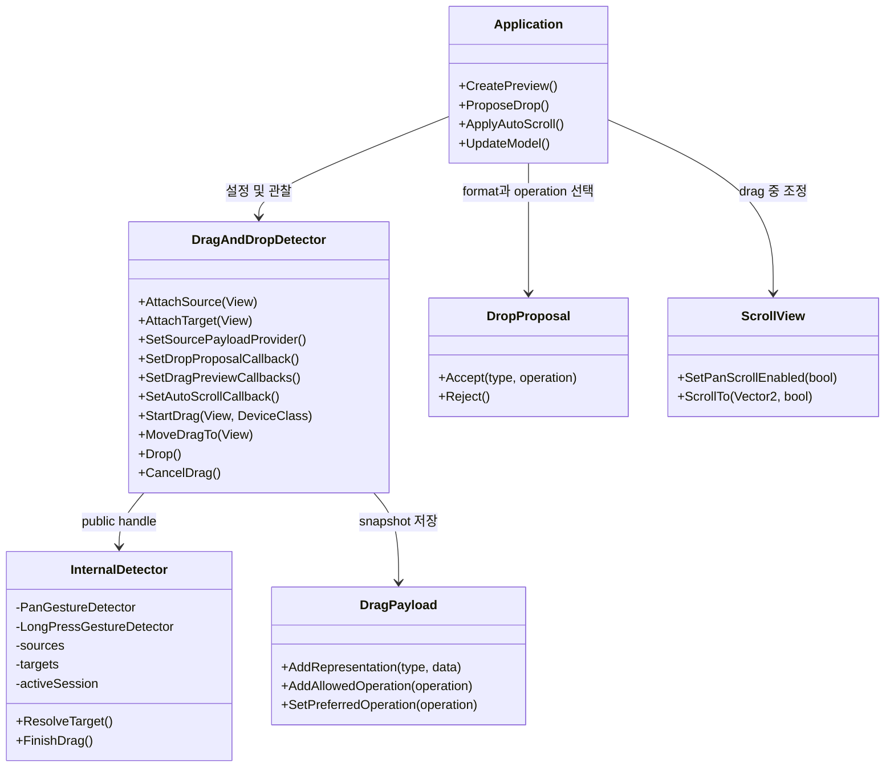

# DALi UI Foundation - In-Scene Drag and Drop

[→ English](https://github.sec.samsung.net/NUI/dali-ui/wiki/In-Scene-Drag-and-Drop)

`DragAndDropDetector`는 같은 DALi scene과 window 안의 `View` 사이에서
drag-and-drop을 구현합니다. pointer gesture, keyboard/접근성 explicit session,
custom preview, payload 기반 target 수락, edge auto-scroll을 지원합니다.

이 기능은 window 또는 process 사이에서 데이터를 전달하는 플랫폼 drag-and-drop
프로토콜과는 다릅니다.

---

## 목차

1. [아키텍처](#1-아키텍처)
2. [기본 설정](#2-기본-설정)
3. [활성화](#3-활성화)
4. [복수 Payload Representation과 Drop Proposal](#4-복수-payload-representation과-drop-proposal)
5. [Custom Drag Preview](#5-custom-drag-preview)
6. [Lifecycle과 Feedback](#6-lifecycle과-feedback)
7. [ScrollView와 Edge Auto-Scroll](#7-scrollview와-edge-auto-scroll)
8. [Keyboard와 접근성 Session](#8-keyboard와-접근성-session)
9. [취소와 정리](#9-취소와-정리)
10. [Sample 테스트](#10-sample-테스트)
11. [API 요약](#11-api-요약)

---

## 1. 아키텍처

detector는 input 인식과 drag session 상태를 소유하고, application은 표현과 제품
정책을 소유합니다.



책임은 다음과 같이 구분됩니다.

| Detector 책임 | Application 책임 |
|---|---|
| Pan/long-press 인식 | Preview 모양과 종료 animation |
| 단일 pointer session lifecycle | Model 변경 또는 item reorder |
| Scene hit-test, proposal 검증, target 순서 | Representation/operation proposal 정책 |
| 좌표 snapshot | Scroll boundary clamp |
| Edge intensity와 timer tick | Keyboard/접근성 traversal과 focus |
| Interruption 감지 | 사용자 메시지와 announcement |

---

## 2. 기본 설정

umbrella header 또는 개별 public header를 include합니다.

```cpp
#include <dali-ui-foundation/dali-ui-foundation.h>
#include <utility>

using namespace Dali;
using namespace Dali::Ui;
```

detector를 만들고 source와 target을 독립적으로 등록합니다.

```cpp
DragAndDropDetector detector = DragAndDropDetector::New();

View source = View::New();
View target = View::New();

detector.AttachSource(source);
detector.AttachTarget(target);
```

하나의 View가 source와 target 역할을 모두 할 수도 있습니다.

```cpp
detector.AttachSourceAndTarget(source);
```

detector는 등록된 View의 handle을 유지합니다. 기능에서 제외할 때는 명시적으로
등록을 제거합니다.

```cpp
detector.DetachSource(source);
detector.DetachTarget(target);
// active drag를 취소하고 모든 등록 제거
detector.DetachAll();
```

등록된 target이 잠시 scene에서 빠져도 등록 자체는 유지됩니다. scene에 연결되고,
visible/sensitive/enabled이며 ignored 상태가 아니고 source와 같은 window에 있을
때만 target으로 선택됩니다.

### 2.1 최소 End-to-End 구현

아래 controller는 실제 구현에 필요한 최소 흐름을 모두 포함합니다. Source/target
등록, pickup data 설정, target filter, drop 시 선택 data 적용, 모든 종료 경로의 UI
정리를 한 곳에서 확인할 수 있습니다.

```cpp
class ProductDragController : public ConnectionTracker
{
public:
  void Initialize(View source, View target)
  {
    mSource   = source;
    mTarget   = target;
    mDetector = DragAndDropDetector::New();

    mDetector.SetDragActivationMode(DragActivationMode::LONG_PRESS);
    mDetector.SetDragStartThreshold(0.0f);

    mDetector.AttachSource(mSource);
    DragPayload payload{
      "application/x-my-product-item",
      Property::Value(42),
      DragAndDropOperation::MOVE};
    payload.AddRepresentation("text/plain", Property::Value("Product 42"));
    payload.AddAllowedOperation(DragAndDropOperation::COPY);
    mDetector.SetSourcePayload(mSource, std::move(payload));

    mDetector.AttachTarget(mTarget);
    mDetector.SetDropProposalCallback(
      mTarget,
      DragAndDropDetector::DropProposalCallback::New(
        this,
        &ProductDragController::ProposeDrop));

    mDetector.DroppedSignal().Connect(
      this,
      &ProductDragController::OnDropped);
    mDetector.EndedSignal().Connect(
      this,
      &ProductDragController::OnEnded);
  }

private:
  DropProposal ProposeDrop(const DragAndDropEvent& event)
  {
    Property::Value data;
    int32_t itemId = -1;
    const DragPayload& payload = event.GetPayload();
    const bool canMove =
      payload.GetRepresentationData(
        "application/x-my-product-item", data) &&
      data.Get(itemId) &&
      payload.IsOperationAllowed(DragAndDropOperation::MOVE) &&
      CanMoveItem(itemId, event.GetCandidateTarget());

    return canMove
             ? DropProposal::Accept(
                 "application/x-my-product-item",
                 DragAndDropOperation::MOVE)
             : DropProposal::Reject();
  }

  void OnDropped(const DragAndDropEvent& event, DragAndDropDetector)
  {
    Property::Value data;
    int32_t itemId = -1;
    if(event.GetTarget() == mTarget &&
       event.GetDropProposal().GetOperation() ==
         DragAndDropOperation::MOVE &&
       event.GetSelectedRepresentationData(data) &&
       data.Get(itemId))
    {
      MoveItemInModel(itemId, mTarget, event.GetTargetLocalPosition());
    }
  }

  void OnEnded(const DragAndDropEvent&, DragAndDropDetector)
  {
    // Source opacity, target highlight, parent scroll을 여기서 복구합니다.
  }

  DragAndDropDetector mDetector;
  View                mSource;
  View                mTarget;
};
```

`CanMoveItem()`과 `MoveItemInModel()`은 application 함수입니다. Detector는 operation을
협상하지만 application model data를 직접 복사·삭제·reorder하지 않습니다.

---

## 3. 활성화

### 3.1 Long press

스크롤 가능한 collection 안에서 item을 옮길 때는 long press가 일반 scroll과 가장
명확하게 구분됩니다.

```cpp
detector.SetDragActivationMode(DragActivationMode::LONG_PRESS);
detector.SetDragStartThreshold(0.0f);
```

hold 시간은 platform long-press recognizer가 결정합니다. 추가 threshold가 0이면
long press가 인식되는 즉시 session과 preview가 만들어져 pointer를 움직이지 않아도
보입니다.

### 3.2 Pan

움직임이 인식되는 즉시 drag를 시작하려면 pan activation을 사용합니다.

```cpp
detector.SetDragActivationMode(DragActivationMode::PAN);
detector.SetDragStartThreshold(48.0f);
```

추가 threshold는 activation 시작 위치로부터 screen pixel 단위로 계산됩니다.
DALi recognizer 자체의 platform threshold는 별도로 적용될 수 있습니다.

### 3.3 Device별 설정

input class별로 기본 설정을 덮어쓸 수 있습니다.

```cpp
detector.SetDragActivationMode(DragActivationMode::LONG_PRESS);
detector.SetDragStartThreshold(0.0f);

detector.SetDragActivationConfiguration(
  Device::Class::MOUSE,
  {DragActivationMode::LONG_PRESS, 0.0f});
detector.SetDragActivationConfiguration(
  Device::Class::TOUCH,
  {DragActivationMode::LONG_PRESS, 0.0f});
```

일부 desktop adaptor는 mouse를 `Device::Class::NONE`으로 보고합니다. `MOUSE`
override에만 의존하지 말고 기본 설정도 mouse 정책과 일치시키는 것이 안전합니다.

### 3.4 Application 승인

내장 mode와 threshold가 충족된 뒤 application callback에서 최종 승인을 할 수
있습니다.

```cpp
bool MyView::ApproveDrag(const DragActivationEvent& event)
{
  return IsItemDraggable(event.GetSource(), event.GetPayload());
}

detector.SetCanStartDragCallback(
  DragAndDropDetector::CanStartDragCallback::New(
    this,
    &MyView::ApproveDrag));
```

`false`를 반환하면 activation pending 상태를 유지하며 다음 pan update에서 다시
평가할 수 있습니다. callback은 짧게 유지합니다.

---

## 4. 복수 Payload Representation과 Drop Proposal

source를 등록한 뒤 type이 명시된 payload를 설정합니다. session 시작 시 전체 값이
복사되므로 active drag는 안정적인 snapshot을 봅니다.

```cpp
detector.AttachSource(item);
detector.SetSourcePayload(
  item,
  {"application/x-my-product-item",
   Property::Value(itemId),
   DragAndDropOperation::MOVE});
```

하나의 payload는 같은 논리 item을 여러 representation으로 제공할 수 있습니다.
representation 순서는 source의 선호 순서이며, 같은 type을 다시 추가하면 순서는
유지하고 data만 교체합니다. Format 식별자는 application이 정의하며 MIME 형태를
권장합니다. `Property::Value`에는 scalar, string, array, map을 넣을 수 있습니다.

```cpp
DragPayload payload{
  "application/x-my-product-item",
  Property::Value(itemId),
  DragAndDropOperation::MOVE};
payload.AddRepresentation("text/plain", Property::Value(displayName));
payload.AddAllowedOperation(DragAndDropOperation::COPY);
detector.SetSourcePayload(item, std::move(payload));
```

생성자에 지정한 `NONE`이 아닌 operation은 preferred이면서 allowed operation이
됩니다. Target이 다른 operation도 선택할 수 있게 하려면
`AddAllowedOperation()`을 사용합니다. Format은 `GetRepresentationCount()`,
`GetRepresentationType()`, `HasRepresentation()`,
`GetRepresentationData()`로 조회합니다. 화면 위치보다 안정적인 model 식별자를
payload로 사용하는 것이 좋습니다.

`SetSourcePayload()`는 payload를 value로 받습니다. 소유권에 따라 호출 방식을
선택합니다.

```cpp
detector.SetSourcePayload(item, payload);            // Deep copy; payload 계속 사용 가능
detector.SetSourcePayload(item, std::move(payload)); // Ownership 전달; 이후 payload 조회 금지
detector.SetSourcePayload(
  item,
  DragPayload{"text/plain", Property::Value("hello")}); // Temporary는 자동 move
```

`std::move`는 필수가 아닙니다. Named payload 구성을 마쳤고 호출자가 더 이상
사용하지 않을 때 유용합니다. Move된 drag-and-drop value object는 파괴하거나 새
값을 대입한 뒤에만 다시 사용해야 합니다.

### 4.1 데이터 모델 요약

`DragPayload`는 논리적으로 하나의 drag item을 나타내며 format별로 하나의 값을
저장합니다.

| 개념 | 계약 |
|---|---|
| 복수 format | MIME 형태의 type마다 representation 하나 추가 |
| 하나의 type | `Property::Value` 하나를 저장하며 같은 type을 다시 추가하면 data 교체 |
| 한 type의 복수 값 | 하나의 `Property::Array` 또는 `Property::Map` 안에 묶어서 저장 |
| Target 선택 | `DropProposalCallback`에서 선택 type과 operation 반환 |
| Drop data | `GetSelectedRepresentationData()`로 선택된 값 조회 |

예를 들어 image item 하나가 metadata, DALi resource URL, text 설명을 동시에
제공할 수 있습니다. Image target은 application URL 계약을 선택하고 text target은
`text/plain`을 선택할 수 있습니다.

```text
DragPayload
  ├─ application/x-image-metadata          → Property::Map
  ├─ application/x-dali-image-resource-url → DALi resource URL
  └─ text/plain                            → description
                ↓ target proposal
       DropProposal("application/x-dali-image-resource-url", COPY)
                ↓ drop event
       GetSelectedRepresentationData()
```

Format 문자열은 source View의 모양이 아니라 `Property::Value`의 의미와 encoding을
설명해야 합니다. 예를 들어 `image/svg+xml`은 file path나 DALi resource URL이 아닌
직렬화된 SVG data를 의미해야 합니다. URI-list 규약을 따르는 data에는
`text/uri-list`를 사용하고, process 내부 DALi resource URL에는
`application/x-dali-image-resource-url` 같은 application type을 사용합니다.
Source와 target은 값의 구체적인 `Property::Type`에도 합의해야 합니다.

같은 type을 반복해서 추가해도 두 item이 만들어지지 않습니다.

```cpp
payload.AddRepresentation("text/plain", Property::Value("first"));
payload.AddRepresentation("text/plain", Property::Value("second"));
// 이제 "text/plain"에는 "second"가 저장됩니다.
```

하나의 application format으로 여러 값을 전달하려면 명시적으로 묶습니다.

```cpp
Property::Array itemIds;
itemIds.PushBack(10);
itemIds.PushBack(20);
payload.AddRepresentation(
  "application/x-item-id-list",
  Property::Value(itemIds));
```

이 API는 같은 process의 in-scene drag를 위한 것입니다. Drag가 시작되면 payload
전체가 안정적인 session snapshot으로 복사됩니다. 데이터를 직렬화하지 않고,
운영체제에 type을 등록하거나 검증하지 않으며, URI 권한 부여 또는 lazy/비동기 data
전송도 제공하지 않습니다. MIME 형태의 이름은 application 간 계약을 알아보기 쉽게
하기 위한 권장 형식입니다.

Payload, configuration, event 객체는 구현을 숨긴 ABI-stable value type입니다.
Payload와 configuration은 생성자로 만들고 event snapshot은 `Get...()` 메서드로
읽습니다. Event를 복사하면 독립적인 snapshot이 생성됩니다. Getter가 반환한
reference는 소유 value 객체가 살아 있고 다른 값이 대입되지 않은 동안에만
유효합니다.

pickup 순간의 최신 상태로 payload를 만들어야 하면 모든 static payload를 반복해서
고치는 대신 provider를 사용합니다.

```cpp
DragPayload MyView::CreatePayload(const DragActivationEvent& event)
{
  return {"application/x-my-product-item",
          Property::Value(GetCurrentItemId(event.GetSource())),
          DragAndDropOperation::MOVE};
}

detector.SetSourcePayloadProvider(
  item,
  DragAndDropDetector::SourcePayloadProvider::New(
    this,
    &MyView::CreatePayload));
```

provider는 gesture activation 이후, `CanStartDragCallback` 이전에 한 번 호출됩니다.
반환값은 application 승인을 기다리는 동안 유지되며 해당 session에 한해서 static
payload보다 우선합니다.

Allowed operation과 preferred operation은 별도 개념입니다.

| 호출 | 결과 |
|---|---|
| Constructor에 `MOVE` 전달 | `MOVE`를 추가하고 preferred로 지정 |
| `AddAllowedOperation(COPY)` | `COPY` 추가, 중복 호출은 무시 |
| `SetPreferredOperation(COPY)` | 필요하면 `COPY`를 추가하고 preferred로 지정 |
| `SetPreferredOperation(NONE)` | Preferred만 제거 |
| Preferred operation 제거 | 남은 첫 insertion을 preferred로 선택 |
| `ClearAllowedOperations()` | 목록을 비우고 preferred를 `NONE`으로 초기화 |

Allowed-operation 조회 순서는 insertion order입니다. 별도의 두 번째 선호 목록이
아니며 명시적 기본값은 `GetPreferredOperation()`입니다. Valid preference가 없을
때만 첫 allowed operation을 deterministic fallback으로 사용합니다. Invalid enum
값은 저장하지 않고 log를 남깁니다.

### 4.2 Target에서 representation 선택

등록된 target은 기본적으로 모든 drag를 수락하며 payload의 첫 representation과
preferred operation을 선택합니다. Target이 format과 operation을 선택해야 하면
proposal callback을 지정합니다.

```cpp
DropProposal MyView::ProposeDrop(const DragAndDropEvent& event)
{
  Property::Value itemData;
  if(!event.GetPayload().GetRepresentationData(
       "application/x-my-product-item", itemData) ||
     !event.GetPayload().IsOperationAllowed(DragAndDropOperation::MOVE))
  {
    return DropProposal::Reject();
  }

  int32_t itemId = -1;
  itemData.Get(itemId);
  return CanMoveItemTo(itemId, event.GetCandidateTarget())
           ? DropProposal::Accept("application/x-my-product-item",
                                  DragAndDropOperation::MOVE)
           : DropProposal::Reject();
}

detector.AttachTarget(target);
detector.SetDropProposalCallback(
  target,
  DragAndDropDetector::DropProposalCallback::New(
    this,
    &MyView::ProposeDrop));
```

detector는 layer, transform, hierarchy, clipping을 포함한 DALi scene hit-test
순서대로 겹친 target을 평가합니다. 맨 위 target이 거절하거나 존재하지 않는
format/operation을 proposal하면 그 뒤에 겹친 target을 계속 검사하고, 첫 valid
accepted proposal을 실제 drop target으로 선택합니다.

proposal callback은 event thread에서 동기 실행됩니다. callback 안에서 source나
target 등록을 변경하지 말고 오래 걸리는 작업을 피합니다.

Callback event는 candidate snapshot입니다. `event.GetCandidateTarget()`이 현재
평가할 target이고, callback 반환값을 detector가 검증하기 전까지 drop proposal은
의도적으로 rejected 상태입니다. Candidate data는
`GetSelectedRepresentationData()`가 아니라 `event.GetPayload()`로 확인합니다.

인자 없는 `DropProposal::Accept()`는 detector 기본 선택을 요청합니다. Accepted
lifecycle event에서는 정규화된 선택을 `event.GetDropProposal()`로 확인합니다.
Candidate 평가 event와 rejected feedback event의 proposal은 rejected 상태입니다.
`event.GetSelectedRepresentationData()`를 사용하면 proposal type을 다시 꺼내지 않고
선택된 data를 바로 복사할 수 있습니다. Proposal이 rejected이거나 선택
representation이 없으면 `false`를 반환하고 output은 변경하지 않습니다.

| Target 반환값 | Detector 결과 |
|---|---|
| `Reject()` | 다음으로 겹친 target 평가 |
| `Accept()` | 첫 representation + preferred operation과 deterministic fallback |
| `Accept(type, NONE)` | 명시적 type + preferred/fallback operation |
| `Accept({}, operation)` | 첫 representation + 명시적 allowed operation |
| 없는 type 또는 허용되지 않은 operation | 해당 target reject |

Callback을 설정하지 않은 target은 `Accept()`와 같아서 geometry상 eligible한 모든
drag를 수락합니다. 단순 target에는 편리하지만 특정 data만 처리하는 제품 target은
항상 proposal callback을 설치하고 representation의 `Property::Type`과 operation을
모두 검증해야 합니다.

`event.GetTargetLocalPosition()`은 pointer를 현재 target 또는 candidate target 좌표계로
변환한 값입니다. application에서 좌표 변환을 반복하지 않고 삽입 위치, drop zone,
local feedback에 사용할 수 있습니다.

---

## 5. Custom Drag Preview

### 5.1 Session별 preview callback

drag마다 별도 preview가 필요하면 factory, updater, 선택적 finalizer를 사용합니다.

```cpp
View MyView::CreatePreview(const DragAndDropEvent& event)
{
  View preview = View::New();
  const Vector3 size =
    event.GetSource().GetCurrentProperty<Vector3>(Actor::Property::SIZE);

  preview.SetRequestedWidth(size.x);
  preview.SetRequestedHeight(size.y);
  preview.SetLayoutMode(LayoutMode::STANDALONE);
  preview.SetUiScalePolicy(UiScalePolicy::DISABLED);
  preview.SetParentOrigin(ParentOrigin::TOP_LEFT);
  preview.SetPositionUsesPivotEnabled(true);
  preview.SetSensitive(false);
  preview.SetBackgroundColor(UiColor(0.2f, 0.6f, 1.0f, 0.7f));
  return preview; // parent가 없는 View를 반환합니다.
}

void MyView::UpdatePreview(View preview, const DragAndDropEvent& event)
{
  preview.SetPivot(
    Vector3(event.GetSourceAnchor().x, event.GetSourceAnchor().y, 0.5f));
  preview.SetRequestedX(event.GetPreviewLocalPosition().x);
  preview.SetRequestedY(event.GetPreviewLocalPosition().y);
}

void MyView::FinalizePreview(View preview, const DragAndDropEvent& event)
{
  // 이 시점에는 detector가 preview를 parent에서 제거했습니다.
  // 앱이 종료 animation을 소유한다면 다른 overlay에 다시 추가할 수 있습니다.
}

detector.SetDragPreviewCallbacks(
  DragAndDropDetector::DragPreviewFactory::New(
    this, &MyView::CreatePreview),
  DragAndDropDetector::DragPreviewUpdater::New(
    this, &MyView::UpdatePreview),
  DragAndDropDetector::DragPreviewFinalizer::New(
    this, &MyView::FinalizePreview));
```

factory는 activation 때 한 번 호출됩니다. preview가 필요 없는 session은 empty `View`를
반환할 수 있습니다. updater는 즉시 호출되므로 long-press preview가 pointer 이동
전에 표시됩니다. factory가 이미 parent에 연결된 View를 반환하면 detector는 계약
위반을 로그로 남기고 해당 session을 preview 없이 계속합니다.

### 5.2 Scene-level overlay

`ScrollView`나 다른 ancestor의 clipping을 피하려면 scene-level overlay에 preview를
배치합니다.

```cpp
View dragOverlay = View::New();
dragOverlay.SetSensitive(false);
root.Add(dragOverlay);

detector.SetDragPreviewContainer(dragOverlay);
```

`previewLocalPosition`은 설정한 container 좌표로 이미 변환된 pointer 위치입니다.
`sourceAnchor`는 source 안에서 grab한 지점을 정규화한 값입니다. 두 값을 함께 쓰면
source와 overlay의 scale/rotation이 달라도 preview의 grab point가 pointer에
붙어 있습니다.

### 5.3 단순한 방법

하나의 detached View를 반복 사용하려면 다음 API를 사용합니다.

```cpp
detector.SetDragPreview(reusablePreview);
```

updater나 `DragPreviewPositionSignal`이 없으면 detector가 anchor-aware 기본 위치를
적용하고 session 종료 시 reusable View의 원래 layout 속성을 복구합니다.

preview API를 모두 설정하지 않으면 preview가 없는 headless session으로 동작합니다.

---

## 6. Lifecycle과 Feedback

연결 수명보다 오래 유지되는 객체에서 lifecycle signal을 연결합니다.

```cpp
detector.StartedSignal().Connect(this, &MyView::OnDragStarted);
detector.EnteredSignal().Connect(this, &MyView::OnTargetEntered);
detector.MovedSignal().Connect(this, &MyView::OnTargetMoved);
detector.ExitedSignal().Connect(this, &MyView::OnTargetExited);
detector.DroppedSignal().Connect(this, &MyView::OnDropped);
detector.CancelledSignal().Connect(this, &MyView::OnCancelled);
detector.TargetFeedbackChangedSignal().Connect(
  this, &MyView::OnTargetFeedback);
detector.EndedSignal().Connect(this, &MyView::OnDragEnded);
```

정상 drop 순서는 다음과 같습니다.

```text
Started
  → [Entered → Moved ... → Exited ...]
  → Dropped
  → TargetFeedbackChanged(NONE)
  → preview finalizer
  → Ended
```

모든 lifecycle signal은 동일한 event snapshot 형태를 전달합니다.

```cpp
void MyView::OnDropped(
  const DragAndDropEvent& event,
  DragAndDropDetector)
{
  int32_t itemId = -1;
  Property::Value itemData;
  if(event.GetSelectedRepresentationData(itemData) && itemData.Get(itemId))
  {
    MoveItemInModel(itemId, event.GetTarget(), event.GetTargetLocalPosition());
  }
}
```

detector의 query state가 정리된 `EndedSignal`에서도 event 자체는 source, target,
payload를 유지합니다. `result`는 `DROPPED`, `CANCELLED`, `NO_TARGET` 중 하나이며
취소인 경우 `cancelReason`으로 원인을 구분합니다.

Accepted `DropProposal`은 해당 snapshot에서 target이 eligible했다는 의미이지 drop
완료 증거가 아닙니다. 예를 들어 accepted target 위에서 cancel하면 cleanup과
feedback을 위해 concrete proposal이 유지됩니다. Application model은
`DroppedSignal`에서만 변경하거나
`event.GetResult() == DragAndDropResult::DROPPED`를 확인한 뒤 변경합니다.

signal callback은 event를 `const` reference로 받습니다. source 또는 target `View`를
수정하려면 아래 scroll 예제처럼 lightweight handle을 먼저 복사한 뒤
(`View source = event.GetSource()`) 그 handle의 속성을 변경합니다.

`TargetFeedbackChangedSignal` 상태는 다음 의미입니다.

| 상태 | 의미 |
|---|---|
| `ACCEPTED` | `candidateTarget`이 현재 drop target |
| `REJECTED` | 등록 target과 겹치지만 수락하는 target이 없음 |
| `NONE` | 등록 target과 겹치지 않거나 feedback 정리 중 |

accepted/rejected highlight에 이 signal을 사용하고 `NONE`에서 항상 UI feedback을
초기화합니다.

---

## 7. ScrollView와 Edge Auto-Scroll

child가 처음 touch를 consume해도 parent `ScrollView`는 pan threshold 이후의 motion을
intercept할 수 있습니다. active drag 동안 parent pan scroll을 중지합니다.

```cpp
void MyView::OnDragStarted(
  const DragAndDropEvent& event,
  DragAndDropDetector)
{
  View source = event.GetSource();
  scrollView.SetPanScrollEnabled(false);
  source.SetOpacity(0.35f);
}

void MyView::OnDragEnded(
  const DragAndDropEvent& event,
  DragAndDropDetector)
{
  View source = event.GetSource();
  scrollView.SetPanScrollEnabled(true);
  source.SetOpacity(1.0f);
}
```

`SetPanScrollEnabled(false)`는 touch/mouse pan scroll을 막고 진행 중인 pan을 fling
없이 종료합니다. `ScrollTo()` 같은 programmatic API는 계속 사용할 수 있습니다.

detector에 edge auto-scroll을 설정합니다.

```cpp
const DragAutoScrollConfiguration config(
  scrollView,
  Vector2(0.0f, 56.0f),
  Vector2(0.0f, 480.0f),
  16u);

detector.SetAutoScrollCallback(
  config,
  DragAndDropDetector::AutoScrollCallback::New(
    this,
    &MyView::ApplyAutoScroll));
```

제안된 delta를 실제 content 범위로 clamp해 적용합니다.

```cpp
bool MyView::ApplyAutoScroll(const DragAutoScrollEvent& event)
{
  const Vector2 before = scrollView.GetScrollPosition();
  const Vector2 next(
    before.x,
    std::clamp(before.y + event.GetSuggestedDelta().y,
               0.0f,
               maximumScrollY));

  if(next == before)
  {
    return false; // boundary에 도달했으므로 tick 중지
  }

  scrollView.ScrollTo(next, false);
  return true; // geometry가 바뀌었으므로 pointer 위치에서 target 재판정
}
```

이 조합은 다음 정책을 만듭니다.

- viewport 중앙에서 drag하면 collection이 스크롤되지 않습니다.
- pointer가 상단/하단 edge 영역에 들어가면 timer 기반 scroll이 시작됩니다.
- pointer를 추가로 움직이지 않아도 scroll이 계속됩니다.
- edge 영역을 벗어나거나 boundary에 도달하면 멈춥니다.

---

## 8. Keyboard와 접근성 Session

explicit drag session은 pointer 없이도 payload, acceptance, feedback,
preview와 terminal lifecycle을 그대로 재사용합니다.

```cpp
if(detector.StartDrag(source, Device::Class::KEYBOARD))
{
  // traversal 순서는 application이 소유합니다.
  detector.MoveDragTo(nextTarget);
}

// 다시 activate하여 drop
const bool dropped = detector.Drop();

// Escape 또는 Back
detector.CancelDrag();
```

callback event에서 session origin을 구분할 수 있습니다.

```cpp
if(event.GetSessionOrigin() ==
   DragSessionOrigin::EXPLICIT)
{
  // keyboard/accessibility focus 정책 적용
}
```

detector는 collection 순서를 선택하거나 focus를 이동하지 않습니다. application은
다음 정책을 제공해야 합니다.

- 논리 item 수와 traversal 순서
- 논리 위치에서 등록 target `View`를 찾는 resolver
- focus 이동과 복구
- 현지화된 picked-up, target, dropped, cancelled announcement
- pointer drop과 동일한 model mutation

`samples/in-scene-drag-and-drop/drag-session-controller.h`는 이 책임을 보여주는
재사용 가능한 reference policy입니다. example application은 keyboard traversal을
직접 구현하며 접근성 action과 announcement 경로를 포함하지 않습니다. 제품에서는
같은 explicit-session API 위에 해당 정책을 별도로 추가할 수 있습니다. 이
controller는 foundation public API가 아닙니다.

---

## 9. 취소와 정리

active session은 다음 취소 사유를 보고할 수 있습니다.

| 취소 사유 | 일반적인 원인 |
|---|---|
| `GESTURE_INTERRUPTED` | Pan cancel 또는 두 번째 touch |
| `SOURCE_DISCONNECTED` | Source가 scene에서 제거됨 |
| `PREVIEW_CONTAINER_DISCONNECTED` | Preview overlay가 scene에서 제거됨 |
| `WINDOW_FOCUS_LOST` | Source window가 focus를 잃음 |
| `REGISTRATION_REMOVED` | Active source 또는 모든 등록 제거 |
| `REQUESTED` | `CancelDrag()` |

취소 순서는 다음과 같습니다.

```text
[Exited]
  → Cancelled
  → TargetFeedbackChanged(NONE)
  → preview finalizer
  → Ended
```

accepted target이 없는 상태에서 release하는 것은 cancel이 아니라 `NO_TARGET`입니다.
`DroppedSignal`과 `CancelledSignal`은 발생하지 않지만 preview finalizer와
`EndedSignal`은 실행됩니다.

source opacity 복구와 `ScrollView` pan 재활성화처럼 모든 종료 경로에 공통인 정리는
`EndedSignal`에서 처리합니다. 다음 drag가 필요하면 callback 반환 뒤에 시작하도록
schedule해야 하며, `EndedSignal` 안의 재진입 start는 거절됩니다.

---

## 10. Sample 테스트

sample은 기존 platform/window drag-and-drop sample과 별도 폴더에 있습니다.

```text
samples/in-scene-drag-and-drop/
├── drag-session-controller.h
├── in-scene-drag-and-drop-example.cpp
├── in-scene-image-drop-example.cpp
├── res/
│   └── source-image.svg
└── CMakeLists.txt
```

### Card reorder sample

`in-scene-drag-and-drop.example`의 수동 테스트 항목:

| 입력 | 기대 동작 |
|---|---|
| Mouse/touch long press | 이동 전 custom preview 표시 |
| 인접 card 위로 drag | 녹색 accepted feedback |
| 인접하지 않은 card 위로 drag | 빨간색 rejected feedback |
| Viewport 중앙에서 drag | Preview만 이동하고 content는 고정 |
| 상단/하단 edge에서 유지 | Edge-only auto-scroll |
| Accepted card에서 release | Card reorder |
| `M` | Long-press 정책과 pan + threshold mode 전환 |
| `K` | Keyboard explicit drag 시작/drop |
| 방향키 | 선택 card 또는 keyboard drag target 이동 |
| `Esc` / `Back` | Active session 취소 |

sample은 같은 모양에 고유 색상과 `Card N` label을 가진 8개 item, transform된
scene-level preview overlay, payload 기반 인접 target 수락, pickup 시점 payload
생성, 명시적 keyboard-session payload, keyboard focus 복구를 함께 보여줍니다.

### Image source-to-target sample

`in-scene-image-drop.example`은 source와 target 역할을 분리합니다. Mouse 또는
touch로 source 이미지를 long press해서 custom image preview가 표시되면 target
위로 drag한 뒤 release합니다. 수락 가능한 동안 target이 녹색으로 표시되고,
drop 후에는 source 이미지가 target에 나타납니다. Target 밖에서 release하면
target은 변경되지 않습니다. Source는 의도적으로 metadata + `LINK`를 첫 번째로,
DALi image resource URL + `COPY`를 두 번째로 제공합니다. URL 값은 직렬화된
`image/svg+xml` bytes가 아니라 DALi resource path이므로
`application/x-dali-image-resource-url` application 계약을 사용합니다. Target
proposal은 두 번째 representation과 non-preferred `COPY` operation을 선택하며
status label에서 그 concrete 선택을 확인할 수 있습니다. Session별 `ImageView`
preview 생성과 `DroppedSignal`에서의 application state 갱신도 함께 검증할 수
있습니다.

---

## 11. API 요약

### 등록과 payload

| API | 목적 |
|---|---|
| `AttachSource`, `DetachSource` | Drag source 관리 |
| `AttachTarget`, `DetachTarget` | Drop target 관리 |
| `AttachSourceAndTarget`, `DetachSourceAndTarget` | 두 역할 동시 관리 |
| `DetachAll` | 필요하면 cancel하고 모든 등록 제거 |
| `SetSourcePayload`, `ClearSourcePayload` | Source data 설정 |
| `SetSourcePayloadProvider`, `ClearSourcePayloadProvider` | Pickup 시점 data 생성 |
| `GetAttachedSource/Target...` | 등록 상태 조회 |

### 활성화와 session control

| API | 목적 |
|---|---|
| `SetDragActivationMode` | 기본 PAN 또는 LONG_PRESS 선택 |
| `SetDragStartThreshold` | 추가 이동 조건 |
| `SetDragActivationConfiguration` | Device class별 override |
| `SetCanStartDragCallback` | Application 승인 정책 |
| `StartDrag`, `MoveDragTo` | Explicit session 진행 |
| `Drop`, `CancelDrag` | Session 종료 |

### Visual, target, scroll 정책

| API | 목적 |
|---|---|
| `SetDropProposalCallback` | Target별 representation과 operation 선택 |
| `SetDragPreview` | Detached preview 하나 재사용 |
| `SetDragPreviewCallbacks` | Session별 preview 생성/update/finalize |
| `SetDragPreviewContainer` | Preview overlay 지정 |
| `SetAutoScrollCallback` | Edge scroll 제안 적용 |
| `ScrollView::SetPanScrollEnabled` | Parent pan intercept 일시 중지 |

### 상태와 event

| API | 목적 |
|---|---|
| `IsDragActivationPending`, `IsDragging` | Lifecycle 상태 조회 |
| `GetDragSessionOrigin` | Gesture/explicit session 구분 |
| `GetDragSource`, `GetDragTarget`, `GetDragPayload` | Session data 조회 |
| `DragAndDropEvent` | 안정적인 source, target, 좌표, payload, proposal, 결과 |
| `Started`, `Entered`, `Moved`, `Exited`, `Dropped`, `Cancelled`, `Ended` | Event 기반 lifecycle signal |
| `TargetFeedbackChangedSignal` | Accepted/rejected/none feedback |

---

## 참고 문서

- [Touch & Gesture](https://github.sec.samsung.net/NUI/dali-ui/wiki/Touch-&-Gesture-(kr))
- [ScrollView](https://github.sec.samsung.net/NUI/dali-ui/wiki/ScrollView-(kr))
- [Accessibility](https://github.sec.samsung.net/NUI/dali-ui/wiki/Accessibility-(kr))

<br/>

---

[← 목록으로](https://github.sec.samsung.net/NUI/dali-ui/wiki/Home-(kr)#development-guides)
