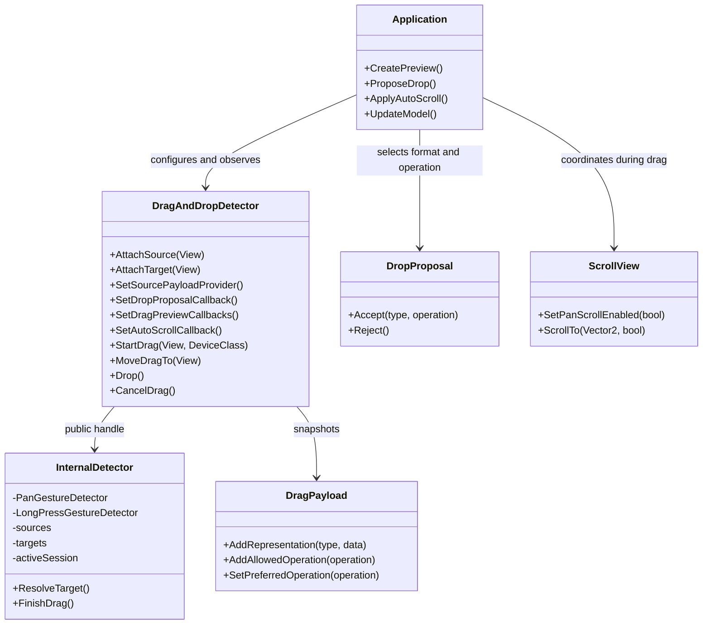

# DALi UI Foundation - In-Scene Drag and Drop

[→ 한국어 문서](https://github.sec.samsung.net/NUI/dali-ui/wiki/In-Scene-Drag-and-Drop-(kr))

`DragAndDropDetector` implements drag and drop between `View` objects in the
same DALi scene and window. It supports pointer gestures, explicitly started
keyboard or accessibility sessions, custom previews, payload-based target
acceptance, and edge auto-scroll.

This is not the platform drag-and-drop protocol used to transfer data between
windows or processes.

---

## Table of Contents

1. [Architecture](#1-architecture)
2. [Basic Setup](#2-basic-setup)
3. [Activation](#3-activation)
4. [Payload Representations and Drop Proposal](#4-payload-representations-and-drop-proposal)
5. [Custom Drag Preview](#5-custom-drag-preview)
6. [Lifecycle and Feedback](#6-lifecycle-and-feedback)
7. [ScrollView and Edge Auto-Scroll](#7-scrollview-and-edge-auto-scroll)
8. [Keyboard and Accessibility Sessions](#8-keyboard-and-accessibility-sessions)
9. [Cancellation and Cleanup](#9-cancellation-and-cleanup)
10. [Testing the Sample](#10-testing-the-sample)
11. [API Summary](#11-api-summary)

---

## 1. Architecture

The detector owns input recognition and drag session state. The application
owns presentation and product policy.



The division of responsibility is:

| Detector owns | Application owns |
|---|---|
| Pan and long-press recognition | Preview appearance and finish animation |
| One-pointer session lifecycle | Data model mutation or item reorder |
| Scene hit-testing, proposal validation, and target order | Representation and operation proposal policy |
| Coordinate snapshots | Scroll boundary clamping |
| Edge intensity and timer ticks | Keyboard/accessibility traversal and focus |
| Interruption detection | User-facing messages and announcements |

---

## 2. Basic Setup

Include the umbrella header or the individual public header.

```cpp
#include <dali-ui-foundation/dali-ui-foundation.h>
#include <utility>

using namespace Dali;
using namespace Dali::Ui;
```

Create one detector and register sources and targets independently.

```cpp
DragAndDropDetector detector = DragAndDropDetector::New();

View source = View::New();
View target = View::New();

detector.AttachSource(source);
detector.AttachTarget(target);
```

A view can be both a source and a target:

```cpp
detector.AttachSourceAndTarget(source);
```

The detector keeps handles to registered views. Remove registrations explicitly
when they are no longer part of the feature.

```cpp
detector.DetachSource(source);
detector.DetachTarget(target);
// Or cancel an active drag and remove every registration:
detector.DetachAll();
```

Registered targets may temporarily leave the scene without losing their
registration. They are eligible only while connected, visible, sensitive,
enabled, not ignored, and in the source window.

### 2.1 Minimal end-to-end implementation

The following controller contains the minimum production flow: register a
source and target, configure pickup data, filter the target, apply the selected
data on drop, and restore transient UI state on every terminal path.

```cpp
class ProductDragController : public ConnectionTracker
{
public:
  void Initialize(View source, View target)
  {
    mSource   = source;
    mTarget   = target;
    mDetector = DragAndDropDetector::New();

    mDetector.SetDragActivationMode(DragActivationMode::LONG_PRESS);
    mDetector.SetDragStartThreshold(0.0f);

    mDetector.AttachSource(mSource);
    DragPayload payload{
      "application/x-my-product-item",
      Property::Value(42),
      DragAndDropOperation::MOVE};
    payload.AddRepresentation("text/plain", Property::Value("Product 42"));
    payload.AddAllowedOperation(DragAndDropOperation::COPY);
    mDetector.SetSourcePayload(mSource, std::move(payload));

    mDetector.AttachTarget(mTarget);
    mDetector.SetDropProposalCallback(
      mTarget,
      DragAndDropDetector::DropProposalCallback::New(
        this,
        &ProductDragController::ProposeDrop));

    mDetector.DroppedSignal().Connect(
      this,
      &ProductDragController::OnDropped);
    mDetector.EndedSignal().Connect(
      this,
      &ProductDragController::OnEnded);
  }

private:
  DropProposal ProposeDrop(const DragAndDropEvent& event)
  {
    Property::Value data;
    int32_t itemId = -1;
    const DragPayload& payload = event.GetPayload();
    const bool canMove =
      payload.GetRepresentationData(
        "application/x-my-product-item", data) &&
      data.Get(itemId) &&
      payload.IsOperationAllowed(DragAndDropOperation::MOVE) &&
      CanMoveItem(itemId, event.GetCandidateTarget());

    return canMove
             ? DropProposal::Accept(
                 "application/x-my-product-item",
                 DragAndDropOperation::MOVE)
             : DropProposal::Reject();
  }

  void OnDropped(const DragAndDropEvent& event, DragAndDropDetector)
  {
    Property::Value data;
    int32_t itemId = -1;
    if(event.GetTarget() == mTarget &&
       event.GetDropProposal().GetOperation() ==
         DragAndDropOperation::MOVE &&
       event.GetSelectedRepresentationData(data) &&
       data.Get(itemId))
    {
      MoveItemInModel(itemId, mTarget, event.GetTargetLocalPosition());
    }
  }

  void OnEnded(const DragAndDropEvent&, DragAndDropDetector)
  {
    // Restore source opacity, target highlight, and parent scrolling here.
  }

  DragAndDropDetector mDetector;
  View                mSource;
  View                mTarget;
};
```

`CanMoveItem()` and `MoveItemInModel()` are application functions. The detector
negotiates the operation but never copies, removes, or reorders application
model data itself.

---

## 3. Activation

### 3.1 Long press

For item movement inside a scrollable collection, long press is usually the
least ambiguous choice:

```cpp
detector.SetDragActivationMode(DragActivationMode::LONG_PRESS);
detector.SetDragStartThreshold(0.0f);
```

The platform long-press recognizer supplies the holding time. A threshold of
zero creates the session and its preview as soon as the long press is
recognized, without waiting for pointer movement.

### 3.2 Pan

Use pan activation when drag should begin as soon as movement is recognized:

```cpp
detector.SetDragActivationMode(DragActivationMode::PAN);
detector.SetDragStartThreshold(48.0f);
```

The additional threshold is measured from the activation origin in screen
pixels. The underlying DALi gesture recognizer can still have its own platform
threshold.

### 3.3 Per-device settings

Input classes can override the default:

```cpp
detector.SetDragActivationMode(DragActivationMode::LONG_PRESS);
detector.SetDragStartThreshold(0.0f);

detector.SetDragActivationConfiguration(
  Device::Class::MOUSE,
  {DragActivationMode::LONG_PRESS, 0.0f});
detector.SetDragActivationConfiguration(
  Device::Class::TOUCH,
  {DragActivationMode::LONG_PRESS, 0.0f});
```

Some desktop adaptors report mouse input as `Device::Class::NONE`. Keep the
default configuration aligned with the mouse policy instead of relying only on
the `MOUSE` override.

### 3.4 Application approval

An optional callback can approve activation after the built-in mode and
threshold are satisfied.

```cpp
bool MyView::ApproveDrag(const DragActivationEvent& event)
{
  return IsItemDraggable(event.GetSource(), event.GetPayload());
}

detector.SetCanStartDragCallback(
  DragAndDropDetector::CanStartDragCallback::New(
    this,
    &MyView::ApproveDrag));
```

Returning `false` keeps activation pending and allows the callback to be
evaluated on a later pan update. Keep the callback fast.

---

## 4. Payload Representations and Drop Proposal

Set a typed source payload after registering the source. The complete value is
copied when a session starts, so the active drag sees a stable snapshot.

```cpp
detector.AttachSource(item);
detector.SetSourcePayload(
  item,
  {"application/x-my-product-item",
   Property::Value(itemId),
   DragAndDropOperation::MOVE});
```

One payload can expose the same logical item in several representations.
Representation order expresses source preference, and duplicate types replace
their data without changing that order. Format identifiers are
application-defined; MIME-style strings make contracts easy to recognize.
`Property::Value` can hold a scalar, string, array, or map.

```cpp
DragPayload payload{
  "application/x-my-product-item",
  Property::Value(itemId),
  DragAndDropOperation::MOVE};
payload.AddRepresentation("text/plain", Property::Value(displayName));
payload.AddAllowedOperation(DragAndDropOperation::COPY);
detector.SetSourcePayload(item, std::move(payload));
```

The constructor's non-`NONE` operation becomes both preferred and allowed.
Use `AddAllowedOperation()` when a target may choose another operation. Query
formats with `GetRepresentationCount()`, `GetRepresentationType()`,
`HasRepresentation()`, and `GetRepresentationData()`. Prefer a stable model
identifier rather than using visual position as identity.

`SetSourcePayload()` takes the payload by value. Choose the call form according
to ownership:

```cpp
detector.SetSourcePayload(item, payload);            // Deep copy; keep using payload.
detector.SetSourcePayload(item, std::move(payload)); // Transfer; do not read payload again.
detector.SetSourcePayload(
  item,
  DragPayload{"text/plain", Property::Value("hello")}); // Temporary moves automatically.
```

`std::move` is optional. It is useful after a named payload has been fully
configured and is no longer needed by the caller. A moved-from drag-and-drop
value object may only be destroyed or assigned a new value before reuse.

### 4.1 Data model at a glance

`DragPayload` represents one logical dragged item with one value per format.

| Concept | Contract |
|---|---|
| Multiple formats | Add one representation for each MIME-style type |
| One type | Stores one `Property::Value`; adding the type again replaces its data |
| Multiple values of one type | Store them inside one `Property::Array` or `Property::Map` |
| Target selection | Return the chosen type and operation from `DropProposalCallback` |
| Drop data | Read the chosen value with `GetSelectedRepresentationData()` |

For example, one image item can simultaneously expose metadata, a DALi resource
URL, and a text description. An image target can select the application URL
contract, while a text target can select `text/plain`.

```text
DragPayload
  ├─ application/x-image-metadata          → Property::Map
  ├─ application/x-dali-image-resource-url → DALi resource URL
  └─ text/plain                            → description
                ↓ target proposal
       DropProposal("application/x-dali-image-resource-url", COPY)
                ↓ drop event
       GetSelectedRepresentationData()
```

The format string describes the meaning and encoding of its
`Property::Value`, not the appearance of the source View. For example,
`image/svg+xml` should identify serialized SVG data, not a file path or DALi
resource URL. Use `text/uri-list` for data that follows URI-list semantics, or
an application-specific name such as
`application/x-dali-image-resource-url` for an in-process DALi resource URL.
Both source and target must agree on the value's concrete `Property::Type`.

Adding a duplicate type does not create a second item.

```cpp
payload.AddRepresentation("text/plain", Property::Value("first"));
payload.AddRepresentation("text/plain", Property::Value("second"));
// "text/plain" now contains "second".
```

To carry several values under one application format, group them explicitly.

```cpp
Property::Array itemIds;
itemIds.PushBack(10);
itemIds.PushBack(20);
payload.AddRepresentation(
  "application/x-item-id-list",
  Property::Value(itemIds));
```

This is a same-process, in-scene API. The payload is copied into a stable
session snapshot when the drag starts. It is not serialized, does not register
or validate types with the operating system, does not grant URI permissions,
and does not provide a lazy/asynchronous data transfer mechanism. MIME-style
names are recommended because they make application contracts recognizable.

Payload, configuration, and event objects are ABI-stable value types with
hidden implementations. Construct payload and configuration values with their
constructors, and read event snapshots through `Get...()` methods. Copying an
event creates an independent snapshot. References returned by getters remain
valid only while their owning value object remains alive and has not been
reassigned.

When the data must reflect the state at pickup time, use a provider instead of
rewriting every static payload:

```cpp
DragPayload MyView::CreatePayload(const DragActivationEvent& event)
{
  return {"application/x-my-product-item",
          Property::Value(GetCurrentItemId(event.GetSource())),
          DragAndDropOperation::MOVE};
}

detector.SetSourcePayloadProvider(
  item,
  DragAndDropDetector::SourcePayloadProvider::New(
    this,
    &MyView::CreatePayload));
```

The provider runs once after gesture activation and before
`CanStartDragCallback`. Its return value is retained while application approval
is pending and overrides the static payload for that session only.

Allowed operations and preference are separate concepts:

| Call | Result |
|---|---|
| Constructor with `MOVE` | Adds `MOVE` and makes it preferred |
| `AddAllowedOperation(COPY)` | Appends `COPY`; duplicate additions do nothing |
| `SetPreferredOperation(COPY)` | Adds `COPY` if needed and makes it preferred |
| `SetPreferredOperation(NONE)` | Clears only the preference |
| Remove the preferred operation | First remaining insertion becomes preferred |
| `ClearAllowedOperations()` | Clears the list and resets preference to `NONE` |

The allowed-operation enumeration preserves insertion order. It is not a
second preference list: `GetPreferredOperation()` is the explicit default.
When no valid preference exists, the first inserted allowed operation is the
deterministic fallback. Invalid enum values are ignored and logged rather than
being stored.

### 4.2 Selecting a representation at the target

A registered target accepts all drags by default and receives the payload's
first representation and preferred operation. Install a proposal callback when
the target must select a format and operation:

```cpp
DropProposal MyView::ProposeDrop(const DragAndDropEvent& event)
{
  Property::Value itemData;
  if(!event.GetPayload().GetRepresentationData(
       "application/x-my-product-item", itemData) ||
     !event.GetPayload().IsOperationAllowed(DragAndDropOperation::MOVE))
  {
    return DropProposal::Reject();
  }

  int32_t itemId = -1;
  itemData.Get(itemId);
  return CanMoveItemTo(itemId, event.GetCandidateTarget())
           ? DropProposal::Accept("application/x-my-product-item",
                                  DragAndDropOperation::MOVE)
           : DropProposal::Reject();
}

detector.AttachTarget(target);
detector.SetDropProposalCallback(
  target,
  DragAndDropDetector::DropProposalCallback::New(
    this,
    &MyView::ProposeDrop));
```

The detector evaluates intersected targets in DALi scene hit-test order,
including layers, transforms, hierarchy, and clipping. If the top target
rejects the drag or proposes an unavailable format/operation, it continues to
an intersected target behind it. The first valid accepted proposal becomes the
drop target.

Proposal callbacks are synchronous. Do not change source or target
registration from inside the callback, and avoid expensive work.

The callback event is a candidate snapshot. Therefore
`event.GetCandidateTarget()` identifies the target being evaluated, while its
drop proposal is intentionally rejected until the callback returns and the
detector validates the result. Inspect candidate data through
`event.GetPayload()`, not `GetSelectedRepresentationData()`.

`DropProposal::Accept()` with no arguments requests detector defaults. Accepted
lifecycle events expose the normalized selection through
`event.GetDropProposal()`. Candidate evaluation and rejected feedback events
carry a rejected proposal. `event.GetSelectedRepresentationData()` copies the
selected data directly, so a drop handler does not need to repeat the
proposal-type lookup. It returns `false` and leaves the output unchanged when
the proposal is rejected or the selected representation is missing.

| Target return value | Detector result |
|---|---|
| `Reject()` | Try the next intersected target |
| `Accept()` | First representation + preferred operation, with deterministic fallbacks |
| `Accept(type, NONE)` | Explicit type + preferred/fallback operation |
| `Accept({}, operation)` | First representation + explicit allowed operation |
| Missing type or non-allowed operation | Reject this target |

No callback is equivalent to `Accept()`, so it accepts every geometrically
eligible drag. That default is convenient for an unfiltered target; product
targets that only understand specific data should always install a proposal
callback and validate both the representation's `Property::Type` and the
operation.

`event.GetTargetLocalPosition()` is the pointer converted into the current target
or candidate target. Use it for insertion indices, drop zones, and local
feedback without repeating coordinate conversion in application code.

---

## 5. Custom Drag Preview

### 5.1 Per-session preview callbacks

Use a factory, updater, and optional finalizer when each drag needs its own
preview:

```cpp
View MyView::CreatePreview(const DragAndDropEvent& event)
{
  View preview = View::New();
  const Vector3 size =
    event.GetSource().GetCurrentProperty<Vector3>(Actor::Property::SIZE);

  preview.SetRequestedWidth(size.x);
  preview.SetRequestedHeight(size.y);
  preview.SetLayoutMode(LayoutMode::STANDALONE);
  preview.SetUiScalePolicy(UiScalePolicy::DISABLED);
  preview.SetParentOrigin(ParentOrigin::TOP_LEFT);
  preview.SetPositionUsesPivotEnabled(true);
  preview.SetSensitive(false);
  preview.SetBackgroundColor(UiColor(0.2f, 0.6f, 1.0f, 0.7f));
  return preview; // Return a detached View.
}

void MyView::UpdatePreview(View preview, const DragAndDropEvent& event)
{
  preview.SetPivot(
    Vector3(event.GetSourceAnchor().x, event.GetSourceAnchor().y, 0.5f));
  preview.SetRequestedX(event.GetPreviewLocalPosition().x);
  preview.SetRequestedY(event.GetPreviewLocalPosition().y);
}

void MyView::FinalizePreview(View preview, const DragAndDropEvent& event)
{
  // The detector has already detached preview.
  // Reparent it here if the app owns an asynchronous finish animation.
}

detector.SetDragPreviewCallbacks(
  DragAndDropDetector::DragPreviewFactory::New(
    this, &MyView::CreatePreview),
  DragAndDropDetector::DragPreviewUpdater::New(
    this, &MyView::UpdatePreview),
  DragAndDropDetector::DragPreviewFinalizer::New(
    this, &MyView::FinalizePreview));
```

The factory is called once at activation. It may return an empty `View` for a
preview-less session. The updater is called immediately, so a long-press preview
appears before any pointer movement. If the factory returns an already-parented
View, the detector logs the contract violation and continues that session
without a preview.

### 5.2 Scene-level overlay

Place previews in an overlay to avoid clipping by a `ScrollView` or another
ancestor:

```cpp
View dragOverlay = View::New();
dragOverlay.SetSensitive(false);
root.Add(dragOverlay);

detector.SetDragPreviewContainer(dragOverlay);
```

`previewLocalPosition` is already converted into the configured container's
coordinate space. `sourceAnchor` is the normalized point grabbed inside the
source. Using both keeps the preview attached to the pointer even when the
source and overlay have different scale or rotation.

### 5.3 Simpler alternatives

Use one reusable detached view:

```cpp
detector.SetDragPreview(reusablePreview);
```

If no updater or `DragPreviewPositionSignal` is connected, the detector applies
default anchor-aware positioning and restores the reusable view's original
layout properties when the session ends.

Leave all preview APIs unset for a headless drag session.

---

## 6. Lifecycle and Feedback

Connect lifecycle signals from an object whose lifetime covers the
connections.

```cpp
detector.StartedSignal().Connect(this, &MyView::OnDragStarted);
detector.EnteredSignal().Connect(this, &MyView::OnTargetEntered);
detector.MovedSignal().Connect(this, &MyView::OnTargetMoved);
detector.ExitedSignal().Connect(this, &MyView::OnTargetExited);
detector.DroppedSignal().Connect(this, &MyView::OnDropped);
detector.CancelledSignal().Connect(this, &MyView::OnCancelled);
detector.TargetFeedbackChangedSignal().Connect(
  this, &MyView::OnTargetFeedback);
detector.EndedSignal().Connect(this, &MyView::OnDragEnded);
```

Normal drop order is:

```text
Started
  → [Entered → Moved ... → Exited ...]
  → Dropped
  → TargetFeedbackChanged(NONE)
  → preview finalizer
  → Ended
```

Every lifecycle signal receives the same event snapshot shape:

```cpp
void MyView::OnDropped(
  const DragAndDropEvent& event,
  DragAndDropDetector)
{
  int32_t itemId = -1;
  Property::Value itemData;
  if(event.GetSelectedRepresentationData(itemData) && itemData.Get(itemId))
  {
    MoveItemInModel(itemId, event.GetTarget(), event.GetTargetLocalPosition());
  }
}
```

The event remains self-contained even in `EndedSignal`, after the detector's
query state has been cleared. Its `result` is `DROPPED`, `CANCELLED`, or
`NO_TARGET`; `cancelReason` further identifies cancellation.

An accepted `DropProposal` means that the target was eligible at that snapshot;
it does not prove that a drop completed. For example, cancellation while over an
accepted target retains that concrete proposal for cleanup and feedback. Mutate
the application model only in `DroppedSignal`, or after checking
`event.GetResult() == DragAndDropResult::DROPPED`.

Signal callbacks receive the event by `const` reference. To modify a source or
target `View`, copy its lightweight handle first (`View source = event.GetSource()`)
and mutate that handle, as shown in the scrolling example below.

`TargetFeedbackChangedSignal` distinguishes:

| Status | Meaning |
|---|---|
| `ACCEPTED` | `candidateTarget` is the current drop target |
| `REJECTED` | A registered target is hit but no intersected target accepts |
| `NONE` | No registered target is hit, or feedback is being cleared |

Use this signal for accepted/rejected highlights. Always clear UI feedback on
`NONE`.

---

## 7. ScrollView and Edge Auto-Scroll

A parent `ScrollView` can intercept motion after its pan threshold even if a
child consumed the initial touch. Suspend parent pan scrolling for the active
drag:

```cpp
void MyView::OnDragStarted(
  const DragAndDropEvent& event,
  DragAndDropDetector)
{
  View source = event.GetSource();
  scrollView.SetPanScrollEnabled(false);
  source.SetOpacity(0.35f);
}

void MyView::OnDragEnded(
  const DragAndDropEvent& event,
  DragAndDropDetector)
{
  View source = event.GetSource();
  scrollView.SetPanScrollEnabled(true);
  source.SetOpacity(1.0f);
}
```

`SetPanScrollEnabled(false)` disables touch and mouse pan scrolling and stops
an active pan without starting a fling. Programmatic APIs such as `ScrollTo()`
remain available.

Configure edge auto-scroll on the detector:

```cpp
const DragAutoScrollConfiguration config(
  scrollView,
  Vector2(0.0f, 56.0f),
  Vector2(0.0f, 480.0f),
  16u);

detector.SetAutoScrollCallback(
  config,
  DragAndDropDetector::AutoScrollCallback::New(
    this,
    &MyView::ApplyAutoScroll));
```

Apply and clamp the suggested delta:

```cpp
bool MyView::ApplyAutoScroll(const DragAutoScrollEvent& event)
{
  const Vector2 before = scrollView.GetScrollPosition();
  const Vector2 next(
    before.x,
    std::clamp(before.y + event.GetSuggestedDelta().y,
               0.0f,
               maximumScrollY));

  if(next == before)
  {
    return false; // Boundary reached; stop ticking.
  }

  scrollView.ScrollTo(next, false);
  return true; // Geometry changed; re-resolve target at the pointer.
}
```

This produces the expected policy:

- dragging in the center does not scroll the collection;
- entering the top or bottom edge zone starts timer-based scrolling;
- scrolling continues without additional pointer motion;
- leaving the edge zone or reaching a boundary stops it.

---

## 8. Keyboard and Accessibility Sessions

Explicit drag sessions reuse payload, acceptance, feedback, preview,
and terminal lifecycle without a pointer.

```cpp
if(detector.StartDrag(source, Device::Class::KEYBOARD))
{
  // The application owns traversal order.
  detector.MoveDragTo(nextTarget);
}

// Activate again to drop:
const bool dropped = detector.Drop();

// Escape or Back:
detector.CancelDrag();
```

The session origin is available in callback events:

```cpp
if(event.GetSessionOrigin() ==
   DragSessionOrigin::EXPLICIT)
{
  // Apply keyboard/accessibility focus policy.
}
```

The detector intentionally does not choose collection order or move focus.
Applications should provide:

- logical item count and traversal order;
- a resolver from logical position to a registered target `View`;
- focus movement and restoration;
- localized picked-up, target, dropped, and cancelled announcements;
- the same model mutation used by pointer drops.

`samples/in-scene-drag-and-drop/drag-session-controller.h` is a reusable
reference policy for these responsibilities. The example application keeps its
keyboard traversal inline and has no accessibility action or announcement
path. Products may layer those policies on the same explicit-session API.
The controller is not a foundation public API.

---

## 9. Cancellation and Cleanup

An active session can report:

| Cancel reason | Typical cause |
|---|---|
| `GESTURE_INTERRUPTED` | Pan cancellation or a second touch |
| `SOURCE_DISCONNECTED` | Source leaves the scene |
| `PREVIEW_CONTAINER_DISCONNECTED` | Preview overlay leaves the scene |
| `WINDOW_FOCUS_LOST` | Source window loses focus |
| `REGISTRATION_REMOVED` | Active source or all registrations are removed |
| `REQUESTED` | `CancelDrag()` |

Cancellation order is:

```text
[Exited]
  → Cancelled
  → TargetFeedbackChanged(NONE)
  → preview finalizer
  → Ended
```

Releasing without an accepted target is `NO_TARGET`, not cancellation. It does
not emit `DroppedSignal` or `CancelledSignal`, but still finalizes the preview
and emits `EndedSignal`.

Use `EndedSignal` for cleanup shared by every terminal path, such as restoring
source opacity and re-enabling `ScrollView` pan. If another drag must start,
schedule it after the callback returns; a reentrant start from `EndedSignal` is
rejected.

---

## 10. Testing the Sample

The sample is separate from the existing platform/window drag-and-drop sample:

```text
samples/in-scene-drag-and-drop/
├── drag-session-controller.h
├── in-scene-drag-and-drop-example.cpp
├── in-scene-image-drop-example.cpp
├── res/
│   └── source-image.svg
└── CMakeLists.txt
```

### Card reorder sample

Manual controls for `in-scene-drag-and-drop.example`:

| Input | Expected behavior |
|---|---|
| Mouse/touch long press | Custom preview appears before movement |
| Drag over adjacent card | Green accepted feedback |
| Drag over non-adjacent card | Red rejected feedback |
| Drag in viewport center | Preview moves; content does not scroll |
| Hold at top/bottom edge | Edge-only auto-scroll |
| Release on accepted card | Cards reorder |
| `M` | Toggle long-press policy and pan + threshold mode |
| `K` | Start/drop keyboard-controlled drag |
| Arrow keys | Move the selected card or keyboard drag target |
| `Esc` / `Back` | Cancel an active session |

The sample also demonstrates eight uniformly shaped, color-coded `Card N`
items, a transformed scene-level preview overlay, payload-based adjacent-only
target acceptance, pickup-time payload creation, explicit keyboard-session
payloads, and keyboard focus restoration.

### Image source-to-target sample

`in-scene-image-drop.example` keeps the source and target roles separate.
Long press the source image with a mouse or touch until its custom image
preview appears, drag it over the target, and release. The target turns green
while accepted and displays the source image after the drop. Releasing outside
the target leaves it unchanged. The source deliberately advertises metadata +
`LINK` first and DALi image resource URL + `COPY` second. The URL uses the
application contract `application/x-dali-image-resource-url` because its value
is a DALi resource path, not serialized `image/svg+xml` bytes. The target
proposal selects the second representation and non-preferred `COPY` operation;
the status label shows that concrete selection. This also demonstrates
per-session `ImageView` preview creation and updating application state from
`DroppedSignal`.

---

## 11. API Summary

### Registration and payload

| API | Purpose |
|---|---|
| `AttachSource`, `DetachSource` | Manage drag sources |
| `AttachTarget`, `DetachTarget` | Manage drop targets |
| `AttachSourceAndTarget`, `DetachSourceAndTarget` | Manage both roles |
| `DetachAll` | Cancel if needed and clear all registrations |
| `SetSourcePayload`, `ClearSourcePayload` | Configure source data |
| `SetSourcePayloadProvider`, `ClearSourcePayloadProvider` | Create pickup-time data |
| `GetAttachedSource/Target...` | Inspect registrations |

### Activation and session control

| API | Purpose |
|---|---|
| `SetDragActivationMode` | Select default PAN or LONG_PRESS |
| `SetDragStartThreshold` | Additional movement requirement |
| `SetDragActivationConfiguration` | Override one device class |
| `SetCanStartDragCallback` | Application approval policy |
| `StartDrag`, `MoveDragTo` | Drive an explicit session |
| `Drop`, `CancelDrag` | Finish a session |

### Visual, target, and scrolling policy

| API | Purpose |
|---|---|
| `SetDropProposalCallback` | Select a representation and operation for one target |
| `SetDragPreview` | Reuse one detached preview |
| `SetDragPreviewCallbacks` | Create/update/finalize per-session previews |
| `SetDragPreviewContainer` | Select a preview overlay |
| `SetAutoScrollCallback` | Apply edge-scroll suggestions |
| `SetPanScrollEnabled` on `ScrollView` | Suspend parent pan interception |

### State and events

| API | Purpose |
|---|---|
| `IsDragActivationPending`, `IsDragging` | Query lifecycle state |
| `GetDragSessionOrigin` | Distinguish gesture/explicit sessions |
| `GetDragSource`, `GetDragTarget`, `GetDragPayload` | Query session data |
| `DragAndDropEvent` | Stable source, target, coordinates, payload, proposal, and result |
| `Started`, `Entered`, `Moved`, `Exited`, `Dropped`, `Cancelled`, `Ended` | Event-based lifecycle signals |
| `TargetFeedbackChangedSignal` | Accepted/rejected/none feedback |

---

## References

- [Touch & Gesture](https://github.sec.samsung.net/NUI/dali-ui/wiki/Touch-&-Gesture)
- [ScrollView](https://github.sec.samsung.net/NUI/dali-ui/wiki/ScrollView)
- [Accessibility](https://github.sec.samsung.net/NUI/dali-ui/wiki/Accessibility)

<br/>

---

[← Back to list](https://github.sec.samsung.net/NUI/dali-ui/wiki#development-guides)
