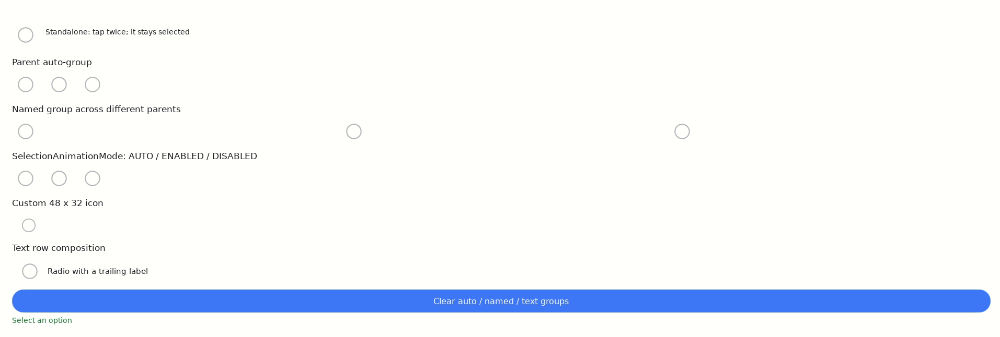

[→ English](https://github.sec.samsung.net/NUI/dali-ui/wiki/RadioButton.md)

# DALi UI Components - RadioButton

`RadioButton`은 아이콘만 제공하는 단일 선택 컨트롤입니다. 그룹에서 한 항목을 선택하면
이전에 선택된 항목은 자동으로 해제됩니다. 선택된 항목을 다시 클릭해도 상태는 변하지
않지만, 애플리케이션에서 명시적으로 선택을 해제할 수는 있습니다.

`RadioButton`은 선택 상태, signal, click, focus, grouping API를
`GroupSelectableView`에서 상속합니다.

## Sample



이 sample은 외곽 ring만 보이는 정상 비선택 상태, 가운데가 채워진 선택 상태, 부모 자동
그룹과 named group의 상호 배타 선택, selection animation mode, 48×32 custom icon, text가
있는 radio row를 보여줍니다. 아래쪽 초록색 status text에는 마지막 선택 결과가 표시됩니다.

---

## 핵심 동작

| 동작 | 결과 |
|---|---|
| 선택되지 않은 radio 클릭 | 해당 radio를 선택하고 그룹의 이전 항목을 선택 해제 |
| 선택된 radio 다시 클릭 | 변화 없음 |
| `SetSelected(true)` | 프로그램으로 radio 선택 |
| `SetSelected(false)` | 프로그램으로 radio 선택 해제 |
| `SelectionGroup::ClearSelection()` | 그룹을 선택 항목이 없는 상태로 변경 |

포인터나 key 입력으로는 그룹을 비울 수 없습니다. 선택 항목이 없는 상태가 필요하면
프로그램 API를 사용하세요.

---

## 초기화와 기본 사용법

`dali-ui-components`를 사용하는 애플리케이션은 `MainLoop()` 전에
`Components::UiConfig`를 한 번 적용해야 합니다. foundation `UiConfig`를 별도로 적용하지
마세요.

```cpp
#include <dali-ui-components/dali-ui-components.h>
#include <dali-ui-foundation/public-api/layouts/stack-layout-manager.h>
#include <dali-ui-foundation/public-api/layouts/stack-layout-params.h>
#include <dali-ui-foundation/public-api/layouts/stack-layout.h>
#include <dali-ui-foundation/public-api/views/text-controls/label.h>

using namespace Dali;
using namespace Dali::Ui;

int main(int argc, char** argv)
{
  Application application = Application::New(&argc, &argv);
  Components::UiConfig::New().Apply();

  MyController controller(application);
  application.MainLoop();
  return 0;
}
```

아이콘만 있는 radio를 생성하고 접근성 이름을 지정합니다.

```cpp
RadioButton radio = RadioButton::New();
radio.SetRequestedWidth(52.0f);
radio.SetRequestedHeight(52.0f);
radio.SetAccessibilityName("Wi-Fi");
parent.Add(radio);
```

기본 style은 36×36 아이콘과 각 방향 8 logical pixel의 padding을 사용합니다. 선택되지 않은
상태는 `UiColor::OUTLINE`, 선택된 상태는 `UiColor::PRIMARY`, interaction feedback은 round
state effect이며 색은 현재 theme에서 resolve됩니다.

---

## Grouping

### 부모 기반 자동 그룹

그룹 이름이 없는 RadioButton들은 scene에 연결되어 있는 동안 동일한 `View` 부모의 직접
자식끼리 자동으로 그룹을 구성합니다.

```cpp
StackLayout row = StackLayout::New(StackOrientation::HORIZONTAL);

RadioButton compact = RadioButton::New();
RadioButton normal  = RadioButton::New();
RadioButton large   = RadioButton::New();

row.Add(compact);
row.Add(normal);
row.Add(large);
root.Add(row);

SelectionGroup sizeGroup = SelectionGroup::Find(row);
```

직접 자식만 이 부모 그룹에 참여합니다. radio마다 서로 다른 wrapper에 넣으면 각 radio의
부모가 다르므로 자동 그룹이 만들어지지 않습니다. 이런 layout에서는 named group을
사용하세요.

### 부모가 다른 항목의 named group

```cpp
RadioButton cardOption = RadioButton::New();
RadioButton cashOption = RadioButton::New();

cardOption.SetGroupName("payment-method");
cashOption.SetGroupName("payment-method");

cardWrapper.Add(cardOption);
cashWrapper.Add(cashOption);

SelectionGroup paymentGroup = SelectionGroup::Find("payment-method");
```

비어 있지 않은 group name은 부모 기반 자동 그룹보다 우선합니다. `View` 부모 아래에서
scene에 연결된 radio에 `SetGroupName("")`을 호출하면 다시 부모 그룹을 사용합니다.

### 그룹 변경 감시와 선택 해제

```cpp
void SettingsPage::OnSelectedMemberChanged(View previous,
                                           View current,
                                           InputEvent event)
{
  if(current)
  {
    // current is the newly selected member.
  }
}

paymentGroup.SelectedMemberChangedSignal().Connect(
  this, &SettingsPage::OnSelectedMemberChanged);

View selected = paymentGroup.GetSelectedMember(); // Empty when no member is selected.
paymentGroup.ClearSelection();
```

radio에서 `GetGroup()`을 호출할 수도 있지만, 부모 기반 자동 그룹은 해당 항목이 scene에
연결된 뒤에 bind됩니다. 부모를 이미 알고 있다면 `SelectionGroup::Find(parent)`를 사용하는
것이 편리합니다.

---

## 선택 상태와 signal

```cpp
radio.SetSelected(true);
bool selected = radio.IsSelected();

void SettingsPage::OnRadioSelectionChanged(View view,
                                           bool selected,
                                           InputEvent event)
{
  if(selected)
  {
    // Apply the option represented by view.
  }
}

radio.SelectionChangedSignal().Connect(
  this, &SettingsPage::OnRadioSelectionChanged);
```

`InputEvent`는 입력 발생 원인을 나타내며 API로 상태를 변경하면 programmatic event가
전달됩니다. 새 항목의 selected 알림보다 이전 항목의 deselected 알림이 먼저 발생할 수
있으므로, callback이 항상 선택을 의미한다고 가정하지 말고 전달받은 `selected` 값을
사용하세요.

---

## 선택 애니메이션

```cpp
radio.SetSelectionAnimationMode(SelectionAnimationMode::AUTO);
```

| Mode | 동작 |
|---|---|
| `AUTO` | 사용자 입력에 의한 변경은 애니메이션, 프로그램 변경은 즉시 전환 |
| `ENABLED` | 사용자 입력과 프로그램 변경을 모두 애니메이션 |
| `DISABLED` | 항상 목표 상태로 즉시 전환 |

요청한 mode와 관계없이 off-scene이거나 보이지 않는 radio는 즉시 전환됩니다. 보이지 않는
transition이 시작되는 것을 막고 처음 표시되는 frame이 논리적인 선택 상태와 일치하도록
하기 위한 동작입니다.

---

## Style 설정

현재 theme style을 기반으로 필요한 값만 변경한 뒤 생성할 때 전달하는 방법을 권장합니다.

```cpp
RadioButtonStyle style = RadioButtonStyle::Default()
                           .Configure()
                           .SetIconWidth(48.0f)
                           .SetIconHeight(32.0f)
                           .SetPadding(Insets(6, 6, 4, 4))
                           .SetIconColor(UiColor::OUTLINE)
                           .SetSelectedIconColor(UiColor::PRIMARY)
                           .Build();

RadioButton radio = RadioButton::New(style);
```

아이콘 width와 height는 서로 독립적입니다. 실행 중에는 `RadioButton`의
`SetIconWidth()`와 `SetIconHeight()`로 변경할 수도 있습니다. 0 이하이거나 finite하지
않은 값은 0, 즉 해당 dimension을 명시하지 않은 상태로 정규화됩니다.

- width가 미설정이면 유효한 icon height를 따릅니다.
- height가 미설정이면 확정된 content height를 따르고, wrap content일 때는 style의
  minimum height를 사용합니다.

theme override와 관계없이 내장 값을 사용해야 할 때만 `RadioButtonStyle::DefaultPreset()`을
사용하세요. 일반적인 애플리케이션 UI에는 `Default()`를 사용합니다.

---

## 커스텀 Lottie 아이콘

Icon generator는 style로 생성하는 각 `RadioButton`마다 한 번 호출됩니다. 초기화된
`SelectableImageInterface`를 반환해야 하며, 그 handle의 `GetView()`도 초기화된 `View`를
반환해야 합니다. 호출할 때마다 새 selectable image와 drawing View를 생성해야 하며, 하나의
live image 또는 View를 여러 control이 공유하는 방식은 지원하지 않습니다.

```cpp
#include <dali-ui-foundation/public-api/types/selectable-lottie-color-binding.h>
#include <dali-ui-foundation/public-api/types/selectable-lottie-image.h>
#include <dali-ui-foundation/public-api/views/image/selectable-lottie-animation-view.h>

SelectableImageInterface MakePaymentRadioIcon()
{
  using Binding     = SelectableLottieColorBinding;
  using ColorPolicy = Binding::ColorPolicy;
  using FrameRange  = SelectableLottieImage::FrameRange;

  SelectableLottieColorBindings bindings;
  bindings.PushBack(Binding("payment_radio.inner_fill.color",
                            LottieAnimation::VectorProperty::FILL_COLOR,
                            ColorPolicy::ALWAYS_SELECTED));
  bindings.PushBack(Binding("payment_radio.outline.color",
                            LottieAnimation::VectorProperty::STROKE_COLOR,
                            ColorPolicy::SELECTED_IN_FRAME_RANGE,
                            FrameRange(7, 26)));

  SelectableLottieImage image("/opt/usr/share/my-app/payment-radio.json",
                              FrameRange(0, 19),
                              FrameRange(20, 37));
  return SelectableLottieAnimationView::New(image, bindings);
}

RadioButtonStyle customStyle = RadioButtonStyle::Default()
                                 .Configure()
                                 .SetIconGenerator(
                                   RadioButtonStyle::IconGenerator::New(
                                     &MakePaymentRadioIcon))
                                 .Build();
```

Frame range, key path, color policy는 Lottie asset에 종속되므로 예제 값을 다른 asset에 그대로
사용하면 안 됩니다. `Dali::Callback`은 move-only이고 style 복사본들이 generator를
공유하므로 상태가 없는 free function을 generator target으로 사용하는 것을 권장합니다.

---

## 텍스트 label이 있는 radio

`RadioButton`은 의도적으로 아이콘만 제공합니다. 아이콘과 label을 포함한 row 전체를
클릭할 수 있게 하려면 외부 `GroupSelectableView`가 selection, grouping, focus,
accessibility를 소유하게 하고, 자식 `RadioButton`은 visual indicator로만 사용하세요.

```cpp
GroupSelectableView SettingsPage::MakeRadioRow(const Dali::String& text)
{
  GroupSelectableView row = GroupSelectableView::New();
  row.AttachLayoutManager(
    Dali::MakeUnique<StackLayoutManager>(StackOrientation::HORIZONTAL, 8.0f));
  row.SetRequestedWidth(MATCH_PARENT);
  row.SetRequestedHeight(56.0f);
  row.SetAccessibilityRole(Accessibility::Role::RADIO_BUTTON);
  row.SetGroupName("settings-options");
  row.SetAccessibilityName(text);

  RadioButton indicator = RadioButton::New();
  indicator.SetRequestedWidth(52.0f);
  indicator.SetRequestedHeight(52.0f);
  indicator.SetClickable(false);
  indicator.SetSensitive(false);
  indicator.SetFocusable(false);
  indicator.SetAccessibilityHidden(true);
  indicator.SetSelectionAnimationMode(SelectionAnimationMode::ENABLED);

  Label label = Label::New(text);
  label.SetAccessibilityHidden(true);
  label.SetLayoutParams(
    StackLayoutParams::New().SetWeight(1.0f).SetAlignment(LayoutAlignment::FILL));

  row.Add(indicator);
  row.Add(label);
  row.SelectionChangedSignal().Connect(
    this, [indicator](View, bool selected, InputEvent) mutable
    {
      indicator.SetSelected(selected);
    });
  return row;
}
```

`SetClickable(false)`는 자식의 기본 tap/click action을 끄고, 소비되지 않은 touch가 외부
row로 전달되도록 하지만 연결된 long-press 처리를 끄거나 자식을 hit testing 대상에서
제거하지는 않습니다. 표시 전용 indicator와 그 subtree를 hit testing에서 완전히
제외하려면 `SetSensitive(false)`를 사용합니다. 두 자식을 모두 accessibility에서 숨기면
중복 node 대신 외부 row 하나만 radio option으로 노출됩니다.

자식에서 long-press 처리가 활성화되어 있으면 clickable=false여도 gesture 인식을 위해
자식이 touch stream을 소비합니다. Signal handler 연결을 유지한 채 인식을 중지하려면
`SetLongPressEnabled(false)`를 호출합니다.

---

## 접근성

- 아이콘만 있는 모든 radio에 의미 있는 `SetAccessibilityName()`을 지정하세요.
- `RadioButton`은 `RADIO_BUTTON` role과 checked state를 제공합니다.
- Label이 있는 row는 외부 row를 `RADIO_BUTTON`으로 노출하고 label text를 이름으로
  지정하며 indicator와 label 자식은 accessibility에서 숨깁니다.
- `RadioButton`은 touch 방식에 종속된 기본 description을 주입하지 않습니다. 해당 option에
  화면 맥락을 보충해야 할 때만 application에서 명시적인 accessibility description을 지정하세요.
- 외부 row를 focusable, enabled 상태로 유지하여 keyboard와 screen reader activation이
  pointer 입력과 같은 selection 경로를 사용하게 합니다.

---

## 문제 해결

### 서로 다른 card의 radio가 상호 배타적으로 동작하지 않음

부모 기반 자동 그룹은 동일한 `View`의 직접 자식에만 적용됩니다. Wrapper나 서로 다른
부모가 사용되면 같은 non-empty group name을 지정하세요.

### 프로그램 변경이 애니메이션되지 않음

`AUTO`의 정상 동작입니다. 눈에 보이는 프로그램 전환이 필요하면
`SelectionAnimationMode::ENABLED`를 사용하세요.

---

## 주요 API

| Type | API | 용도 |
|---|---|---|
| `RadioButton` | `New()`, `New(style)` | 아이콘형 radio 생성 |
| `RadioButton` | `SetSelected()`, `IsSelected()` | 선택 상태 변경과 조회 |
| `RadioButton` | `SelectionChangedSignal()` | 해당 항목의 상태 변경 감시 |
| `RadioButton` | `SetGroupName()`, `GetGroup()` | 그룹 설정 또는 조회 |
| `RadioButton` | `SetSelectionAnimationMode()` | 전환 animation 정책 선택 |
| `RadioButton` | `SetIconWidth()`, `SetIconHeight()` | 실행 중 요청 아이콘 크기 변경 |
| `SelectionGroup` | `Find()`, `GetSelectedMember()` | 그룹 획득과 선택 항목 조회 |
| `SelectionGroup` | `ClearSelection()` | 그룹 선택 상태 명시적 해제 |
| `RadioButtonStyle` | `Default().Configure()` | Theme style로부터 immutable style 생성 |

---

## 관련 문서와 예제

- [RadioButton API reference](https://pages.github.sec.samsung.net/NUI/dali-ui/daliUi/classDali_1_1Ui_1_1RadioButton.html)
- [RadioButton sample](https://github.sec.samsung.net/NUI/dali-ui/tree/devel/samples/radio-button)
- [RadioButton manual test](https://github.sec.samsung.net/NUI/dali-ui/blob/devel/manual-tests/dali-ui-components/tc/tc-radio-button-basics.cpp)
- [GroupSelectableView sample](https://github.sec.samsung.net/NUI/dali-ui/tree/devel/samples/group-selectable-view)
- [Configuration](Configuration-(kr).md)
- [Components](Components.md)
