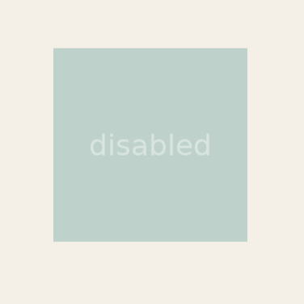
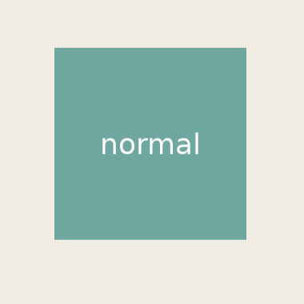
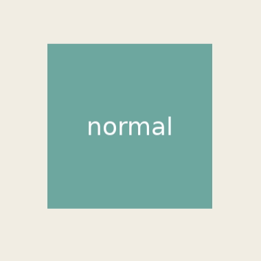

[→ English](https://github.sec.samsung.net/NUI/dali-ui/wiki/State-Effect)

# State Effect

`StateEffect`는 `PRESSED`, `FOCUSED`, `DISABLED`, `SELECTED` 같은 `ViewState` 변화에 반응해 시각적 피드백을 제공하는 객체입니다.

State management가 "View가 어떤 상태인가"를 다룬다면, `StateEffect`는 "그 상태를 어떻게 보여줄 것인가"를 다룹니다. View에는 `View::SetStateEffect()`로 하나의 state effect를 지정할 수 있습니다. Interactive View는 명시적으로 effect가 지정되어 있지 않으면 `UiConfig`의 기본 effect를 사용합니다.

<br/>

## OverlayEffect

dali-ui는 built-in 효과로 `OverlayEffect`를 제공합니다.

### Plain

`FOCUSED`와 `PRESSED`, `DISABLED`에 대응해 dim 및 scale down 효과를 보여줍니다.

```cpp
view.AsInteractive();
view.SetStateEffect(OverlayEffect::Plain());
```



<br/>

### ListItem

`Plain`과 동일하지만, press 되었을때 scale down 되는 타겟이 chlidren으로 한정됩니다.

```cpp
view.AsInteractive();
view.SetStateEffect(OverlayEffect::ListItem());
```



<br/>

### Effect targeting

View의 state가 변경됨에 따라 효과를 대신 받을 대상 child 를 지정할 수 있습니다.

```cpp
view.AsInteractive();
view.SetStateEffect(OverlayEffect::ListItem());
view.Add(circleChild);
view.SetStateEffectTarget(circleChild);
```

<video src="./assets/StateEffect/plain-targeted.mp4" controls width="200"></video>

<br/>

### Overlay 색상 변경

기본 builder로 custom overlay를 만들거나, 공유 preset을 `Configure()`로 복사한 뒤 일부 값만 바꿀 수 있습니다.

```cpp
StateEffect blueOverlay =
  OverlayEffect::Builder()
    .SetOverlayColor(UiColor(0x0066CC, 0.18f))
    .SetUseTargetCornerRadius(true)
    .Build();

view.SetStateEffect(blueOverlay);
```

Preset의 기본값은 유지하고 일부 속성만 바꿀 수도 있습니다.

```cpp
StateEffect brandOverlay =
  OverlayEffect::ListItem()
    .Configure()
    .SetOverlayColor(UiColor::PRIMARY.WithAlpha(0.16f))
    .Build();

view.SetStateEffect(brandOverlay);
```

<br/>

## UiConfig를 통한 Interactive 기본값

`InteractiveView` (또는 `AsInteractive()` 를 통해 interactive가 된 view)는 config에 지정된 기본 state effect를 적용받습니다. 현재 기본값은 `OverlayEffect::Plain()`입니다.

Interactive View에 기본 effect를 적용하지 않으려면 application 시작전에 다음처럼 config를 설정합니다.

```cpp
UiConfig config = UiConfig::New();
config.SetDefaultStateEffectForInteractive(StateEffect::None());
config.Apply();
```

아래와 같이 `OverlayEffect`에 옵션을 바꾸어 적용하는것도 가능합니다.

```cpp
UiConfig config = UiConfig::New();
config.SetDefaultStateEffectForInteractive(
  OverlayEffect::Plain()
    .Configure()
    .SetOverlayColor(UiColor::PRIMARY.WithAlpha(0.12f))
    .Build());
config.Apply();
```

개별 View에 명시적으로 지정한 `view.SetStateEffect(...)`는 `UiConfig` 기본값보다 우선합니다. 특정 View에서 state effect를 끄려면 `StateEffect::None()`을 지정하세요.

<br/>

## Custom Effect 개발하기

Custom state effect는 `Integration::StateEffectImpl`을 상속하고 이를 `StateEffect` handle로 노출하여 구현합니다. State effect 객체는 **shared** 개념입니다. 같은 effect handle이 여러 View에 attach될 수 있으며, framework는 effect를 clone하지 않고 handle을 그대로 저장합니다.

따라서 다음 원칙을 지켜야 합니다.

- View별 runtime data를 effect 객체 멤버에 저장하지 않습니다.
- `OnAttached()`는 같은 effect instance에 대해 여러 View에서 호출될 수 있습니다.
- View별 data는 `AttachmentId`와 `View::SetAttachment()`으로 해당 View에 저장합니다.
- 메모리 절감을 위해 View마다 effect를 새로 만들기보다 하나의 effect instance를 공유하는 것을 권장합니다.
- View별 private data가 필요하면 `OnAttached()`에서 만들고 해당 View에 attachment로 붙이는 패턴을 사용합니다.

<br/>

### 간단한 Custom Effect

```cpp
#include <dali-ui-foundation/integration-api/state-effect-impl.h>
#include <dali-ui-foundation/public-api/traits/attachment-id.h>
#include <dali-ui-foundation/public-api/views/view.h>

using namespace Dali;
using namespace Dali::Ui;

namespace
{
const AttachmentId kPressedTintData = AttachmentId::Alloc();

struct PressedTintData
{
  UiColor originalColor;
};

class PressedTintEffectImpl : public Integration::StateEffectImpl
{
public:
  void OnAttached(TraitId, View& view) override
  {
    if(!view.GetAttachment<PressedTintData>(kPressedTintData))
    {
      view.SetAttachment(kPressedTintData, Dali::MakeUnique<PressedTintData>());
    }
  }

  void OnDetaching(TraitId, View& view) override
  {
    view.RemoveAttachment(kPressedTintData);
  }

protected:
  void OnViewStateChanged(View view, const StateEvent& event) override
  {
    auto* data = view.GetAttachment<PressedTintData>(kPressedTintData);
    if(!data)
    {
      return;
    }

    if(event.Added(ViewState::PRESSED))
    {
      view.SetBackgroundColor(UiColor::PRIMARY.WithAlpha(0.12f));
    }
    else if(event.Removed(ViewState::PRESSED))
    {
      view.SetBackgroundColor(data->originalColor);
    }
  }
};

class PressedTintEffect : public StateEffect
{
public:
  static PressedTintEffect New()
  {
    return PressedTintEffect(new PressedTintEffectImpl());
  }

private:
  explicit PressedTintEffect(PressedTintEffectImpl* impl)
  : StateEffect(impl)
  {
  }
};
} // namespace
```

실제 코드에서는 `PressedTintData::originalColor`를 View의 실제 visual model 또는 component style에서 초기화해야 합니다. 핵심은 공유되는 effect에는 동작만 두고, View별 runtime data는 각 View의 attachment로 소유하게 하는 것입니다.

---

## 함께 보기

- [State Management](State-Management-(kr).md)
- [Color & Theme](Color-&-Theme-(kr).md)
- [API Reference - StateEffect](https://pages.github.sec.samsung.net/NUI/dali-ui/daliUi/classDali_1_1Ui_1_1StateEffect.html)
- [API Reference - OverlayEffect](https://pages.github.sec.samsung.net/NUI/dali-ui/daliUi/classDali_1_1Ui_1_1OverlayEffect.html)
- [API Reference - UiConfig](https://pages.github.sec.samsung.net/NUI/dali-ui/daliUi/classDali_1_1Ui_1_1UiConfig.html)

---

[← Back to list](https://github.sec.samsung.net/NUI/dali-ui/wiki/Home-(kr)#development-guides)
