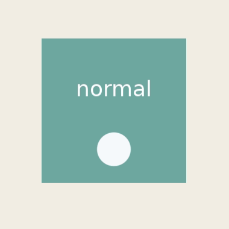

[→ 한국어 문서](https://github.sec.samsung.net/NUI/dali-ui/wiki/State-Effect-(kr))

# State Effect

`StateEffect` is an object that provides visual feedback in response to `ViewState` changes such as `PRESSED`, `FOCUSED`, `DISABLED`, and `SELECTED`.

If state management is about "which state a View is in", `StateEffect` is about "how that state should be shown". A View can have one state effect through `View::SetStateEffect()`. Interactive Views use the default effect from `UiConfig` when no explicit effect is assigned.

<br/>

## OverlayEffect

dali-ui provides `OverlayEffect` as a built-in effect.

### Plain

Shows dimming and scale-down feedback for `FOCUSED`, `PRESSED`, and `DISABLED`.

```cpp
view.AsInteractive();
view.SetStateEffect(OverlayEffect::Plain());
```


<br/>

### ListItem

Same as `Plain`, except the scale-down target on press is limited to the View's children.

```cpp
view.AsInteractive();
view.SetStateEffect(OverlayEffect::ListItem());
```


<br/>

### Effect Targeting

You can specify a child View that should receive the effect instead of the owner View when the owner View's state changes.

```cpp
view.AsInteractive();
view.SetStateEffect(OverlayEffect::ListItem());
view.Add(circleChild);
view.SetStateEffectTarget(circleChild);
```



<br/>

### Changing Overlay Color

You can build a custom overlay with the default builder, or copy a shared preset with `Configure()` and change only selected values.

```cpp
StateEffect blueOverlay =
  OverlayEffect::Builder()
    .SetOverlayColor(UiColor(0x0066CC, 0.18f))
    .SetUseTargetCornerRadius(true)
    .Build();

view.SetStateEffect(blueOverlay);
```

You can also keep the preset defaults and change only some properties.

```cpp
StateEffect brandOverlay =
  OverlayEffect::ListItem()
    .Configure()
    .SetOverlayColor(UiColor::PRIMARY.WithAlpha(0.16f))
    .Build();

view.SetStateEffect(brandOverlay);
```

<br/>

## Interactive Defaults Via UiConfig

`InteractiveView`, or a View made interactive through `AsInteractive()`, receives the default state effect configured in `UiConfig`. The current default is `OverlayEffect::Plain()`.

To prevent Interactive Views from receiving a default effect, configure `UiConfig` before the application starts.

```cpp
UiConfig config = UiConfig::New();
config.SetDefaultStateEffectForInteractive(StateEffect::None());
config.Apply();
```

You can also customize the options of `OverlayEffect` and apply it as the default.

```cpp
UiConfig config = UiConfig::New();
config.SetDefaultStateEffectForInteractive(
  OverlayEffect::Plain()
    .Configure()
    .SetOverlayColor(UiColor::PRIMARY.WithAlpha(0.12f))
    .Build());
config.Apply();
```

An explicit `view.SetStateEffect(...)` on an individual View takes priority over the `UiConfig` default. To disable state effects for a specific View, set `StateEffect::None()`.

<br/>

## Developing Custom Effects

Custom state effects are implemented by deriving from `Integration::StateEffectImpl` and exposing it as a `StateEffect` handle. A state effect object is **shared**. The same effect handle can be attached to multiple Views, and the framework stores the handle as-is instead of cloning it.

Follow these rules:

- Do not store per-View runtime data in the effect object itself.
- `OnAttached()` can be called for multiple Views on the same effect instance.
- Store per-View data on the View itself with `AttachmentId` and `View::SetAttachment()`.
- Prefer sharing one effect instance across Views instead of creating a new effect for every View, which reduces memory usage.
- If private per-View data is needed, create it in `OnAttached()` and attach it to that View.

<br/>

### Minimal Custom Effect

```cpp
#include <dali-ui-foundation/integration-api/state-effect-impl.h>
#include <dali-ui-foundation/public-api/traits/attachment-id.h>
#include <dali-ui-foundation/public-api/views/view.h>

using namespace Dali;
using namespace Dali::Ui;

namespace
{
const AttachmentId kPressedTintData = AttachmentId::Alloc();

struct PressedTintData
{
  UiColor originalColor;
};

class PressedTintEffectImpl : public Integration::StateEffectImpl
{
public:
  void OnAttached(TraitId, View& view) override
  {
    if(!view.GetAttachment<PressedTintData>(kPressedTintData))
    {
      view.SetAttachment(kPressedTintData, Dali::MakeUnique<PressedTintData>());
    }
  }

  void OnDetaching(TraitId, View& view) override
  {
    view.RemoveAttachment(kPressedTintData);
  }

protected:
  void OnViewStateChanged(View view, const StateEvent& event) override
  {
    auto* data = view.GetAttachment<PressedTintData>(kPressedTintData);
    if(!data)
    {
      return;
    }

    if(event.Added(ViewState::PRESSED))
    {
      view.SetBackgroundColor(UiColor::PRIMARY.WithAlpha(0.12f));
    }
    else if(event.Removed(ViewState::PRESSED))
    {
      view.SetBackgroundColor(data->originalColor);
    }
  }
};

class PressedTintEffect : public StateEffect
{
public:
  static PressedTintEffect New()
  {
    return PressedTintEffect(new PressedTintEffectImpl());
  }

private:
  explicit PressedTintEffect(PressedTintEffectImpl* impl)
  : StateEffect(impl)
  {
  }
};
} // namespace
```

In real code, initialize `PressedTintData::originalColor` from the View's actual visual model or component style. The key idea is to keep behavior in the shared effect and let each View own its runtime data through attachments.

---

## See Also

- [State Management](State-Management.md)
- [Color & Theme](Color-&-Theme.md)
- [API Reference - StateEffect](https://pages.github.sec.samsung.net/NUI/dali-ui/daliUi/classDali_1_1Ui_1_1StateEffect.html)
- [API Reference - OverlayEffect](https://pages.github.sec.samsung.net/NUI/dali-ui/daliUi/classDali_1_1Ui_1_1OverlayEffect.html)
- [API Reference - UiConfig](https://pages.github.sec.samsung.net/NUI/dali-ui/daliUi/classDali_1_1Ui_1_1UiConfig.html)

---

[← Back to list](https://github.sec.samsung.net/NUI/dali-ui/wiki#development-guides)
