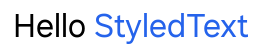
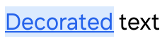
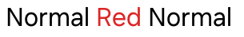
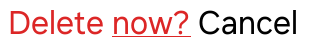
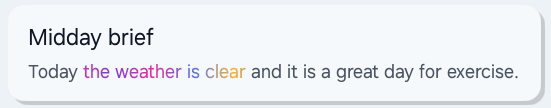

# StyledText

[→ 한국어 문서](https://github.sec.samsung.net/NUI/dali-ui/wiki/StyledText-(kr))

## Overview

`StyledText` is a styled text value created from UTF-8 input. DALi decodes the text and attaches spans to ranges in the decoded UTF-32 sequence. It is useful when an application needs to style selected text ranges programmatically, or when rich text should be derived from semantic markup before being applied to a text component.

`StyledTextBuilder` is used to assemble a `StyledText` snapshot. For sequential text construction, `PushSpan()` and `PopSpan()` apply style to appended text without requiring the application to calculate range indexes manually. Use `SetSpan()` when the target range is already known.

`Label`, `InputField`, and `InputEditor` can apply a `StyledText` value with `SetStyledText()`.

~~~cpp
Label label = Label::New();

Text::StyledTextBuilder builder = Text::StyledTextBuilder::New();
builder.AppendText("Hello ");
builder.PushSpan(Text::ForegroundColorSpan::New(UiColor(0x2563EB)));
builder.AppendText("StyledText");
builder.PopSpan();

label.SetStyledText(builder.Build());
~~~

> [!NOTE]
> `StyledText` range indexes are UTF-32 indexes in the decoded text, not UTF-8 byte offsets.

 

## StyledText And Markup

For simple static markup, convert directly to `StyledText`:

~~~cpp
Label label = Label::New();
label.SetStyledText(Text::StyledText::FromMarkup("<color value='red'>Red</color> text"));
~~~

Use `StyledTextBuilder::FromMarkup()` when markup should be parsed first and then extended with application-defined spans:

~~~cpp
Text::StyledTextBuilder builder =
  Text::StyledTextBuilder::FromMarkup("<u>Hello</u> StyledText");

builder.SetSpan(Text::ForegroundColorSpan::New(UiColor(0xDC2626)), 0u, 5u);

label.SetStyledText(builder.Build());
~~~

> [!NOTE]
> Passing markup to `Label::New()`, `SetText()`, `InputField::SetText()`, or `InputEditor::SetText()` treats it as plain text. Use `SetStyledText()` to apply parsed markup or spans.

 

## Span Types

A `Span` stores the style payload. The text range is attached by `StyledTextBuilder` and stored in `StyledText`.

| Span | Purpose |
|---|---|
| `ForegroundColorSpan` | Text color |
| `GradientSpan` | Foreground gradient for a specific text range |
| `BackgroundColorSpan` | Text background color |
| `FontSpan` | Font family, size, weight, width, slant, variation |
| `UnderlineSpan` | Underline style |
| `LineThroughSpan` | Line-through style |
| `ImageSpan` | Replaces a text range with an atomic inline image |
| `AnchorSpan` | Anchor metadata for link handling |
| `AnnotationSpan` | Semantic key/value metadata |

Multiple spans can target the same range when they describe different style categories:

~~~cpp
Text::StyledTextBuilder builder = Text::StyledTextBuilder::New("Decorated text");

builder.SetSpan(Text::ForegroundColorSpan::New(UiColor(0x2563EB)), 0u, 9u);
builder.SetSpan(Text::BackgroundColorSpan::New(UiColor(0xDBEAFE)), 0u, 9u);

Text::Underline underline;
underline.SetColor(UiColor(0x2563EB));
underline.SetThickness(2.0f);
builder.SetSpan(Text::UnderlineSpan::New(underline), 0u, 9u);

label.SetStyledText(builder.Build());
~~~

> [!NOTE]
> A builder stores at most one attachment for the same `Span` handle. If the same span handle is attached again, its range is updated. Create separate span handles when the same visual style should be attached to multiple ranges.

 

## Push And Pop

`PushSpan()` and `PopSpan()` are the easiest way to apply style while appending text. `PushSpan()` opens a span at the current end of the decoded text, and `PopSpan()` closes it at the current end. The text appended between the two calls becomes the span range automatically.

~~~cpp
Text::StyledTextBuilder builder = Text::StyledTextBuilder::New();

builder.AppendText("Normal ");
builder.PushSpan(Text::ForegroundColorSpan::New(UiColor(0xDC2626)));
builder.AppendText("Red");
builder.PopSpan();
builder.AppendText(" Normal");

label.SetStyledText(builder.Build());
~~~

`PopSpan()` closes the most recent open span. `PopSpan(token)` can be used when a specific pushed span should be closed in nested construction:

~~~cpp
Text::StyledTextBuilder builder = Text::StyledTextBuilder::New();

const uint32_t warningToken =
  builder.PushSpan(Text::ForegroundColorSpan::New(UiColor(0xDC2626)));

builder.AppendText("Delete ");

Text::Underline underline;
underline.SetColor(UiColor(0xDC2626));
builder.PushSpan(Text::UnderlineSpan::New(underline));

builder.AppendText("now?");
builder.PopSpan(warningToken);
builder.AppendText(" Cancel");

label.SetStyledText(builder.Build());
~~~

`PopSpan(token)` closes the matching open span. If spans were opened after that token and are still open, they are closed at the same position as well. Use `SetSpan()` instead when a range has already been calculated by search, parser, or application logic.

 

## UTF-32 Ranges

`SetSpan()` and span inspection APIs use UTF-32 indexes. You usually do not need to calculate these indexes when building text with `PushSpan()` and `PopSpan()`, but they matter when the source text contains non-ASCII characters, emoji, or when ranges come from UTF-8 string APIs.

When a range is known as UTF-8 byte offsets, convert it before calling `SetSpan()`:

~~~cpp
std::string text = "Hello 가😀 StyledText";
std::string target = "가😀";

std::size_t utf8Start = text.find(target);
std::size_t utf8End   = utf8Start + target.size();

uint32_t utf32Start = 0u;
uint32_t utf32End   = 0u;

if(Text::Utf8ToUtf32Range(Dali::StringView(text.data(), static_cast<uint32_t>(text.size())),
                          static_cast<uint32_t>(utf8Start),
                          static_cast<uint32_t>(utf8End),
                          utf32Start,
                          utf32End))
{
  Text::StyledTextBuilder builder = Text::StyledTextBuilder::New(text.c_str());
  builder.SetSpan(Text::ForegroundColorSpan::New(UiColor(0xDC2626)), utf32Start, utf32End);
  label.SetStyledText(builder.Build());
}
~~~

When building text incrementally, use `GetUtf32Length()` before and after `AppendText()` to calculate the appended range.

 

## ImageSpan

`ImageSpan` replaces a specified text range with a single atomic inline image box. Use `ImageAttributes` to set the image source, the size reserved in the layout, and its alignment relative to the text baseline.

The safest pattern is to insert one U+FFFC OBJECT REPLACEMENT CHARACTER where the image should appear and apply `ImageSpan` to that character.

~~~cpp
Text::StyledTextBuilder builder = Text::StyledTextBuilder::New();
builder.AppendText("DALi ");

// The UTF-32 length before appending U+FFFC is the start of the image range.
const uint32_t imageIndex = builder.GetUtf32Length();
builder.AppendText(Text::ReplacementSpan::OBJECT_REPLACEMENT_CHARACTER);
builder.AppendText(" Icon");

Text::ImageAttributes attributes("res/dali-icon.png", Vector2(72.0f, 72.0f));
attributes.SetAlignment(Text::ImageAttributes::InlineAlignment::TEXT_CENTER);

builder.SetSpan(Text::ImageSpan::New(attributes), imageIndex, imageIndex + 1u);
label.SetStyledText(builder.Build());
~~~

Keep the following points in mind:

- `OBJECT_REPLACEMENT_CHARACTER` is three bytes in UTF-8 but occupies one UTF-32 index in the decoded text.
- `SetSpan()` uses the half-open range `[start, end)`. To replace one U+FFFC character, use `[imageIndex, imageIndex + 1)`.
- When `ImageSpan` is applied, the logical text in the range remains in `StyledText`, but it appears as one image layout unit on screen.
- Replacing multiple code points with one image is supported, but using a single U+FFFC character is recommended because it makes the source and range semantics clear and is easier to maintain during editing.
- If the range or required `ImageAttributes` is invalid, the replacement is not applied and the original range remains visible.

You can also wrap an appended range with a pushed span:

~~~cpp
Text::ImageAttributes attributes("res/dali-icon.png", Vector2(72.0f, 72.0f));

builder.PushSpan(Text::ImageSpan::New(attributes));
builder.AppendText(Text::ReplacementSpan::OBJECT_REPLACEMENT_CHARACTER);
builder.PopSpan();
~~~

 

## GradientSpan

`GradientSpan` applies a gradient only to the foreground fill of a specified range instead of the entire text. It can be combined with the normal text color to emphasize a word or phrase within a sentence.

~~~cpp
Text::StyledTextBuilder builder = Text::StyledTextBuilder::New();
builder.AppendText("Plain text and ");

const uint32_t gradientStart = builder.GetUtf32Length();
builder.AppendText("gradient text");
const uint32_t gradientEnd = builder.GetUtf32Length();

Gradient::Linear gradient(Vector2(-0.5f, 0.0f), Vector2(0.5f, 0.0f));
gradient.SetUnits(Gradient::Units::OBJECT_BOUNDING_BOX);
gradient.SetStopNodes({
  Gradient::StopNode(0.0f, UiColor(0x0EA5E9)),
  Gradient::StopNode(0.25f, UiColor(0x2563EB)),
  Gradient::StopNode(0.5f, UiColor(0x7C3AED)),
  Gradient::StopNode(0.75f, UiColor(0xDB2777)),
  Gradient::StopNode(1.0f, UiColor(0xF97316)),
});

builder.SetSpan(
  Text::GradientSpan::New(gradient, Text::GradientSpan::BoundsMode::SPAN_BOUND),
  gradientStart,
  gradientEnd);

label.SetTextColor(UiColor(0x111827));
label.SetStyledText(builder.Build());
~~~

`BoundsMode` selects the reference area used to evaluate gradient coordinates.

| Mode | Reference area | Use case |
|---|---|---|
| `SPAN_BOUND` | Union of the visible glyph ink bounds owned by this span | A gradient fitted to a specific word or phrase. This is the default. |
| `CONTENT_BOUND` | Bounds of the entire laid-out text content | Multiple spans that should share one gradient flow relative to the content |
| `VIEW_BOUND` | Bounds of the entire text view | A gradient fixed to the view area, including padding |

`Gradient::Units::OBJECT_BOUNDING_BOX` uses normalized coordinates within the selected bounds, while `Gradient::Units::USER_SPACE` uses pixel coordinates within the same bounds. In other words, `BoundsMode` selects the reference rectangle and `Gradient::Units` determines how coordinates are interpreted inside it.

`GradientSpan::New()` stores a snapshot of the supplied gradient. Changing the original gradient later does not affect an existing span; create and apply a new `GradientSpan` to change it. If a `ForegroundColorSpan` overlaps the same range, the span applied later determines the foreground paint for the overlapping characters. Color emoji retain their intrinsic colors.

 

## Annotation

`AnnotationSpan` stores semantic key/value metadata. It does not directly change rendering. Application or theme code can read annotations and resolve them into visual spans.

`AnnotationSpan` is also a `Span`, so it appears when iterating all spans with `GetSpanCount()` and `GetSpanAt()`. `GetAnnotationCount()`, `GetAnnotationAt()`, `GetAnnotationStartIndexAt()`, and `GetAnnotationEndIndexAt()` provide a filtered view for annotation spans, which is convenient when resolving markup or localized text into visual styling. In other words, the annotation APIs are convenience filters; annotation spans are still part of normal span iteration.

~~~cpp
Text::StyledTextBuilder builder = Text::StyledTextBuilder::FromMarkup(
  "<annotation style='muted'>Muted text</annotation> Normal text");

const uint32_t annotationCount = builder.GetAnnotationCount();
for(uint32_t index = 0u; index < annotationCount; ++index)
{
  Text::AnnotationSpan annotation = builder.GetAnnotationAt(index);
  if(annotation.GetKey() == "style" && annotation.GetValue() == "muted")
  {
    builder.SetSpan(Text::ForegroundColorSpan::New(UiColor(0x808080)),
                    builder.GetAnnotationStartIndexAt(index),
                    builder.GetAnnotationEndIndexAt(index));
  }
}

label.SetStyledText(builder.Build());
~~~

Each attribute in one `<annotation>` tag becomes a separate `AnnotationSpan` over the annotated text range.

~~~cpp
Text::StyledTextBuilder builder = Text::StyledTextBuilder::FromMarkup(
  "<annotation style='accent' role='action'>Apply</annotation>");
~~~

The example above creates annotation spans for `style=accent` and `role=action`.

 

## Localized Rich Text

Annotations are useful for localized rich text because the semantic range can move with the translated sentence.

PO example:

~~~po
msgid "IDS_ACTION_MESSAGE"
msgstr "Tap <annotation style='accent'>Apply</annotation> to continue."
~~~

Resolve the localized markup and then apply `StyledText`:

~~~cpp
void MyApp::ApplyLocalizedMessage(BaseHandle target, const Dali::String& localizedMarkup)
{
  Label label = Label::DownCast(target);
  if(!label)
  {
    return;
  }

  Text::StyledTextBuilder builder = Text::StyledTextBuilder::FromMarkup(localizedMarkup);
  const uint32_t annotationCount = builder.GetAnnotationCount();
  for(uint32_t index = 0u; index < annotationCount; ++index)
  {
    Text::AnnotationSpan annotation = builder.GetAnnotationAt(index);
    if(annotation.GetKey() == "style" && annotation.GetValue() == "accent")
    {
      builder.SetSpan(Text::ForegroundColorSpan::New(UiColor::PRIMARY),
                      builder.GetAnnotationStartIndexAt(index),
                      builder.GetAnnotationEndIndexAt(index));
    }
  }

  label.SetStyledText(builder.Build());
}

UiLocalizationManager::Get().SetBindingResource(
  label,
  "StyledText",
  "IDS_ACTION_MESSAGE",
  LocalizedStringCallback::New(this, &MyApp::ApplyLocalizedMessage));
~~~

> [!NOTE]
> `Label::SetTranslatableText()` is convenient for plain localized text. For localized rich text that needs markup or annotations, use direct lookup or `SetBindingResource()` and apply `SetStyledText()` in the callback.

### Localized GradientSpan

Keep semantic annotations in the translated string instead of embedding the gradient itself, then resolve the annotated range to a `GradientSpan` in the callback. The annotation range moves with the translated word order and string length.

~~~po
msgid "IDS_GRADIENT_ACTION_MESSAGE"
msgstr "Today <annotation style='gradient'>the weather is clear</annotation> and it is a great day for exercise."
~~~

Moving gradient construction into a helper keeps the localized range-handling code concise.

~~~cpp
Gradient::Base CreateLocalizedAccentGradient()
{
  Gradient::Linear gradient(Vector2(-0.5f, 0.0f), Vector2(0.5f, 0.0f));
  gradient.SetUnits(Gradient::Units::OBJECT_BOUNDING_BOX);
  gradient.SetStopNodes({
    Gradient::StopNode(0.0f, UiColor(0x2563EB)),
    Gradient::StopNode(0.5f, UiColor(0x7C3AED)),
    Gradient::StopNode(1.0f, UiColor(0xF97316)),
  });
  return gradient;
}

void MyApp::ApplyLocalizedGradientMessage(BaseHandle target,
                                          const Dali::String& localizedMarkup)
{
  Label label = Label::DownCast(target);
  if(!label)
  {
    return;
  }

  Text::StyledTextBuilder builder = Text::StyledTextBuilder::FromMarkup(localizedMarkup);
  const Gradient::Base gradient = CreateLocalizedAccentGradient();

  const uint32_t annotationCount = builder.GetAnnotationCount();
  for(uint32_t index = 0u; index < annotationCount; ++index)
  {
    Text::AnnotationSpan annotation = builder.GetAnnotationAt(index);
    if(annotation.GetKey() == "style" && annotation.GetValue() == "gradient")
    {
      builder.SetSpan(
        Text::GradientSpan::New(gradient, Text::GradientSpan::BoundsMode::SPAN_BOUND),
        builder.GetAnnotationStartIndexAt(index),
        builder.GetAnnotationEndIndexAt(index));
    }
  }

  label.SetStyledText(builder.Build());
}

UiLocalizationManager::Get().SetBindingResource(
  label,
  "StyledText",
  "IDS_GRADIENT_ACTION_MESSAGE",
  LocalizedStringCallback::New(this, &MyApp::ApplyLocalizedGradientMessage));
~~~

With `SPAN_BOUND`, the gradient is reevaluated against the actual glyph bounds of the translated emphasized phrase.

 

## Samples

| Feature | Sample |
|---|---|
| Simple spans | [text-styled-text-simple-example.cpp](https://github.sec.samsung.net/NUI/dali-ui/tree/devel/samples/text/text-styled-text-simple-example.cpp) |
| Builder cases | [text-styled-text-builder-example.cpp](https://github.sec.samsung.net/NUI/dali-ui/tree/devel/samples/text/text-styled-text-builder-example.cpp) |
| Interactive spans | [text-styled-text-example.cpp](https://github.sec.samsung.net/NUI/dali-ui/tree/devel/samples/text/text-styled-text-example.cpp) |
| ImageSpan | [text-image-span-simple-example.cpp](https://github.sec.samsung.net/NUI/dali-ui/tree/devel/samples/text/text-image-span-simple-example.cpp) |
| GradientSpan | [text-gradient-example.cpp](https://github.sec.samsung.net/NUI/dali-ui/tree/devel/samples/text/text-gradient-example.cpp) |
| Localized GradientSpan | [text-gradient-localization-example.cpp](https://github.sec.samsung.net/NUI/dali-ui/tree/devel/samples/text/text-gradient-localization-example.cpp) |
| Markup | [text-markup-example.cpp](https://github.sec.samsung.net/NUI/dali-ui/tree/devel/samples/text/text-markup-example.cpp) |

 

---

[← Text Overview](https://github.sec.samsung.net/NUI/dali-ui/wiki/Text)
