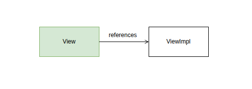
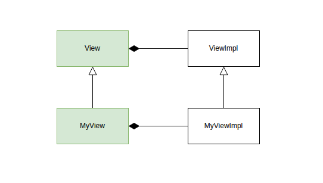

## View Architecture (Handle / Impl Pattern)

`View`는 DALi의 **p-impl(pointer-to-implementation) 패턴**을 기반으로 설계되어 있습니다. Framework 개발자는 이 패턴을 이해해야 새로운 컴포넌트를 올바르게 정의할 수 있습니다.



<br/>

### Handle 클래스: `View`

`View`는 `Dali::CustomActor`를 상속한 **handle 클래스**입니다. 실제 구현 데이터를 직접 보유하지 않고, `ViewImpl` 인스턴스에 대한 ref-counted 포인터를 통해 구현체를 참조합니다.

- `View`를 복사하면 동일한 `ViewImpl`을 가리키는 새 handle이 만들어집니다.
- 모든 `View` handle이 소멸되면 `ViewImpl`이 자동으로 해제됩니다.

```cpp
// public-api/view.h
class View : public CustomActor
{
public:
  static View New();
  static View DownCast(BaseHandle handle);

  /* ... */
};
```

<br/>

### Impl 클래스: `ViewImpl`

`ViewImpl`은 `Dali::CustomActorImpl`을 상속한 **구현 클래스**입니다. 실제 상태와 로직이 여기에 있습니다.

```cpp
// public-api/view-impl.h
class ViewImpl : public CustomActorImpl
{
public:
  static IntrusivePtr<ViewImpl> New();

  /* ... */
};
```

<br/>

### View에서 ViewImpl 접근: `GetImpl()`

`View` 클래스는 `GetImpl()` 헬퍼로 handle에서 impl 참조를 얻습니다.

```cpp
// public-api/view-impl.h 에 정의
ViewImpl& GetImpl(View& view);
const ViewImpl& GetImpl(const View& view);
```
```cpp
// 사용 예
ViewImpl& impl = GetImpl(view);
```

<br/>

### ViewImpl에서 View 접근: `Self()` + `DownCast()`

ViewImpl 인스턴스에서 View의 기능을 사용하려면, 아래와 같이 View를 추가 생성합니다.

```cpp
// 사용 예
View view = View::DownCast(impl.Self());
```

<br/>

## Data attachment

NUI나 FLUX를 사용하여 앱을 작성할 때, View 나 Layout 또는 Button등의 클래스를 단순 상속받아 앱이 원하는 데이터를 추가하는 형태의 코딩 패턴은 네이티브에서 유효하지 않습니다. p-impl 구조의 View 핸들에 데이터를 추가하면 upcast 과정에서 소실되기 때문입니다.


이에 대한 대안으로 View 에 데이터를 붙일 수 있는 API가 제공되며, 붙인 데이터는 view 인스턴스가 소멸될 때 함께 소멸되도록 관리됩니다.


<ins>Define data class</ins>
```cpp
class MyData
{
  /* ... */
};
```

<ins>Create a data instance and attach to a view</ins>
```cpp
const AttachmentId MY_DATA_ID = AttachmentId::Alloc();
```
```cpp
view.SetAttachment(MY_DATA_ID, Dali::MakeUnique<MyData>());
```

<ins>Access to data</ins>
```cpp
MyData* data = view.GetAttachment(MY_DATA_ID);
```

<br/>

## 커스텀 컴포넌트 정의하기

Framework 개발자가 새 컴포넌트를 만들거나 앱이 커스텀 컴포넌트를 만드고 싶을때는 `View`의 **handle 클래스**와 **impl 클래스**를 각각 상속합니다.



### 1. Impl 클래스 정의 (View 상속)

```cpp
// my-view-impl.h

class MyViewImpl : public ViewImpl
{
public:
  static IntrusivePtr<MyViewImpl> New();

private:
  int mMyData0;
  float mMyData1;
};
```

### 2. Handle 클래스 정의 (ViewImpl 상속)

```cpp
// my-view.h
class MyView : public View
{
public:
  static MyView New();

  // DownCast: View::DownCast<T, I>() 템플릿 사용
  static MyView DownCast(BaseHandle handle)
  {
    return View::DownCast<MyView, MyViewImpl>(handle);
  }

  void DoSomething();

  ~MyView(); // non-virtual
};
```

### 3. `New()` 구현

```cpp
// my-view.cpp
MyView MyView::New()
{
  IntrusivePtr<MyViewImpl> impl = MyViewImpl::New();
  MyView handle(*impl);   // handle이 impl의 소유권을 획득
  impl->Initialize();
  return handle;
}
```

<br/>

### 주의사항

| 항목 | 규칙 |
|------|------|
| Handle 소멸자 | `~MyView()` 는 반드시 **non-virtual** |
| Handle 데이터 | Handle 클래스에 멤버 변수를 추가하지 않는다 |
| 로직 위치 | 모든 상태와 로직은 Impl에 위치해야 한다 |

<br/>

## FAQ

### Q. View 이외에 다른 클래스를 상속 받을 수 있을까?

#### A. 앱이 `View` 이외의 클래스를 상속받는 것은 불가능합니다.

`View`만 impl 클래스가 public-api로 노출되어 있기 때문입니다. 다만 integration-api로는 `Label`이나 `ImageView` 의 impl 클래스도 제공되고 있기 때문에,  재컴파일이 가능한 모듈에서는 사용이 가능합니다. ([참고: API levels](https://github.sec.samsung.net/NUI/dali-ui/wiki/Home-(kr)#api-levels))

#### Tip! Layout 은 상속받을 필요가 없습니다.
편의를 위해 `StackLayout`이나 `AbsoluteLayout`등의 레이아웃 view 클래스들이 제공되지만, 레이아웃은 `LayoutManager`라는 기능 단위로 제공되므로 `View`에 붙여서 사용할 수 있습니다. 즉, `StackLayout`을 상속받아 `Label`과 `ImageView`로 구성된 버튼을 만들어 제공하고 싶을 경우, `View`를 상속받아 `StackLayoutManager`를 연결하면 동일한 형태로 사용할 수 있습니다.

<br/>

---

[← Back to list](https://github.sec.samsung.net/NUI/dali-ui/wiki/Home-(kr)#view-and-inheritance)
