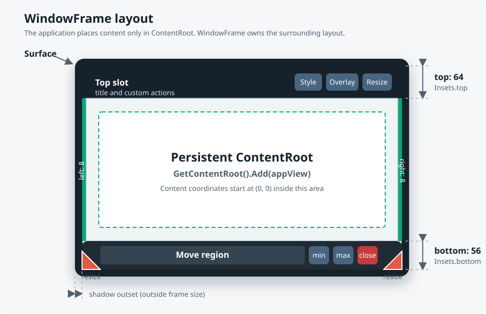

[→ English](https://github.sec.samsung.net/NUI/dali-ui/wiki/WindowFrame)

# DALi UI Components - WindowFrame

`WindowFrame`은 기존 `Dali::Window` 위에 앱이 그리는 보더, 창 제어 버튼, 이동 영역, 리사이즈 핸들을 설치하는 컴포넌트입니다. 앱 콘텐츠는 보더와 분리된 `ContentRoot`에 추가합니다. 보더의 배치와 크기 계산은 `WindowFrame`이 맡고, 실제 창 이동, 리사이즈, 최소화, 최대화 및 복원은 window backend와 compositor가 처리합니다.

> [시각형 HTML 가이드 열기](./assets/WindowFrame/window-frame-guide.html)<br>
> HTML 가이드에는 샘플 구조, 레이아웃 변화, public API 지도, `DesktopWindow` 형태의 확장 방법이 한 화면에 정리되어 있습니다.



## 1. 책임 구분

| 주체 | 책임 |
|---|---|
| 앱 | decoration용 `View` 생성, 역할 지정, 스타일 설정, `ContentRoot`에 콘텐츠 추가 |
| `WindowFrame` | view 수명과 slot 배치, 콘텐츠 좌표계, 입력 역할 연결, 상태 추적, signal 제공 |
| window backend / compositor | 실제 move/resize/minimize/maximize/restore 수행, 최종 위치와 크기 결정 |

중요한 원칙은 다음과 같습니다.

- 앱은 콘텐츠 크기에서 보더 두께나 shadow 크기를 직접 빼지 않습니다.
- 앱 콘텐츠는 항상 `GetContentRoot()`에 추가합니다.
- 일반적인 maximize/restore의 복원 위치와 크기는 compositor가 소유합니다.
- `RequestMinimize()`, `RequestMaximize()`, `RequestRestore()`의 반환은 요청 dispatch 결과입니다. 화면 표시 완료를 의미하지 않습니다.
- decoration view와 스타일은 실행 중에도 교체할 수 있지만 콘텐츠 root는 유지됩니다.

## 2. 빠른 시작

필요한 public header는 하나입니다.

```cpp
#include <dali-ui-components/public-api/window/window-frame.h>
```

다음은 생성부터 콘텐츠 추가까지의 최소 흐름입니다.

```cpp
using namespace Dali;
using namespace Dali::Ui;

class MyWindowController : public ConnectionTracker
{
public:
  void Initialize(Application application)
  {
    mApplication = application;
    mWindow      = application.GetWindow();
    mWindow.SetBackgroundColor(Color::TRANSPARENT);
    mWindow.SetTransparency(true);

    WindowFrameOptions options;
    options.SetInitialStatePolicy(WindowFrameInitialStatePolicy::AUTO);
    options.SetInitialRestoreFrameSize(Vector2(400.0f, 260.0f));

    mWindowFrame = WindowFrame::New(
      mWindow,
      WindowFrame::CloseCallback::New(this, &MyWindowController::OnClose),
      options);
    mWindowFrame.SetOverlayEnabled(true);
    mWindowFrame.SetOverlayAutoHideDelay(2500u);

    InstallDecoration();
    ConnectSignals();

    mWindowFrame.RequestFrameResize(Vector2(400.0f, 260.0f));
    mWindowFrame.SetMinimumFrameSize(Vector2(200.0f, 130.0f));
    mWindowFrame.Attach();

    View appContent = CreateAppContent();
    mWindowFrame.GetContentRoot().Add(appContent);
  }

private:
  void OnClose()
  {
    mApplication.Quit();
  }

  // Application-specific helpers implemented by the product.
  void InstallDecoration();
  void ConnectSignals();
  View CreateAppContent();

  Application  mApplication;
  Window       mWindow;
  WindowFrame mWindowFrame;
};
```

`Application`과 `Window`는 handle을 값으로 보관합니다. 호출자가 넘긴 지역 handle의 주소를 저장하면 controller보다 먼저 소멸할 수 있으므로 pointer/reference를 장기 보관하지 않는 편이 안전합니다. Client shadow와 둥근 외곽을 사용하려면 native window background와 surface도 transparent로 준비해야 합니다.

권장 초기화 순서는 다음과 같습니다.

1. 생성 시점에만 필요한 launch 및 feature 설정을 `WindowFrameOptions`에 지정합니다.
2. 기존 `Dali::Window`로 `WindowFrame::New()`를 호출합니다.
3. 동적으로 바꿀 presentation 및 interaction 설정을 `WindowFrame`에 지정합니다.
4. decoration, layout, frame style을 설치합니다.
5. 필요한 signal과 interceptor를 연결합니다.
6. 크기와 제약을 설정하고 `Attach()`합니다.
7. 앱 view를 `GetContentRoot()`에 추가합니다.

`GetContentRoot()`는 `Attach()` 전에도 사용할 수 있고, decoration 교체와 `Detach()`/재연결 중에도 같은 handle을 유지합니다.

### Handle과 attach 수명

| API | 계약 |
|---|---|
| `WindowFrame()` | 초기화되지 않은 handle 생성. 초기화된 handle을 대입하기 전에 instance API를 호출하면 안 됨 |
| `New()` | 기존 `Dali::Window`를 감싸는 구현 생성. options 없는 overload는 기본 생성 option 사용 |
| 복사 생성/대입 | 같은 WindowFrame 구현, signal, frame, content root를 공유 |
| `DownCast()` | `BaseHandle` 내부가 WindowFrame 구현일 때만 초기화된 handle 반환. 실패하면 빈 handle 반환 |
| `Attach()` | 중복 호출에 안전하며 persistent frame tree 연결, window callback 연결, 저장된 native size constraint 적용 |
| `Detach()` | 중복 호출에 안전하며 callback 해제, native constraint 제거, 예약된 frame callback 취소와 진행 중인 interaction 취소, frame tree unparent 수행 |
| `IsAttached()` | frame/callback 연결 상태를 반환하며 native window 표시 여부를 의미하지 않음 |

`Detach()`는 앱 content와 custom decoration을 파괴하지 않습니다. 다시 `Attach()`하면 같은 view tree가 복원됩니다. Persistent `ContentRoot`는 같은 구현을 공유하는 마지막 WindowFrame handle이 파괴될 때까지 유효합니다.

## 2.4. 두 개의 샘플

| 샘플 | 보여주는 것 |
|---|---|
| `samples/window-frame` | 모든 기능의 쇼케이스 — 프레임 스타일 2종, overlay, resize policy, 크기 제약 |
| `samples/desktop-window` | 보더를 직접 소유하는 제품 래퍼와, 앱이 확장하는 seam. 제품 프레임워크로 복사해 가는 용도 |

## 2.5. 기본 제공 창 장식

`DefaultWindowDecoration`는 완성된 창 장식을 만들고 설치하고 유지합니다. 호출 한 줄이면
동작하는 창이 됩니다.

```cpp
#include <dali-ui-components/public-api/window/default-window-decoration.h>

mWindowFrame  = WindowFrame::New(window, closeCallback);
mDefaultDecoration = DefaultWindowDecoration::New(mWindowFrame);   // <- 기본 창 장식
mWindowFrame.Attach();

mWindowFrame.GetContentRoot().Add(myContent);
```

상단과 좌우에 얇은 edge를 두고 하단에는 bar를 배치합니다. 하단 bar는 왼쪽부터
bottom-left resize handle, 늘어나는 move region, 앱 action, 기본 제공 minimize,
maximize/restore, close 버튼, bottom-right resize handle 순서입니다.

칠하는 것은 decoration뿐입니다. frame 배경은 투명하므로 앱이 그리는 영역에 색이
입혀지지 않고, `SetTransparency(true)`로 만든 창은 앱이 그리지 않은 곳에서 계속
비쳐 보입니다.

frame은 shadow도 그립니다. shadow는 frame 바깥의 window surface 영역에 그려지므로
**창을 투명하게 만들어야 합니다**:

```cpp
window.SetBackgroundColor(Color::TRANSPARENT);
window.SetTransparency(true);
```

그렇지 않으면 shadow가 차지하는 공간에 불투명한 window 배경이 frame 주변 여백으로
드러납니다. 투명하게 만들 수 없는 창이라면 `SetShadowEnabled(false)`로 끄십시오.
maximized 상태에서는 shadow가 그려지지 않습니다.

아이콘은 컴포넌트와 함께 배포되며 `<dataReadOnlyDir>/ui/images/components/border/`에
설치됩니다. 기본 리소스 디렉터리를 쓰지 않는 빌드에서는 다른 DALi 에셋 디렉터리와
동일하게 `DALI_UI_COMPONENTS_IMAGE_DIR` 환경 변수로 경로를 찾습니다. 알파 채널을 가진 흰색
글리프입니다. 기본 dark theme에서는 흰색을 유지하고, light theme에서는 어둡게
tint합니다.

**`mDefaultDecoration` handle을 멤버로 보관하십시오.** 앱 action callback과 window 상태를
따라가는 연결을 이 handle이 소유합니다. 지역 변수에 받거나 반환값을 버리면 그
동작들이 즉시 사라집니다. decoration과 기본 window control 연결은 `WindowFrame`이
소유하므로 보더는 계속 그려지고 minimize/maximize/close도 동작합니다. 하지만
`AddBarAction()`으로 추가한 action은 멈추고, maximize 아이콘과 corner radius도 더 이상
상태 변경을 따라가지 않습니다.

### 조정하기

```cpp
DefaultWindowDecorationOptions options;
options.SetTheme(DefaultWindowDecorationTheme::LIGHT);
options.SetBarHeight(40.0f);
options.SetMinimizeControlEnabled(false);
mDefaultDecoration = DefaultWindowDecoration::New(mWindowFrame, options);
```

| 옵션 | 기본값 |
|---|---|
| `SetTheme()` | `DARK` (어두운 반투명 frame과 밝은 icon) |
| `SetBarHeight()` | `50` |
| `SetEdgeThickness()` | `5`, 상단과 좌우에 적용 |
| `SetCornerRadius()` | `12`, maximized에서는 0으로 |
| `SetBackgroundColor()` | theme가 결정 |
| `SetMinimizeControlEnabled()` / `SetMaximizeRestoreControlEnabled()` / `SetCloseControlEnabled()` | 모두 `true` |
| `SetResizeHandlesEnabled()` | `true` |
| `SetShadowEnabled()` | `true`, 투명한 창이 필요 |
| `SetTopAreaHeight()` | `0`, 상단은 얇은 테두리로 유지 |

### 상단 영역과 앱 액션

기본 창 장식을 포기하지 않고 두 가지를 더할 수 있습니다.

`SetTopAreaHeight()`는 얇은 상단 테두리를 앱이 채우는 영역으로 바꿉니다. `GetTopArea()`로 가져옵니다. `GetMoveRegion()`와 달리 move region이 아니므로 창 이동을 시작하지 않고, **최대화 상태에서도 자식이 계속 동작합니다.**

```cpp
DefaultWindowDecorationOptions options;
options.SetTopAreaHeight(44.0f);
mDefaultDecoration = DefaultWindowDecoration::New(mWindowFrame, options);
mDefaultDecoration.GetTopArea().Add(myBranding);
```

`AddBarAction()`은 하단 bar에 앱 버튼을 넣습니다. move region과 기본 제공
minimize, maximize/restore, close 버튼 사이에 **자기 컬럼**을 잡습니다. Move region
안이 아니라 옆에 두므로 maximized 상태에서도 계속 입력을 받습니다.

```cpp
const Dali::String shareIconUrl = Dali::String(RESOURCES_DIR) + "share.png";
mDefaultDecoration.AddBarAction(shareIconUrl, Callback<void()>::New(this, &App::Share));
mWindowFrame.SetMinimumFrameSize(mDefaultDecoration.GetMinimumFrameSize());
```

액션마다 컬럼을 하나씩 잡으므로 `GetMinimumFrameSize()`가 함께 커집니다. 추가한 뒤 다시 적용하십시오. 액션은 추가한 순서대로 왼쪽에서 오른쪽으로 놓이고, `GetMoveRegion()`나 `GetTopArea()`에 이미 넣어둔 것은 그대로 유지됩니다. 앱 resource의 full URL을 전달해야 합니다. 기본 제공 흰색 glyph와 달리 앱 아이콘에는 `DefaultWindowDecorationTheme` tint를 적용하지 않습니다.

### 최소 크기

바는 컨트롤과 코너 리사이즈 핸들마다 고정 폭 열을 잡아둡니다. 그래서 이보다 좁아지면
배치가 깨집니다. Move region 폭이 0이 되고 close 버튼이 코너 핸들 밑으로 들어갑니다.
값을 추측하지 말고 물어보십시오.

```cpp
mWindowFrame.SetMinimumFrameSize(mDefaultDecoration.GetMinimumFrameSize());
```

기본 옵션에서는 `276 x 55`입니다. 컨트롤이나 리사이즈 핸들을 끄면 해당 열이 사라져
값도 줄어듭니다. 보더가 이 값을 스스로 적용하지는 않습니다. 창의 크기 제약은 앱의
몫이기 때문입니다. 앱 자체 최소값이 있다면 둘 중 큰 값을 쓰십시오.

`GetMoveRegion()`은 하단 bar에서 남은 폭을 채우는 move region을 돌려줍니다.
입력이 필요 없는 제목이나 branding을 여기에 넣으면 이 region의 나머지 부분은 계속
move를 시작합니다.

최대화된 창은 이동할 수 없으므로 WindowFrame은 최대화 상태에서 move region을
insensitive로 만듭니다. Insensitive한
view는 자식까지 hit-test에서 제외되므로, 여기에 넣은 버튼은 창이 최대화되는 순간
반응을 멈춥니다. 바의 아이콘 action은 `AddBarAction()`을 사용하고, 더 자유로운
interactive content는 `GetTopArea()`에 넣으십시오. 이 두 위치로 제품 layout을 표현할
수 없을 때만 `WindowFrameDecoration`을 직접 구성합니다.

```cpp
mDefaultDecoration.GetMoveRegion().Add(Label::New("My Application"));
```

shadow를 켜고 끄는 것보다 세밀하게 조정하려면 `WindowFrame::GetFrameStyle()`로
설치된 style을 읽어 수정한 뒤 `SetFrameStyle()`로 적용하십시오. style만 바뀌고
decoration은 그대로입니다.

`GetDecoration()`이 돌려주는 것은 설치된 `WindowFrameDecoration`의 **복사본**입니다.
복사본이 같은 view handle을 들고 있으므로, 여기서 view를 꺼내 property나 자식,
색을 바꾸면 설치된 보더가 바뀝니다. 반면 slot이나 role에 다른 view를 대입하는 것은
복사본만 고칠 뿐입니다. view를 교체하려면 복사본에 설정한 뒤 그 복사본을
`SetDecoration()`으로 다시 설치하십시오.

프레임을 통째로 교체하려면 아래 설명대로 `WindowFrameDecoration`을 만들어
`SetDecoration()`으로 설치하되, 사라질 view를 계속 추적하지 않도록
`DefaultWindowDecoration` handle을 먼저 해제하십시오.

보더는 `WindowFrameSizePolicy::KEEP_WINDOW_SIZE`로 설치됩니다. 창 크기는
그대로 두고 content가 보더만큼 줄어듭니다. 따라서 런타임에 custom frame을
`DefaultWindowDecoration`로 바꾸면 content 크기가 달라집니다.

## 3. 보더 구성

### 3.1 Slot과 role

`WindowFrameDecoration`에는 실제 배치되는 **slot**과 동작을 부여하는 **role**이 있습니다.
`SetMoveRegion()`과 세 `Set...Control()` API는 새 layout 영역을 추가하지 않고,
이미 slot tree에 포함된 View에 동작 role만 지정합니다. 여기서 control은 일반적인
window title bar의 최소화, 최대화/복원 및 종료 버튼 역할을 뜻합니다.

| 종류 | API | 용도 |
|---|---|---|
| Slot | `SetTopSlot()`, `SetBottomSlot()`, `SetLeftSlot()`, `SetRightSlot()` | 프레임 네 방향의 root view |
| Slot + role | `SetBottomLeftResizeHandle()`, `SetBottomRightResizeHandle()` | 명시적인 두 코너 리사이즈 핸들 |
| Role | `SetMoveRegion()` | 터치 또는 마우스 드래그로 native move 시작 |
| Role | `SetMinimizeControl()` | 최소화 요청 |
| Role | `SetMaximizeRestoreControl()` | 최대화/복원 토글 요청 |
| Role | `SetCloseControl()` | close callback 실행 |

Role view는 반드시 전달한 slot 내부에 있어야 합니다. Slot root는 설치 시점에 다른 parent를 가지면 안 됩니다. 같은 view를 여러 slot이나 role에 중복 지정하면 전체 설치가 거부되며 기존 프레임은 유지됩니다.

```cpp
WindowFrameDecoration decoration;
decoration.SetTopSlot(top);
decoration.SetBottomSlot(bottom);
decoration.SetLeftSlot(left);
decoration.SetRightSlot(right);

decoration.SetMoveRegion(moveRegion);             // bottom의 child
decoration.SetMinimizeControl(minimizeButton);    // bottom의 child
decoration.SetMaximizeRestoreControl(maximizeButton);    // bottom의 child
decoration.SetCloseControl(closeButton);          // bottom의 child
decoration.SetBottomLeftResizeHandle(leftHandle);
decoration.SetBottomRightResizeHandle(rightHandle);
```

현재 구조는 사용하지 않는 8방향 invisible hit region을 만들지 않습니다. 앱이 제공한 좌하단/우하단 핸들을 누른 상태로 드래그할 때만 명시적인 resize 요청을 시작합니다.

### 3.2 `SetDecorationInsets()`

`WindowFrameLayout::SetDecorationInsets()`는 frame **내부에서** decoration이 차지하는 공간을 지정합니다.

```cpp
WindowFrameLayout layout;
layout.SetDecorationInsets(Insets(8.0f, 8.0f, 64.0f, 56.0f));
//                              start  end   top    bottom
```

위 값은 다음 배치를 뜻합니다.

- 왼쪽 보더: 8 px
- 오른쪽 보더: 8 px
- 위 보더: 64 px
- 아래 보더: 56 px
- 일반 inset mode의 콘텐츠: 이 영역을 제외한 중앙 영역

이 값은 slot의 배치와 `ContentRoot` 크기 계산에 함께 사용됩니다. 앱 개발자가 동일한 값을 다시 빼면 콘텐츠가 이중으로 축소되므로, 콘텐츠는 root 내부 `(0, 0)` 기준으로 배치해야 합니다.

### 3.3 리사이즈 핸들 크기

핸들 view와 layout hit 영역의 크기는 별도로 지정합니다.

```cpp
layout.SetBottomLeftResizeHandleSize(Vector2(36.0f, 36.0f));
layout.SetBottomRightResizeHandleSize(Vector2(36.0f, 36.0f));
```

시각 이미지가 작더라도 터치하기 쉬운 크기의 view를 제공하는 것이 좋습니다. 핸들의 native 요청 여부는 `RESIZE` feature gate와 `WindowFrameInteractiveResizePolicy`에 의해 결정됩니다.

### 3.4 값 의미와 기본값

`WindowFrameDecoration`은 모든 slot과 role이 비어 있는 상태로 생성됩니다. Setter에 빈 `View`를 전달하면 설치를 준비 중인 값에서 해당 항목을 제거할 수 있습니다. Getter는 제품 wrapper가 공통 decoration을 만든 뒤 일부 role을 확인하거나 교체할 때 사용할 수 있습니다.

`WindowFrameDecoration`을 복사하면 저장된 View handle이 복사되며 view tree가 복제되는 것은 아닙니다. 복사본도 같은 view를 가리키므로 서로 다른 두 frame에 동시에 설치할 수 없습니다. 두 번째 window나 교체 frame에 독립 view가 필요하면 새로운 unparented tree를 만들어야 합니다.

`WindowFrameLayout`는 깊은 복사 값 객체이며 기본값은 다음과 같습니다.

| Metric | 기본값 |
|---|---|
| Decoration insets (`start`, `end`, `top`, `bottom`) | `8, 8, 56, 30` |
| Bottom-left resize handle | `28 x 28` |
| Bottom-right resize handle | `28 x 28` |

음수 metric은 layout에서 `0`으로 처리됩니다. Insets는 사용 가능한 frame 크기로 제한되며 두 resize handle 너비의 합이 frame보다 크면 비율에 맞춰 함께 줄어듭니다. Theme에 관계없이 고정된 제품 layout이 필요하면 기본값에 의존하지 말고 화면에 사용하는 metric을 모두 명시합니다.

## 4. 프레임 바꾸기

프레임을 바꾸는 진입점은 다섯 개입니다. **필요한 일을 하는 가장 좁은 것**을 고르십시오.
좁은 호출은 설치된 view를 그대로 두므로 앱이 거기에 붙여둔 것이 살아남습니다.

| 호출 | 교체하는 것 | 유지하는 것 | 반환 |
|---|---|---|---|
| `SetDecoration(decoration, layout, sizePolicy)` | decoration view, layout | frame style | `WindowFrameDecorationResult` |
| `SetDecoration(decoration, layout, style, sizePolicy)` | decoration view, layout, style | — | `WindowFrameDecorationResult` |
| `SetDecorationLayout(layout, sizePolicy)` | layout | **decoration view**, style | `void` |
| `SetFrameStyle(style, sizePolicy)` | style | **decoration view**, layout | `void` |
| `ClearDecoration()` | decoration view와 layout을 빈 값으로 | frame style | `void` |

실제로 고르는 기준입니다.

| 하려는 일 | 사용할 것 |
|---|---|
| 첫 프레임 설치, 또는 외형 전체 교체 | style을 포함한 `SetDecoration()` |
| view만 바꾸고 색과 shadow는 유지 | style 없는 `SetDecoration()` |
| 바 높이, inset, handle 크기 변경 | `SetDecorationLayout()` |
| 색, corner radius, shadow 변경 | `SetFrameStyle()` |
| 장식 없이 content가 프레임 전체를 쓰게 | `ClearDecoration()` |

slot과 role 토폴로지를 검증하는 것은 `SetDecoration()` 두 형태뿐입니다. view를
받는 것이 이 둘뿐이고, 확인할 만한 결과를 돌려주는 것도 이 둘뿐입니다. 좁은 setter
두 개는 실패할 수 없습니다.

`ClearDecoration()`은 항상 window 크기를 유지하므로 content root가 장식이
차지하던 공간까지 커집니다. 나머지는 모두 `WindowFrameSizePolicy`를 받습니다.

### `SetDecoration()`

`SetDecoration()`은 decoration, layout, frame style을 한 번에 검증하고 설치합니다.

```cpp
WindowFrameStyle style;
style.SetFrameBackgroundColor(UiColor(0x17212B));
style.SetFrameCornerRadius(Vector4(14.0f, 14.0f, 14.0f, 14.0f));

WindowFrameDecorationResult result = mWindowFrame.SetDecoration(
  decoration,
  layout,
  style,
  WindowFrameSizePolicy::KEEP_CONTENT_SIZE);

if(result != WindowFrameDecorationResult::INSTALLED)
{
  // Apply a fallback frame based on the typed result.
}
```

이 API가 원자적으로 동작하는 이유는 style만 먼저 적용되고 decoration 검증이 나중에 실패하는 부분 변경을 막기 위해서입니다.

| 결과 | 의미 |
|---|---|
| `INSTALLED` | 전체 프레임 설치 성공 |
| `SLOT_ALREADY_PARENTED` | slot root가 이 WindowFrame이 아닌 다른 parent에 연결됨 |
| `DUPLICATE_SLOT` | 같은 view를 여러 slot에 사용함 |
| `DUPLICATE_ROLE` | 같은 view에 중복 role을 지정함 |
| `ROLE_OUTSIDE_DECORATION` | role view가 전달한 decoration 트리에 속하지 않음 |

Style 없는 `SetDecoration()` overload는 현재 style을 유지하면서 decoration과 layout을 교체합니다. Style만 바꾸려면 `SetFrameStyle()`을 사용합니다. `ClearDecoration()`은 custom decoration을 제거하고 decoration layout을 0으로 초기화하지만 content root와 현재 frame style은 유지합니다.

### 장식을 교체하지 않고 metric만 바꾸기

`SetDecoration()`은 slot view를 교체합니다. 장식 inset이나 리사이즈 핸들
크기만 바꾸려면 `SetDecorationLayout()`를 쓰십시오. 설치된 slot view와 그 안의
내용, 앱이 직접 연결한 signal이 모두 그대로 유지됩니다.

```cpp
WindowFrameLayout compact;
compact.SetDecorationInsets(Insets(6.0f, 6.0f, 44.0f, 44.0f));
compact.SetBottomLeftResizeHandleSize(Vector2(36.0f, 36.0f));
compact.SetBottomRightResizeHandleSize(Vector2(36.0f, 36.0f));
mWindowFrame.SetDecorationLayout(compact, WindowFrameSizePolicy::KEEP_WINDOW_SIZE);
```

`SetDecoration()`도 현재 설치되어 있는 장식을 그대로 다시 받아들이므로, 새
style이나 새 metric과 함께 재제출할 수 있습니다. 다른 부모가 소유한 slot은
여전히 `SLOT_ALREADY_PARENTED`로 거부됩니다.

### 크기 보존 정책

| 정책 | decoration 두께나 shadow가 바뀔 때 유지하는 값 | 적합한 경우 |
|---|---|---|
| `KEEP_CONTENT_SIZE` | 앱 콘텐츠 크기 | 테마/보더 교체가 콘텐츠 layout을 흔들면 안 될 때 |
| `KEEP_WINDOW_SIZE` | window 크기 | 외부 창 크기를 그대로 유지해야 할 때 |

초기 설치에서는 이미 정해진 native window 크기를 유지하려면 `KEEP_WINDOW_SIZE`가 자연스럽습니다. 실행 중 Style 버튼처럼 테마를 바꾸는 경우에는 `KEEP_CONTENT_SIZE`가 앱 사용성에 더 유리한 경우가 많습니다.

이 policy는 WindowFrame에 저장되는 설정이 아니라 **전달된 호출 하나에만** 적용되는
보존 전략입니다. 예를 들면 다음과 같습니다.

```cpp
mWindowFrame.SetDecorationLayout(
  layout,
  WindowFrameSizePolicy::KEEP_CONTENT_SIZE);
mWindowFrame.SetFrameStyle(
  style,
  WindowFrameSizePolicy::KEEP_WINDOW_SIZE);
```

첫 호출은 필요할 때 normal window를 리사이즈하여 content 크기를 보존합니다. 두 번째
호출은 그 시점의 window surface 크기를 독립적으로 보존하므로, shadow outsets가
바뀌면 최종 frame과 content 크기는 달라질 수 있습니다.

## 5. Frame style과 shadow

`WindowFrameStyle`은 frame 배경, corner radius, client-rendered shadow에 대해 앱이 요청한 시각 설정을 담습니다. WindowFrame은 maximized 상태에서 shadow와 corner radius를 억제한 뒤 실제 frame view에 적용합니다.

### 기본값

| 속성 | 기본값 |
|---|---|
| Shadow source | `NONE` |
| Shadow outsets | 모든 방향 `0` |
| Frame background | 투명 |
| Frame corner radius와 policy | `0`, `ABSOLUTE` |
| Shadow image와 stretch border | 빈 URL, `0` border |
| Shadow image border-only | `false` |

`SetShadow()`는 `Dali::Ui::Shadow`의 color, blur, offset, extents, cutout 값으로
생성하는 color shadow를 선택합니다. `SetShadowImageUrl()`은 URL이 비어 있지 않으면
image shadow를 선택합니다. `ClearShadow()` 또는 빈 image URL은 `NONE`을 선택합니다.
Ownership이나 renderer를 별도로 지정할 필요가 없습니다.

### Color shadow

```cpp
WindowFrameStyle style;
style.SetShadowOutsets(Insets(14.0f, 14.0f, 14.0f, 18.0f));
style.SetShadow(Shadow(
  14.0f,
  Vector2(0.0f, 3.0f),
  UiColor(0x000000, 0.48f),
  Vector2::ZERO,
  CutoutPolicy::CUTOUT_VIEW_WITH_CORNER_RADIUS));
style.SetFrameBackgroundColor(UiColor(0x17212B));
style.SetFrameCornerRadius(Vector4(14.0f, 14.0f, 14.0f, 14.0f));
style.SetFrameCornerRadiusPolicy(CornerRadiusPolicy::ABSOLUTE);
```

`SetShadow()`는 `WindowFrameShadowSource::COLOR`를 선택하고 설정한 `Shadow`를 내부 view에 적용합니다. Frame corner radius도 이 view에 적용됩니다. `SetFrameBackgroundColor()`는 frame 전체의 배경색을 설정하며, 앱이 제공한 top, bottom, left, right decoration slot의 개별 색상을 대신하지 않습니다.

Normal 상태에서는 frame root, background, View shadow에 corner radius가 적용됩니다. Maximized 상태에서는 frame이 화면 가장자리까지 채워지도록 radius를 `0`으로 적용합니다. Radius 값의 해석 방식은 `SetFrameCornerRadiusPolicy()`로 지정합니다.

### Shadow outsets

Shadow outsets는 frame 바깥에 effect를 그리기 위해 native surface 내부에 확보하는 공간입니다. Blur 속성이 아니라 geometry이며 View shadow나 N-patch가 잘리지 않을 만큼 충분히 지정해야 합니다. `GetFrameSize()`에는 포함되지 않지만 normal 상태에서 client shadow가 활성화되면 native surface 크기에 포함됩니다.

```text
surface width  = start outset + frame width  + end outset
surface height = top outset   + frame height + bottom outset
```

음수 outset은 `0`으로 보정됩니다. Maximized 상태에서는 client shadow outset을 모두 제거하고 normal로 복원되면 설정값을 다시 적용합니다.

Color와 image shadow는 normal 상태에서만 표시됩니다. Maximized 상태에서는 client effect, shadow outset, corner radius를 제거하고 normal로 복원되면 설정한 값을 다시 적용합니다. WindowFrame은 window system이 소유하는 shadow를 요청하거나 끄거나 조회하지 않습니다.

### Image shadow

NUI 앱에서 사용하던 N-patch 자산을 포함한 shadow image를 그대로 사용할 수 있습니다. 앱이 전체 외곽 효과만 원한다면 각 top/bottom/side에 shadow를 따로 넣지 말고 frame style 한 곳에서 설정하는 것이 일관적입니다.

```cpp
WindowFrameStyle style;
style.SetShadowOutsets(Insets(20.0f, 20.0f, 20.0f, 24.0f));
style.SetShadowImageBorder(Insets(start, end, top, bottom));
style.SetShadowImageBorderOnly(true);
style.SetShadowImageUrl("/opt/usr/apps/.../res/window-shadow.9.png");
```

`SetShadowImageUrl()`은 `WindowFrameShadowSource::IMAGE`를 선택하며 빈 URL은
client-rendered shadow를 끕니다. `SetShadowImageBorder()`는 공개 layout 순서인
`Insets(start, end, top, bottom)`을 받고 내부 `ImageView`의 N-patch stretching을
활성화합니다. WindowFrame은 N-patch renderer에 전달할 때
`(start, top, end, bottom)` 순서로 변환합니다. `SetShadowImageBorderOnly(true)`는
이미지 중앙을 생략하고 border 영역만 렌더링합니다. 일반 이미지는 기본값인
`false`를 유지하면 됩니다.

### Style 적용과 동적 변경

Decoration, layout, style이 하나의 theme이고 원자적으로 검증·설치되어야 한다면 `SetDecoration()`에 style을 함께 전달합니다. 시각 style만 변경할 때는 `SetFrameStyle()`을 사용합니다.

```cpp
mWindowFrame.SetFrameStyle(
  style,
  WindowFrameSizePolicy::KEEP_CONTENT_SIZE);
```

실행 중 theme 변경에서 앱 content layout을 유지하려면 `KEEP_CONTENT_SIZE`, 외부에서 보이는 window 크기를 유지하려면 `KEEP_WINDOW_SIZE`를 사용합니다.

`WindowFrameStyle`은 private implementation을 사용하는 깊은 복사 값 객체입니다. 복사본을 변경해도 WindowFrame에 이미 설치된 style은 바뀌지 않습니다. 이동한 원본 객체에는 다시 접근하지 않아야 합니다.

## 6. 콘텐츠와 크기 좌표계

### 앱 콘텐츠 배치

```cpp
AbsoluteLayout content = AbsoluteLayout::New();
content.SetLayoutParams(AbsoluteLayoutParams::New()
  .SetBounds(LayoutRect(0.0f, 0.0f, 1.0f, 1.0f))
  .SetFlags(AbsoluteLayoutFlags::SIZE_PROPORTIONAL));

mWindowFrame.GetContentRoot().Add(content);
```

앱에서 보는 콘텐츠의 원점과 크기는 `ContentRoot` 기준입니다. 예를 들어 native surface가 `500 x 500`이어도 decoration과 shadow가 있다면 실제 콘텐츠 root는 더 작을 수 있습니다. 이 계산은 `WindowFrame`이 수행하며, 앱은 `500`에서 inset을 직접 빼지 않습니다.

### 크기 API

| API | 기준 |
|---|---|
| `RequestFrameResize()`, `GetFrameSize()` | shadow outset을 제외한 전체 frame |
| `RequestContentResize()`, `GetContentSize()` | decoration을 제외한 앱 콘텐츠 root |
| `SetMinimumFrameSize()`, `SetMaximumFrameSize()` | frame 제약 |

`RequestContentResize()`는 현재 decoration과 shadow metric을 반영해 필요한 native resize를 요청합니다. 이벤트 처리 중 재진입을 피하기 위해 연결된 상태에서는 다음 event-loop tick으로 지연되며 반복 요청은 합쳐질 수 있습니다.

```cpp
mWindowFrame.RequestFrameResize(Vector2(400.0f, 260.0f));
mWindowFrame.SetMinimumFrameSize(Vector2(200.0f, 130.0f));
mWindowFrame.SetMaximumFrameSize(Vector2(1400.0f, 900.0f));
```

최소값이 기존 최대값보다 커지는 등 제약이 충돌하면 setter는 `false`를 반환하고 기존 값을 유지합니다. 정상 적용되면 `true`를 반환합니다.

Constraint와 size API의 세부 동작은 다음과 같습니다.

- 음수 minimum, maximum, frame, content size 성분은 `0`으로 처리됩니다.
- Constraint는 attach 전에도 WindowFrame에 저장됩니다. `Attach()`에서 native window에 적용되고 `Detach()`에서 native 값은 제거되며 다음 `Attach()`에서 다시 적용됩니다.
- `GetMinimumFrameSize(out)`와 `GetMaximumFrameSize(out)`는 설정이 없으면 `false`를 반환합니다. 반환값을 확인한 뒤 `out`을 사용해야 합니다.
- `ClearMinimumFrameSize()`와 `ClearMaximumFrameSize()`는 선택한 constraint만 제거합니다.
- `RequestFrameResize()`와 `RequestContentResize()`는 maximized geometry를 덮어쓰지 않으며, 이 경우 `false`를 반환합니다. Normal 크기를 적용하려면 먼저 restore해야 합니다.
- Size getter는 현재 layout geometry를 반환하므로 constraint 보정이나 compositor 처리 뒤에는 요청값과 다를 수 있습니다.

### Geometry snapshot

`GetGeometry()`와 두 geometry signal은 세 좌표 계약을 가진 `WindowFrameGeometry` snapshot을 전달합니다.

| Getter | 좌표계 | 포함 범위 |
|---|---|---|
| `GetSurfaceBounds()` | Screen 좌표 | Client shadow가 활성화된 경우 shadow 공간까지 포함한 native surface 위치와 크기 |
| `GetFrameBounds()` | Surface-local 좌표 | Client-shadow outset을 제외한 visible frame |
| `GetContentBounds()` | Surface-local 좌표 | Decoration/overlay 해석 뒤의 앱 content 영역 |

`GetContentBounds()`는 상태 관찰과 진단에 사용합니다. 앱의 자식 View는 여전히 `GetContentRoot()` 기준 좌표를 사용하고 원점은 `(0, 0)`입니다. Surface-local content offset을 앱 자식 좌표에 다시 더하지 않습니다.

`GeometryChangedSignal()`은 서로 다른 중간 geometry 변화마다 snapshot을 보냅니다. `GeometryChangeCompletedSignal()`은 native move/resize 완료가 보고한 최종 snapshot이며 pointer release보다 늦게 올 수 있습니다.

## 7. 초기 full-size 런칭

앱이 시작 전에 window 크기를 지정하지 않으면 target 전체 크기로 런칭될 수 있습니다. `WindowFrameInitialStatePolicy::AUTO`는 target maximized bounds와 현재 native bounds를 비교해 이런 경우를 초기 maximized 상태로 해석합니다.

| 초기 policy | 동작 |
|---|---|
| `AUTO` | Native maximized 상태를 먼저 사용하고, 아니면 유효한 target maximized bounds와 현재 surface 크기를 비교 |
| `USE_CURRENT` | Full-size 추론 없이 `Dali::Window`가 이미 보고한 상태를 사용 |
| `REQUEST_MAXIMIZE` | 기존 maximized 상태를 사용하거나 feature가 활성화되어 있으면 일반 maximize 요청 발생 |

```cpp
WindowFrameOptions options;
options.SetInitialStatePolicy(WindowFrameInitialStatePolicy::AUTO);
options.SetInitialRestoreFrameSize(Vector2(400.0f, 260.0f));
```

`SetInitialRestoreFrameSize()`는 **`AUTO`가 처음부터 full-size로 런칭되어 이전 normal 크기를
알 수 없다고 판단한 경우에만** 보관됩니다. 런칭 시에는 일반 maximize를 요청하고,
최초 `RequestRestore()`에서만 `MaximizeWithRestoreSize(false, size)`로 이 값을 전달한 뒤
소비합니다. 이후 maximize/restore와 normal 크기로 런칭한 창의 모든 복원 위치·크기는
compositor에 맡깁니다.

`WindowFrameOptions`의 기본값은 `AUTO`, restore frame size 없음, 모든 `WindowFrameFeature` 활성화입니다. `GetInitialRestoreFrameSize(out)`은 값이 없으면 `false`를 반환하고 `out`을 바꾸지 않습니다. `ClearInitialRestoreFrameSize()`는 설정을 제거합니다. `New()`는 options를 복사하므로 생성 후 원본 options를 바꿔도 기존 WindowFrame에는 반영되지 않습니다. Runtime presentation과 interaction 설정은 생성된 WindowFrame handle에 적용합니다.

앱은 `WindowStateChangedSignal()` 또는 `GetWindowState()`로 window system이
보고한 상태만 관찰합니다.

## 8. 이동과 리사이즈

앱은 pointer 좌표로 window 위치를 직접 계산하지 않습니다. `SetMoveRegion()` 또는 두 resize handle에 pointer down이 발생하면 `WindowFrame`이 native interactive operation을 요청합니다. 이후 위치와 크기 결정은 compositor가 담당합니다.

```cpp
mWindowFrame.InteractionChangedSignal().Connect(
  this,
  [](WindowFrame sender,
     const WindowFrameInteraction& interaction)
  {
    static_cast<void>(sender);
    const WindowFrameInteractionType type = interaction.GetType();
    const WindowFrameInteractionState state = interaction.GetState();
    // Observe STARTED, POINTER_RELEASED, COMPLETED, or CANCELLED.
  });
```

Resize policy는 명시적인 handle interaction 동작을 다음과 같이 선택합니다.

| Policy | 동작 |
|---|---|
| `FREE` | 고정 비율을 요청하지 않고 compositor가 interactive resize를 처리하도록 허용 |
| `KEEP_ASPECT_RATIO` | Resize handle을 활성 상태로 유지하고 window system에 native surface 비율 유지를 요청 |
| `DISABLED` | 진행 중인 resize를 취소하고 이후 interactive resize 요청을 차단 |

```cpp
mWindowFrame.SetInteractiveResizePolicy(
  WindowFrameInteractiveResizePolicy::KEEP_ASPECT_RATIO);
```

Tizen에서는 `KEEP_ASPECT_RATIO`를 `wm.policy.win.resize_aspect_ratio` auxiliary hint에 연결합니다. WindowFrame은 비율 유지 정책을 적용할 때 기존 hint 값을 보관하고, policy가 `FREE` 또는 `DISABLED`로 바뀌거나 detach될 때 원래 값을 복원합니다. 기본 `FREE` policy는 앱이 소유한 hint를 변경하지 않습니다. Backend가 hint를 거부하면 interactive resize 자체는 유지되며 자유 비율로 동작할 수 있습니다.

Compositor가 유지하는 비율은 **native surface** 기준입니다. Client shadow outset도 surface 공간을 차지하므로 visible frame이나 content 비율은 조금 달라질 수 있습니다. Visible frame의 정확한 비율이 필요하면 client-shadow outset을 0으로 두거나 system shadow를 사용합니다.

Interaction state는 geometry 값이 아니라 input/native lifecycle을 나타냅니다.

| State | 의미 |
|---|---|
| `STARTED` | Move 또는 resize 요청을 발행하고 interaction tracking을 시작함 |
| `POINTER_RELEASED` | 시작한 pointer 입력은 끝났지만 native 동작은 아직 완료되지 않음 |
| `COMPLETED` | 대응하는 native move/resize 완료 event가 도착함 |
| `CANCELLED` | Input interruption, window hide, maximize, detach, policy 변경, 또는 포인터가 떨어진 뒤의 focus 상실로 tracking 취소 |

`WindowFrameInteractionType`는 move, bottom-left resize, bottom-right resize를 구분합니다.

기본 resize policy는 `FREE`입니다. `FREE`와 `KEEP_ASPECT_RATIO`는 normal layout에서 resize handle을 표시하고 sensitive 상태로 유지하며, `DISABLED`만 handle을 숨깁니다. 어느 policy도 programmatic `RequestFrameResize()`와 `RequestContentResize()` 호출을 막지 않습니다.

## 9. 최소화, 최대화, 복원, 종료

버튼 role을 지정하면 기본 동작은 자동 연결됩니다. 같은 동작을 앱 코드에서 직접 요청할 수도 있습니다.

```cpp
WindowFrameCommandResult result = mWindowFrame.ToggleMaximize();

if(result == WindowFrameCommandResult::DISPATCHED)
{
  // Native request was dispatched. Acceptance and completion are not implied.
}
```

`ToggleMaximize()`는 현재 최대화 상태의 반대를 요청합니다. `IsMaximized()`로
직접 분기하는 것보다 이 API를 쓰십시오. 최소화된 창처럼 토글할 수 없는 상태까지
함께 판단합니다.

주요 결과는 다음과 같습니다.

| 결과 | 의미 |
|---|---|
| `DISPATCHED` | 기본 window operation 또는 close callback을 호출함. Window system의 수락이나 완료는 뜻하지 않음 |
| `NOT_DISPATCHED` | 기본 operation을 사용할 수 없거나 비활성화되어 아무 동작도 호출하지 않음 |
| `HANDLED` | interceptor가 명령을 넘겨받음 |

Window system command에서 `DISPATCHED`는 이 이상을 약속할 수 없습니다. `Window::Maximize()`, `RequestMoveToServer()` 등은 결과를 반환하지 않으므로 수락 여부를 알아낼 방법이 없습니다. 보장하는 것은 interceptor가 명령을 가져가지 않았고 underlying operation을 호출했다는 것까지입니다.

WindowFrame은 자체적인 진행 중 상태를 두지 않으므로 window system이 보고하지 않은 상태를 client가 먼저 보고하는 일이 없습니다. 앱은 signal로 결과를 관찰합니다.

어느 signal로 오는지는 command마다 다르므로 `DISPATCHED` 하나가 한 곳을 가리키지 않습니다.

| Command | 결과가 나타나는 곳 |
|---|---|
| `MAXIMIZE`, `RESTORE` | `WindowStateChangedSignal()`, 화면에 그려지면 `WindowStatePresentedSignal()` |
| `MINIMIZE` | `WindowStateChangedSignal()`만. 최소화된 창은 표시할 frame이 없음 |
| `MOVE`, `RESIZE` | `COMPLETED`에 도달하는 `InteractionChangedSignal()`, 그리고 `GeometryChangedSignal()`과 `GeometryChangeCompletedSignal()` |
| `CLOSE` | 전용 signal 없음. `New()`에 전달한 `CloseCallback`이 종료의 의미를 소유 |

`CommandProcessedSignal()`은 모든 command에 대해 이 결과값을 전달하므로, 완료가 아니라 무엇이 dispatch되었는지를 알려줍니다.

### 활성화된 명시적 요청은 항상 전달됩니다

`RequestMinimize()`, `RequestMaximize()`, `RequestRestore()`는 창이 이미 그 상태로 보이더라도 window system까지 전달됩니다. 이를 걸러내려면 window system이 마지막으로 보고한 상태와 비교해야 하는데, 그러면 이전 요청이 보고되기 전에 보낸 요청이 버려집니다.

```cpp
mWindowFrame.RequestMaximize();  // DISPATCHED
mWindowFrame.RequestRestore();   // DISPATCHED — 결과적으로 창은 restore됩니다
```

이미 적용된 요청을 한 번 더 보내는 것은 무해하므로, 걸러내지 않아서 잃는 것은 없습니다.

`ToggleMaximize()`만 예외입니다. 토글은 자체 목표가 없어 마지막으로 보고된 상태를 읽어야 하므로, 상태가 바뀌기 전에 토글을 두 번 보내면 같은 것을 두 번 요청하게 됩니다.


## 10. 완료 시점과 signal

NUI의 `OnMaximize`와 같은 “요청한 maximize/restore가 화면에 반영된 뒤” 시점이 필요하면 `WindowStatePresentedSignal()`을 사용합니다.

```cpp
mWindowFrame.WindowStateChangedSignal().Connect(
  this,
  [](WindowFrame sender, WindowFrame::WindowState state)
  {
    static_cast<void>(sender);
    // Compositor confirmed the native state.
  });

mWindowFrame.WindowStatePresentedSignal().Connect(
  this,
  [](WindowFrame sender, WindowFrame::WindowState state)
  {
    static_cast<void>(sender);
    // A frame showing the new maximize or restore state has been presented.
  });
```

| Signal | 시점과 용도 |
|---|---|
| `WindowStateChangedSignal()` | 원인과 무관하게 관찰된 window 상태가 바뀐 시점 |
| `WindowStatePresentedSignal()` | 새로 관찰된 `NORMAL`/`MAXIMIZED` 상태가 frame으로 그려진 뒤 |
| `GeometryChangedSignal()` | surface/frame/content geometry 변경, 중간 resize 포함 |
| `GeometryChangeCompletedSignal()` | compositor move/resize 완료 |
| `DecorationVisibilityChangedSignal()` | effective decoration 표시 여부 변경 |
| `InteractionChangedSignal()` | move/resize 입력 lifecycle |
| `CommandProcessedSignal()` | 모든 command dispatch 결과 |

모든 WindowFrame signal은 첫 번째 인자로 signal을 발생시킨 `WindowFrame`
sender를 전달합니다. 하나의 observer를 여러 frame에 연결했을 때 sender로
발생 대상을 구분할 수 있습니다.

Decoration의 active/inactive 표현에 focus가 필요하면 `Window::FocusChangedSignal()`을
사용합니다. WindowFrame은 underlying window signal을 중복해서 제공하지 않습니다.

`IsMaximized()`와 `IsMinimized()`는 window system이 보고한 상태를 반환합니다.
요청 직후에는 반환값을 완료로 해석하지 말고 state signal을 기다립니다.

`GetWindowState()`는 `NORMAL`, `MINIMIZED`, `MAXIMIZED` 중 하나를 반환합니다. Convenience predicate는 같은 확정 상태를 편리하게 조회할 뿐 별도의 requested/pending 상태를 노출하지 않습니다.

`WindowStatePresentedSignal()`은 `WindowStateChangedSignal()` 뒤에 같은 상태를 실어 보내므로, 앱이 요청한 변경뿐 아니라 compositor가 주도한 변경에도 발생합니다. 두 경우에만 발생하지 않습니다. `MINIMIZED`는 표시할 frame이 없어서, 그리고 frame을 기다리는 동안 더 최신 상태가 도착하면 이전 상태는 건너뜁니다.

WindowFrame은 `WindowStatePresentedSignal()`에 observer가 있을 때만 내부 frame
callback을 등록합니다. 별도의 feature switch는 필요하지 않습니다.

## 11. Overlay mode

Overlay mode는 maximized 상태에서 content bounds를 전체 frame으로 유지하면서 decoration을 콘텐츠 위에 표시합니다. 일정 시간이 지나면 decoration이 자동으로 숨고, window surface를 다시 터치하면 표시된 뒤 타이머가 새로 시작됩니다.

```cpp
mWindowFrame.SetOverlayEnabled(true);
mWindowFrame.SetOverlayAutoHideDelay(2500u);

// 앱 동작으로도 다시 표시할 수 있습니다.
mWindowFrame.ShowOverlayTemporarily();
```

`SetDecorationVisible(true)`는 앱의 표시 요청입니다. Overlay auto-hide가 활성화된 순간에는 요청이 `true`여도 effective visibility는 `false`일 수 있습니다. 실제 표시 여부는 `IsDecorationVisible()` 또는 `DecorationVisibilityChangedSignal()`로 확인하고, auto-hide 여부만 따로 필요하면 `IsOverlayAutoHidden()`을 사용합니다.

Overlay는 maximized일 때만 활성화됩니다. Normal window에서는 decoration inset layout을 사용합니다.

Overlay API는 policy, visibility, auto-hide 상태를 구분합니다.

| API | 의미 |
|---|---|
| `IsOverlayEnabled()` | 요청한 overlay policy. Normal 상태에서도 true일 수 있음 |
| `IsOverlayAutoHidden()` | Active overlay decoration이 auto-hide timeout으로 숨겨짐 |
| `IsDecorationVisible()` | 요청 visibility와 auto-hide를 해석한 실제 표시 상태 |

기본값은 overlay disabled, decoration 표시 요청 true, auto-hide delay `3000 ms`입니다. `SetOverlayAutoHideDelay(0)`은 자동 숨김을 끕니다. overlay decoration이 계속 표시되고, 자동 숨김으로 이미 숨겨져 있던 decoration도 다시 나타납니다. 0이 아닌 delay는 timeout을 새로 시작합니다. `ShowOverlayTemporarily()`는 overlay가 active이고 window가 표시 중이며 decoration 표시가 요청된 경우에만 효과가 있습니다.

## 12. Feature gate

모든 `WindowFrameFeature`는 backend 종류와 무관하게 기본값이 `true`이고, 이를 바꾸는 것은 호출자뿐입니다. **이것은 제품이 선언하는 gate이지 WindowFrame이 탐지하는 capability가 아닙니다.** window system에 지원 여부를 물어보는 곳은 없습니다. 따라서 feature가 켜져 있다는 것은 요청을 발행한다는 뜻이지 window system이 그것을 수행한다는 뜻이 아닙니다. 아직 그 요청을 구현하지 않은 backend에서도 UI는 그대로 sensitive하고 `DISPATCHED`가 반환됩니다. 제품이 제공하지 않을 기능은 `WindowFrame::New()` 전에 끄십시오.

```cpp
WindowFrameOptions options;
options.SetFeatureEnabled(WindowFrameFeature::MINIMIZE, false);

WindowFrame windowFrame = WindowFrame::New(window, closeCallback, options);

if(windowFrame.IsFeatureEnabled(WindowFrameFeature::RESIZE))
{
  // Resize UI or behavior can be enabled.
}
```

Feature gate는 “현재 요청이 성공했다”는 결과가 아니라 제품이 무엇을 제공하도록 구성했는지를 나타냅니다. Feature 종류에 따라 비활성화 효과가 다릅니다.

| Feature | `false`일 때의 동작 |
|---|---|
| `MOVE` | move region 입력 비활성화, move command는 `NOT_DISPATCHED` |
| `RESIZE` | 두 resize handle은 표시될 수 있지만 입력은 비활성화, resize command는 `NOT_DISPATCHED` |
| `MINIMIZE` | minimize control 입력 비활성화, `RequestMinimize()`는 `NOT_DISPATCHED` |
| `MAXIMIZE_RESTORE` | maximize control 입력 비활성화, maximize/restore request는 `NOT_DISPATCHED` |

기본값이 `true`여도 실제 backend/compositor가 요청을 처리하지 않는 문제는 native 계층에서 진단해야 합니다.

## 13. 기본 동작 가로채기

`SetCommandInterceptor()`는 `DesktopWindow`처럼 기본 동작 전후에 앱 정책을 끼워 넣기 위한 단일 진입점입니다. Callback의 첫 번째 인자는 command를 발생시킨 `WindowFrame`이며 signal의 sender-first 규칙과 같습니다.

```cpp
WindowFrameCommandDisposition OnCommand(
  WindowFrame sender,
  const WindowFrameCommandRequest& request)
{
  if(request.GetCommand() == WindowFrameCommand::CLOSE && HasUnsavedWork())
  {
    ShowCloseConfirmation();
    return WindowFrameCommandDisposition::HANDLED;
  }

  return WindowFrameCommandDisposition::CONTINUE_DEFAULT;
}
```

| 반환값 | 계약 |
|---|---|
| `CONTINUE_DEFAULT` | `WindowFrame`이 기본 native/callback 동작 수행 |
| `HANDLED` | 앱이 동기적으로 완료하거나 거부함. 기본 동작 중단 |

Interceptor 안에서 같은 `WindowFrame::Request...()` API를 다시 호출하면 동일 interceptor로 재진입할 수 있으므로 피해야 합니다. 기본 요청을 원하는 경우 `CONTINUE_DEFAULT`를 반환합니다.

### `GetResizeDirection(direction)`

모든 command가 하나의 `WindowFrameCommandRequest` 타입을 공유하지만 resize만 방향 payload를 가집니다. 하나의 boolean getter로 별도 precondition 없이 optional metadata를 읽습니다.

```cpp
WindowFrameCommandDisposition OnCommand(
  WindowFrame sender,
  const WindowFrameCommandRequest& request)
{
  WindowResizeDirection direction;
  if(request.GetResizeDirection(direction))
  {
    AuditResizeDirection(direction);
  }

  return WindowFrameCommandDisposition::CONTINUE_DEFAULT;
}
```

`GetResizeDirection(out)`은 방향이 없으면 `false`를 반환하고 `out`을 바꾸지 않습니다. 이 값은 request metadata일 뿐 resize 지원 여부, native 요청 성공 여부, 완료 여부를 뜻하지 않습니다.

Command별 `WindowFrameCommandRequest` 생성은 WindowFrame 내부가 담당합니다. 앱은 request를 직접 만들지 않고 interceptor나 `CommandProcessedSignal()`으로 전달된 값을 읽습니다. Observer에 비어 있는 초기값이 필요하면 `std::optional<WindowFrameCommandRequest>`를 사용합니다. 이 타입이 public인 이유는 제품 wrapper가 WindowFrame internal 구현에 의존하지 않고도 강한 타입의 정책 코드를 작성할 수 있게 하기 위해서입니다.

`CommandProcessedSignal()`은 설정된 role View에서 시작한 command와 직접 호출한 `Request...()` 모두에 대해 dispatch가 끝날 때마다 발생합니다. Result는 dispatch 결과일 뿐입니다. 비동기 native command의 실제 완료는 state, geometry 또는 interaction signal과 함께 확인합니다.

### 비동기 대체 동작을 구현할 때

`HANDLED`는 interceptor가 명령을 직접 처리하든, 거부하든, 자체 작업을 시작하든 모두 포함합니다. WindowFrame은 기본 operation을 수행하지 않고 이후 아무 것도 추적하지 않습니다.

## 14. `DesktopWindow` 형태로 감싸기

앱이나 3rd party component는 상속 가능한 wrapper를 만들고, 내부 구현은 composition으로 `WindowFrame`을 보유하는 방식이 좋습니다. Public `WindowFrame` 자체의 internal 구현을 상속할 필요가 없습니다.

```cpp
class DesktopWindow : public ConnectionTracker
{
public:
  virtual ~DesktopWindow() = default;

  void Initialize(Window window)
  {
    WindowFrameOptions options = CreateOptions();
    mWindowFrame = WindowFrame::New(
      window,
      WindowFrame::CloseCallback::New(this, &DesktopWindow::OnCloseRequested),
      options);
    ConfigureWindowFrame(mWindowFrame);

    mWindowFrame.SetCommandInterceptor(
      WindowFrame::CommandInterceptor::New(this, &DesktopWindow::DispatchCommand));

    InstallFrame(WindowFrameSizePolicy::KEEP_WINDOW_SIZE);
    ConnectSignals();
    mWindowFrame.Attach();
    OnInitialized(mWindowFrame.GetContentRoot());
  }

protected:
  virtual WindowFrameOptions CreateOptions() const;
  virtual void ConfigureWindowFrame(WindowFrame& windowFrame) {}
  virtual WindowFrameDecoration CreateDecoration(WindowFrameLayout& layout);
  virtual WindowFrameStyle CreateFrameStyle() const;
  virtual WindowFrameCommandDisposition OnCommand(
    WindowFrame sender,
    const WindowFrameCommandRequest& request)
  {
    return WindowFrameCommandDisposition::CONTINUE_DEFAULT;
  }
  virtual void OnCloseRequested() = 0;
  virtual void OnStatePresented(WindowFrame::WindowState) {}
  virtual void OnInitialized(View contentRoot) = 0;

private:
  void InstallFrame(WindowFrameSizePolicy sizePolicy);
  void ConnectSignals();

  WindowFrameCommandDisposition DispatchCommand(
    WindowFrame sender,
    const WindowFrameCommandRequest& request)
  {
    return OnCommand(sender, request);
  }

  WindowFrame mWindowFrame;
};
```

위 코드는 wrapper의 public/protected 경계와 hook 위치를 보여주는 골격입니다. `InstallFrame()`과 `ConnectSignals()`의 구현은 제품 공통 계층에 두고, 파생 클래스는 factory와 typed hook만 구현합니다.

이 구조에서는 파생 클래스가 다음을 바꿀 수 있습니다.

- `CreateOptions()`: 제품별 operation gate와 초기 상태 정책
- `ConfigureWindowFrame()`: overlay, decoration 표시, auto-hide 시간, resize 정책
- `CreateDecoration()`: title bar, footer, 버튼 및 resize handle UI
- `CreateFrameStyle()`: shadow, N-patch, corner radius, frame color
- `OnCommand()`: close 확인, 로깅, 제품 정책, 대체 native 동작
- `OnStatePresented()`: 화면 반영 뒤 후속 처리
- `OnInitialized()`: 앱 콘텐츠 구성

Wrapper는 공통 초기화 순서와 invariant를 소유하고, 파생 클래스는 명확한 hook만 재정의하게 만드는 것이 좋습니다. 이는 기존 `DesktopWindow`의 override 사용성을 유지하면서 view topology와 native 상태 처리를 중복 구현하지 않게 합니다.

## 15. Public API 사용 지도

| 타입/API 그룹 | 앱이 사용하는 이유 |
|---|---|
| `WindowFrameOptions` | 생성 시점 전용 초기 상태와 operation gate 설정 |
| 변경 가능한 `WindowFrame` 설정 | `Attach()` 전후에 overlay, 표시 여부, auto-hide 시간, resize 정책 설정 |
| `WindowFrameDecoration` | decoration slot과 move/control/resize 역할 연결 |
| `WindowFrameLayout` | decoration inset과 두 resize handle의 layout 크기 지정 |
| `WindowFrameStyle` | frame 색상, radius, client-rendered shadow 설정 |
| `SetDecoration()` | decoration, layout, style을 원자적으로 검증/교체 |
| `GetContentRoot()` | decoration 계산과 분리된 앱 콘텐츠 root 획득 |
| Frame/content size API | 앱 의도에 맞는 좌표계로 크기와 제약 지정 |
| Request API | 버튼 외 코드 경로에서 window operation 요청 |
| State/geometry signal | 요청과 compositor 확인/완료/presented 시점 구분 |
| `SetDecorationLayout()` | 설치된 장식 view를 유지한 채 inset과 handle 크기만 변경 |
| `ToggleMaximize()` | 대기 중인 요청을 중복하지 않고 반대 최대화 상태 요청 |
| `WindowFrameGeometry::GetDecorationOverlayInsets()` | overlay decoration이 콘텐츠를 가리는 양을 조회 |
| `DefaultWindowDecoration` | 완성된 기본 창 장식을 설치하고 유지 |
| `DefaultWindowDecorationOptions` | 기본 창 장식의 크기, theme, control 구성 조정 |
| `SetCommandInterceptor()` | 기본 operation 전 제품 정책 또는 대체 동작 삽입 |
| `WindowFrameFeature` | move, resize, minimize, maximize/restore gate를 생성 전에 구성 |

### Public value type과 ownership

| 타입 | 기본값과 복사 계약 | 실제 사용 방법 |
|---|---|---|
| `WindowFrame` | 기본 생성 handle은 비어 있습니다. 초기화된 handle을 복사하면 동일한 구현, content root, frame, signal을 공유합니다. | 공유 handle 의미가 필요할 때 값으로 전달합니다. Instance API는 `New()`나 성공한 `DownCast()` 결과에만 호출합니다. |
| `WindowFrameOptions` | Value type입니다. 기본값은 `AUTO`, restore size 없음, 모든 feature 활성화이며 `New()`가 복사합니다. | 생성 시점 정책을 준비한 뒤 원본 options는 독립적으로 폐기하거나 재사용합니다. |
| `WindowFrameDecoration` | 모든 필드가 빈 View handle인 value type입니다. 복사는 View handle을 복사할 뿐 view tree를 복제하지 않습니다. | 하나의 frame 설치를 기술합니다. 두 window나 두 동시 설치에 독립 decoration이 필요하면 parent가 없는 새 View tree를 만듭니다. |
| `WindowFrameLayout` | Value type입니다. 기본 inset은 `(8, 8, 56, 30)`, 두 handle은 각각 `28 x 28`입니다. | Layout 수치를 role View 및 visual style과 분리해 관리합니다. |
| `WindowFrameStyle` | Value type입니다. 기본값은 `NONE` shadow source, 0 outset/radius, 빈 shadow image, 투명 frame, `ABSOLUTE` radius policy, shadow-image border-only 비활성화입니다. | Theme preset을 복사해 수정한 뒤 `SetFrameStyle()`이나 `SetDecoration()`으로 명시적으로 적용합니다. |
| `WindowFrameGeometry` | 읽기 전용 snapshot value입니다. 기본 객체의 bounds는 모두 0이며, signal 인자와 `GetGeometry()` 결과는 live reference가 아닙니다. | 이후 layout 변경과 무관하게 geometry 관찰값을 보관하거나 비교합니다. |
| `WindowFrameCommandRequest` | 읽기 전용 command metadata value입니다. | Interceptor와 command-processed observer에서 strongly typed command metadata를 읽습니다. |
| `WindowFrameInteraction` | 읽기 전용 interaction snapshot입니다. 기본값은 `NONE`, `CANCELLED`입니다. | `InteractionChangedSignal()`에서 move/resize type과 lifecycle state를 읽습니다. |

Pimpl 기반 value type은 모두 copy와 move를 지원합니다. Move된 원본은 파괴하거나 새 값을 대입하는 용도로만 사용하고 getter/setter를 호출하지 않습니다. 이 방식은 일반적인 value semantics를 유지하면서 public header의 ABI 안정성을 확보합니다.

### 변경 가능한 설정 API 쌍

| Setter 또는 action | 조회 API와 차이점 |
|---|---|
| `SetDecorationVisible(bool)` | `IsDecorationVisible()`는 요청 boolean 자체가 아니라 overlay auto-hide까지 반영한 **effective** visibility를 반환합니다. |
| `SetFrameStyle(style, policy)` | `GetFrameStyle()`은 설정한 style의 복사본을 반환합니다. Capability와 maximized 상태 해석으로 실제 렌더링 effect는 다를 수 있습니다. |
| `SetOverlayEnabled(bool)` | `IsOverlayEnabled()`는 요청 policy를 반환하며 overlay layout은 attached + maximized 상태에서만 적용됩니다. |
| `SetOverlayAutoHideDelay(ms)` | `GetOverlayAutoHideDelay()`는 설정값을 반환하며, `0`은 자동 숨김이 꺼진 상태를 뜻합니다. |
| `ShowOverlayTemporarily()` | 표시 및 timer 재시작 action이며 overlay를 enable하거나 설정 delay를 바꾸지 않습니다. |
| `SetInteractiveResizePolicy(policy)` | `GetInteractiveResizePolicy()`는 `FREE`, `KEEP_ASPECT_RATIO`, `DISABLED` 중 하나를 반환합니다. 이 policy는 interactive resize만 제어하고 programmatic sizing은 막지 않습니다. |

각 getter는 의도적으로 서로 다른 질문에 답합니다. Overlay policy가 enabled라는 사실만으로 maximized 상태라고 판단하거나, `GetFrameStyle()`을 backend가 해석해 만든 rendering view의 snapshot으로 사용하면 안 됩니다.

### 어떤 API에서 결과를 읽어야 하는가

| 알고 싶은 내용 | 사용할 API |
|---|---|
| Command가 dispatch 대상으로 받아들여졌는가? | `Request...()` 반환값 또는 `CommandProcessedSignal()` |
| Compositor가 normal/minimized/maximized 상태를 확정했는가? | `WindowStateChangedSignal()`과 `GetWindowState()` |
| 요청한 maximize/restore frame이 화면에 표시됐는가? | `WindowStatePresentedSignal()` |
| 현재 surface/frame/content geometry는 무엇인가? | `GetGeometry()` |
| Move/resize input이 아직 진행 중인가? | `InteractionChangedSignal()` |
| Native move/resize가 끝났는가? | `GeometryChangeCompletedSignal()` |
| Overlay 정책까지 반영한 decoration이 실제 보이는가? | `IsDecorationVisible()` 또는 `DecorationVisibilityChangedSignal()` |

Public API 선언은 [window-frame.h](https://github.sec.samsung.net/NUI/dali-ui/blob/devel/dali-ui-components/public-api/window/window-frame.h)와 같은 디렉터리의 관련 타입 header에서 확인할 수 있습니다.

## 16. NUI `BorderWindow`와 사용성 차이

| 관점 | NUI 사용 방식 | DALi UI `WindowFrame` |
|---|---|---|
| 콘텐츠 배치 | 앱이 border 구조와 콘텐츠 영역을 함께 의식할 수 있음 | persistent `ContentRoot`에만 추가 |
| UI 교체 | 상속/앱별 조합에 의존 | slot/role 객체를 runtime에 원자 교체 |
| Shadow | 앱에서 N-patch를 border에 적용하는 패턴 | frame style에서 view shadow/N-patch 통합 |
| 완료 알림 | frame presented callback 뒤 `OnMaximize` 계열 callback | changed와 presented signal을 분리 제공 |
| 확장 | virtual override 중심 | composition + interceptor + signal + wrapper hook |
| 크기 의미 | 앱 구현에 따라 border 계산이 노출될 수 있음 | frame/content 좌표계를 public API로 분리 |
| 비율 유지 | `wm.policy.win.resize_aspect_ratio=1` 사용 | `SetInteractiveResizePolicy(WindowFrameInteractiveResizePolicy::KEEP_ASPECT_RATIO)`가 operation adapter를 통해 같은 native policy를 적용 |

DALi UI 구조의 핵심 사용성 개선은 앱 콘텐츠와 window decoration 책임을 분리한 것입니다. 앱 개발자는 보더 두께와 shadow를 계산하지 않고, 프레임을 커스텀하는 개발자만 decoration API를 다루면 됩니다.

## 17. 샘플 읽는 순서

실행 가능한 전체 예제는 [window-frame-example.cpp](https://github.sec.samsung.net/NUI/dali-ui/blob/devel/samples/window-frame/window-frame-example.cpp)에 있습니다.

1. `OnInit()`에서 window, options, signal, frame, size, content 초기화 순서를 봅니다.
2. `BuildDecoration()`에서 top/bottom/side slot과 role 연결을 봅니다.
3. `BuildFrameStyle()`에서 shadow와 corner radius 설정을 봅니다.
4. `InstallFrame()`에서 `SetDecoration()`과 교체 정책을 봅니다.
5. `CycleDecorationStyle()`에서 동적 UI 교체를 봅니다. content root 안의 버튼이 이를 호출합니다.
6. `UpdateWindowControlIcons()`에서 maximize/restore 상태에 따른 아이콘 변경을 봅니다.
7. `OnCommand()`와 `OnStatePresented()`를 override hook 예제로 봅니다.

샘플의 빌드와 키 조작은 [samples/window-frame/README.md](https://github.sec.samsung.net/NUI/dali-ui/blob/devel/samples/window-frame/README.md)를 참고합니다.

## 18. 실기기 확인 항목

Ubuntu backend에서는 native move/resize 또는 state callback 지원이 target과 다를 수 있으므로, 최종 동작은 Tizen 실기기에서 확인합니다.

- 초기 `400 x 260`, 최소 frame `200 x 130` 적용
- 좌하단/우하단 아이콘을 누른 채 드래그할 때만 resize
- 양쪽 resize handle에서 `KEEP_ASPECT_RATIO`가 native surface 비율을 유지하는지
- `KEEP_ASPECT_RATIO`에서 `FREE`로 변경하면 handle을 숨기지 않고 자유 비율 resize가 되는지
- bottom move region 드래그 이동
- minimize, maximize, restore, close 버튼과 아이콘 정렬
- move/resize 후 maximize/restore를 반복해도 compositor의 이전 위치와 크기로 복원
- 크기 미지정 full-size 런칭 시 초기 maximized 판정과 `400 x 260` 복원 크기
- overlay enabled + maximized에서 delay 후 보더 숨김
- 숨겨진 overlay 상태에서 surface 터치 시 보더 재표시
- style 동적 변경 시 content root 유지 및 선택한 크기 정책 준수
- 요청 후 `WindowStateChangedSignal()`에서 compositor-confirmed 상태가 전달되는지
- 지원 backend에서 요청한 maximize/restore가 실제 표시된 뒤 `WindowStatePresentedSignal()` 발생
- resize 중 `GeometryChangedSignal()`, 종료 후 `GeometryChangeCompletedSignal()` 발생
- `MINIMIZE`/`MAXIMIZE_RESTORE`/move/resize feature를 `false`로 지정했을 때 관련 입력과 operation이 차단됨
- state/presented callback, 최초 restore size, operation gate가 각각의 계약대로 동작함

## 관련 자료

- [WindowFrame 시각형 HTML 가이드](./assets/WindowFrame/window-frame-guide.html)
- [WindowFrame public header](https://github.sec.samsung.net/NUI/dali-ui/blob/devel/dali-ui-components/public-api/window/window-frame.h)
- [WindowFrame sample source](https://github.sec.samsung.net/NUI/dali-ui/blob/devel/samples/window-frame/window-frame-example.cpp)
- [WindowFrame sample README](https://github.sec.samsung.net/NUI/dali-ui/blob/devel/samples/window-frame/README.md)
