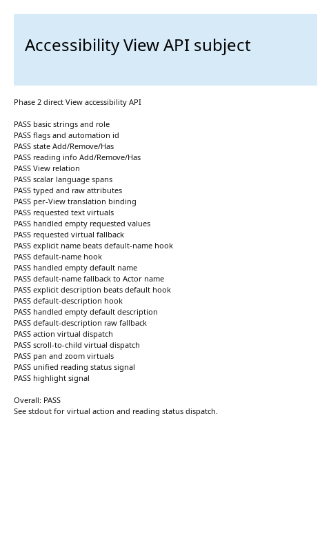

# Accessibility View API

`accessibility-view-api.example` is a self-checking sample for the direct
accessibility API on `Dali::Ui::View` and the accessibility behavior hooks on
`Dali::Ui::ViewImpl`. It displays a pass/fail report and writes every virtual
action and reading-status dispatch to stdout.

The View implementation uses only UI public/extension APIs. It neither includes
nor subclasses `ViewAccessible`. The assertion code queries DALi's generic
platform `Accessible` interface only to observe the final AT-SPI-facing value.

## Name Resolution Contract

The effective accessible name is resolved in this order:

1. `OnAccessibilityRequestName()` when it returns `true`, including an
   intentionally empty value.
2. A non-empty explicitly configured (or translated) accessibility name.
3. `OnAccessibilityRequestDefaultName()` when it returns `true`, including an
   intentionally empty value.
4. The integration-only legacy raw-name fallback, then `Actor::Property::NAME`.

`OnAccessibilityRequestName()` is for an authoritative value resolved for each
accessibility request. `OnAccessibilityRequestDefaultName()` supplies subclass
semantics only when the application did not configure an explicit name.

## Description Resolution Contract

The effective accessible description follows the corresponding order:

1. `OnAccessibilityRequestDescription()` when it returns `true`, including an
   intentionally empty value.
2. A non-empty explicitly configured (or translated) accessibility description.
3. `OnAccessibilityRequestDefaultDescription()` when it returns `true`,
   including an intentionally empty value.
4. The integration-only legacy raw-description fallback.

## Build

From `dali-ui/samples`:

```sh
source ~/setenv
cmake --fresh -DCMAKE_INSTALL_PREFIX=$DESKTOP_PREFIX .
make accessibility-view-api.example -j8
DISPLAY=:0 ./accessibility-view-api/bin/accessibility-view-api.example
```

## Verification

The sample checks:

- Static name, description, value, role, flags, automation id, state, reading
  information, relation, language-span, translation, collection, and raw
  attribute methods.
- Dynamic name, description, and value virtuals for handled values,
  intentionally empty values, and fallback to stored values.
- Explicit-name precedence over the default-name hook, handled-empty
  defaults, and fallback from the default-name hook to the Actor name.
- Explicit-description precedence over the default-description hook,
  handled-empty defaults, and the legacy raw-description fallback.
- Direct virtual dispatch for activate, escape, increment, decrement,
  scroll-to-child, pan, and zoom.
- All five reading lifecycle events through one
  `AccessibilityReadingStatusChangedSignal()` and their exact enum order.
- The existing bool-based accessibility highlight Signal.
- `Dali::Ui::Extension::View::GrabAccessibilityHighlight()` when the sample subject
  receives keyboard focus. With a Screen Reader active, this emits the
  highlighted state change used to announce the subject; otherwise it reports
  an inactive bridge.
- Clear/remove methods after the checks complete.

Every displayed result row must begin with `PASS`, and the final report status must be `Overall: PASS`.
The stdout log must contain `virtual activate`, `virtual escape`, both value
change directions, `virtual scroll to child`, and reading status values
`0, 1, 2, 3, 4` in order.

## Runtime Result

Verified on 2026-08-04 with the Ubuntu DALi desktop environment at 480x800.
The rendered report contained 24 `PASS` rows and `Overall: PASS`.
The stdout sequence also confirmed all action virtuals, reading statuses 0
through 4 in order, both highlight signal states, and the focus-triggered
highlight request. The baseline run reported an inactive accessibility bridge,
so no visual highlight overlay was added. The screenshot below was captured
from this run and shows the complete passing report.



The concise captured output is available in
[`accessibility-view-api-result.log`](accessibility-view-api-result.log).
