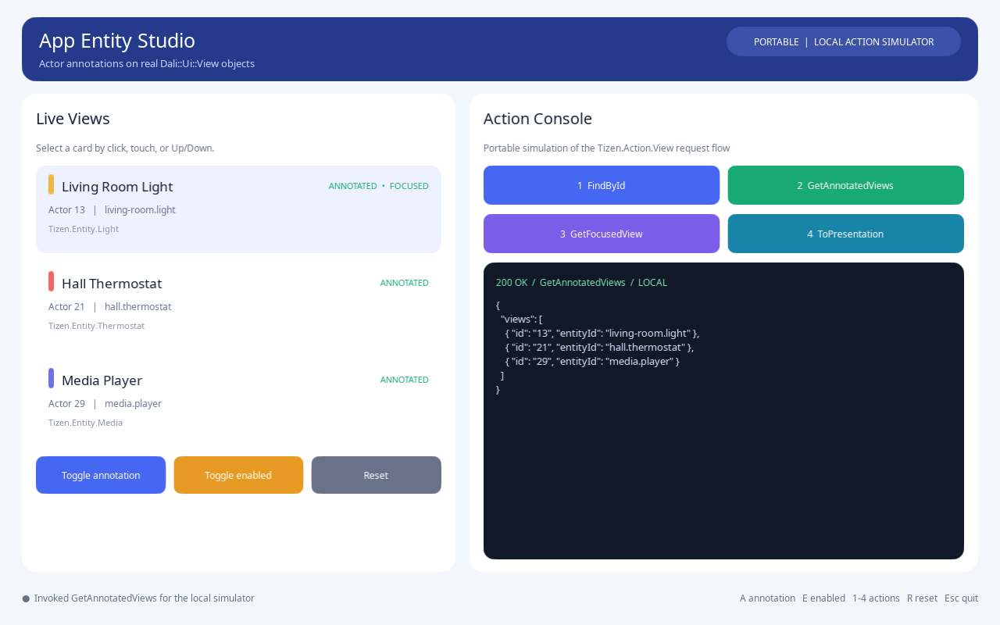

# App Entity Annotation

This portable, interactive sample demonstrates application entity annotations
on real `Dali::Ui::View` objects. It runs on Ubuntu and Windows without Tizen,
TIDL, or rpc-port dependencies.

The left side presents three realistic smart-space views. The right side is a
local simulator for the four `Tizen.Action.View` requests. The simulator uses
the live View annotation and focus state, while replacing only the Tizen
transport and generated binding.



## APIs demonstrated

- `Actor::SetAnnotation()`
- `Actor::GetAnnotation()`
- `Actor::ClearAnnotation()`
- `Actor::GetId()`
- `Ui::FocusManager::SetCurrentFocusView()`
- `Ui::FocusManager::GetCurrentFocusView()`

Every annotated object in this sample is a `Dali::Ui::View`. `Actor::GetId()`
is the runtime Actor identifier used by `FindById`; the application-defined
entity identifier is stored separately in the annotation.

## Local Action Simulator

The action buttons model the user-visible behavior of:

| Action | Local behavior |
|---|---|
| `FindById` | Finds the selected View by its Actor ID and displays a presentation payload. |
| `GetAnnotatedViews` | Reads the current annotations and lists the annotated, visible Views. |
| `GetFocusedView` | Reads the View selected through `Ui::FocusManager`. |
| `ToPresentation` | Displays a JSON representation of the selected View. |

The simulator is intentionally not an RPC mock library. It does not validate
TIDL serialization, rpc-port privileges, or the Tizen host lifecycle; those
belong to dali-adaptor integration tests. It makes the application-side API and
interaction model available on both supported desktop platforms.

## Interaction

- Click or tap an entity card to select and focus it.
- Use **Up/Down** to move between cards.
- Press **A** or select **Toggle annotation** to clear or restore annotation data.
- Press **E** or select **Toggle enabled** to change the selected View state.
- Press **1–4** or select an action button to invoke the local request.
- Press **R** to restore the initial state.
- Press **Escape/Back** to quit.

The response panel shows the action name, status, and current payload. Actor
IDs are assigned at runtime, so the values may differ from the screenshot.

## Build and run on Ubuntu

Build the DALi repositories and source the desktop environment first. Then:

```sh
source ~/setenv
cd dali-ui
cmake -S samples -B build/samples-annotation \
  -DCMAKE_INSTALL_PREFIX="$DESKTOP_PREFIX" \
  -DCMAKE_BUILD_TYPE=Debug \
  -DDALI_UI_SAMPLE_LIST=app-entity-annotation
cmake --build build/samples-annotation \
  --target app-entity-annotation.example -j8

DALI_WINDOW_WIDTH=1280 DALI_WINDOW_HEIGHT=800 \
  ./samples/app-entity-annotation/bin/app-entity-annotation.example
```

## Build and run on Windows

Install and build DALi using the repository Windows build instructions, then
open PowerShell:

```powershell
cd <workspace>
. .\dali-env\setenv.ps1
cd dali-ui\samples
.\build.ps1 -Configuration Debug -Samples app-entity-annotation

$env:DALI_WINDOW_WIDTH = "1280"
$env:DALI_WINDOW_HEIGHT = "800"
& "$env:DESKTOP_PREFIX\bin\app-entity-annotation.example.exe"
```

## Expected result

1. All three cards initially show `ANNOTATED`.
2. The Living Room Light is selected and focused.
3. `GetAnnotatedViews` initially returns three entries.
4. Clearing an annotation removes that View from `GetAnnotatedViews`.
5. Selecting another card changes the `GetFocusedView` response.
6. Reset restores all annotations, enabled states, and initial focus.
